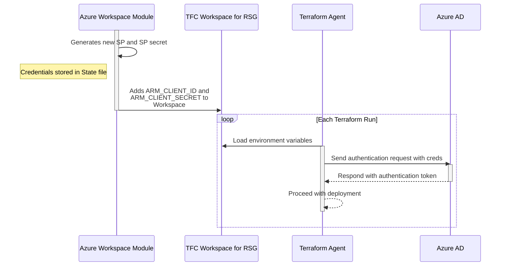
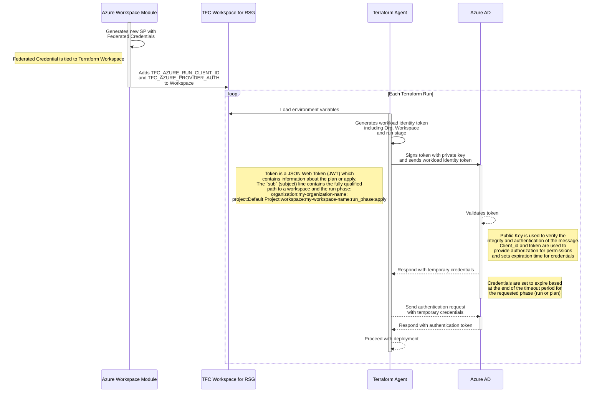

## Status

status: "accepted"\
date: 2023-09-18\
deciders: Architecture Forum\
consulted: IMP, Security

---

## ADR-0001 Terraform Dynamic Provider Credentials

### Context and Problem Statement

Each Terraform Workspace has a set of credentials that are used to authenticate to Azure which are provided through the variables:

- AZURE_CLIENT_ID (Service Principal ID)
- AZURE_CLIENT_SECRET (Service Principal Secret)
- AZURE_SUBSCRIPTION_ID
- AZURE_TENANT_ID

Typically, the Service Principal (SP) ID is shared across multiple Workspaces, with each Workspace having its unique SP
secret, though this is not mandatory.

When creating an SP secret, options to provide a description and set a defined lifetime are available. It is worth noting
that as of April '21, the option for an SP secret to "never expire" was removed [source](https://devblogs.microsoft.com/microsoft365dev/client-secret-expiration-now-limited-to-a-maximum-of-two-years/).

In practice, the description field usage is inconsistent. While some workflows accurately document the intended use case,
at least one automation workflow does not provide a description at all. Given that this secret is primarily tagged to
describe the intended use for the SP, this practice leaves both the SP and its secret susceptible to being used
indiscriminately wherever access is required.

The lifetimes of SP secrets also vary, typically spanning 1 or 2 years depending on the method used to create them.
This necessitates a procedure to actively monitor the lifecycle of these secrets, as well as a mechanism to generate new
secrets for rotation. Presently, automation directly injects the secrets into the Terraform Workspace as environment
variables. However, there is currently no established process for monitoring secret expiration, and the rotation process
would involve manually tainting the secret to generate a new value.

In the unfortunate event of an SP secret being exposed or compromised, the absence of restrictions on its usage and its
extended lifetime significantly heightens the associated risks. It's important to note that, as these secrets are
created through Terraform, the values can be exposed to anyone with access to the state file.

### Decision Drivers

- Shorten the lifetime of valid credentials to minimize risk
- Reduce the scope where valid credentials are able to be used
- Eliminate management of expiring credentials that require operational overhead and introduce risk of disruption

### Considered Options

- Static Azure Credentials (Current option)
- Terraform Dynamic Provider Credentials

### Decision Outcome

Chosen option: Terraform Dynamic Provider Credentials, because
the solution meets all the criteria .

#### Consequences

- Good, because Dynamic Provider Credentials eliminates the need to store credentials, reducing the risk of credentials
  being compromised
- Good, because it reduces the scope of where the Service Principal can be used, reducing the risk of the
  Service Principal being used arbitrarily across different services or applications
- Good, because the credentials being used have a short lifetime, reducing the time compromised secrets are valid
- Bad, because rework of modules will be required to implement which takes additional time and could lead to potential disruptions
- Bad, because an additional dependency to Terraform Cloud is added which moves a component of authentication to a third
  party

### Pros and Cons of the Options

#### Static Azure Credentials

Example flow to deploy into a resource group where the Resource Group (RSG) and Terraform Cloud Workspace were
configured using static credentials:

- Good because automated creation of the secret streamlines the process
- Good because it's leveraging an existing solution which saves time and resources
- Good because compromised secrets become obsolete with each rotation
- Neutral because Service Principal (SP) secret rotation is possible but may involve manual steps or code updates
- Bad because inclusion of SP secret in the state file poses a security risk
- Bad because SP and its corresponding secret could potentially be used in unintended contexts
- Bad because the SP secret having its own lifecycle introduces complications

#### Terraform Dynamic Provider Credentials

Example flow to deploy into a resource group where the Resource Group (RSG) and Terraform Cloud Workspace were
configured using dynamic credentials:

- Good because credentials used are only valid for the duration of the run
- Good because credentials are not stored, enhancing security
- Good because the Service Principal has clearly defined scopes of use
- Good because authentication with Azure is aligned with the Terraform Workspace lifecycle
- Bad because it will cause some re-work of existing code to support, which may entail additional effort
- Bad because it adds an external dependency on Terraform Cloud for certificate management, which may impact availability
- Bad because in the event of token compromise, there is currently no mechanism in place to revoke compromised tokens

### More Information

Authentication is a fundamental component of any security model. It serves as the initial step when a system or user
seeks access to a system or resource. To establish trust, one or both parties must authenticate their identity before
being authorized for actions on the system or resource.

Authentication can be validated through three different means, ranked from strongest to weakest:

- Providing something you are (e.g., fingerprint scan or facial recognition)
- Providing something you have (e.g., private key or mobile device)
- Providing something you know (e.g., username/password or api key)

Comparing the two options for authenticating Terraform runs to Azure, each option uses a different authentication factor.

Static Azure Credentials provide authentication through 'something you know,' utilizing a username/password combination.
This is the most common form of authentication as it's easy to use and with a complex password that is kept secret, it
can be secure. However, the weakness in this factor lies in the potential to share the password, allowing unintended
authentication regardless of the passwords complexity.

Terraform Dynamic Provider Credentials provide authentication through 'something you have'. Authentication is provided
using a JSON Web Token (JWT) signed by the private key from Terraform Cloud. When Azure AD receives and decrypts the
token, using the Terraform Cloud public key, it is validating the origin and integrity of the token. To further
establish trust between the entity's and validity of the certificates, the certificates used for signing are generated
thru a public Certificate Authority.

Link to Terraform documentation: [Terraform Dynamic Provider Credentials](https://developer.hashicorp.com/terraform/tutorials/cloud/dynamic-credentials)
