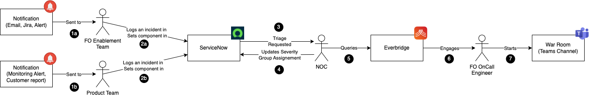
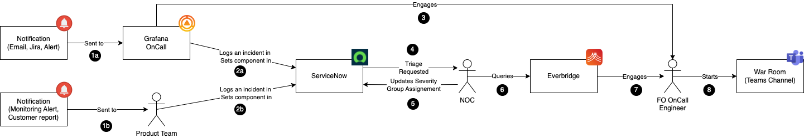

## Status

status: approved \
date: 2023-11-02 \
deciders: @Andreas-Frangopoulos_finastra, @russell-yardley_finastra, @Terry-Wallace_finastra,
@vladimir-babichev_finastra \
consulted: @Andreas-Frangopoulos_finastra, @russell-yardley_finastra, @Terry-Wallace_finastra,
@vladimir-babichev_finastra

---

## ADR-0006: Integrating Grafana OnCall into the FusionOperate's Incident Management Flow

### Context and Problem Statement

In our current incident management flow, we rely on an existing notification mechanism built on top of Everbridge and
ServiceNow to handle alerts and incidents. This flow involves the monitoring system sending alerts in the form of Emails
or Jira tickets to FO Enablement (1a) or Product Team (1b) engineers, who create incidents in ServiceNow (2a and 2b).
After this, ServiceNow forwards requests to NOC engineers (3), who then triage the requests, update the incident's
severity and assignment groups (4) in ServiceNow, and subsequently use EverBridge (5) to engage (6) FO OnCall engineer.

We are now considering integrating Grafana OnCall into the FusionOperate's flow. Grafana OnCall will serve as a
notification and alerting layer before incidents are handed over to ServiceNow. The suggested flow involves the monitoring
system sending alerts (1a) to Grafana OnCall, which will then notify the responsible engineer (3). Additionally, Grafana
OnCall will forward the event to ServiceNow (2a), where an incident will be created and the original flow preserved.

### Decision Drivers

- The need to optimize and improve the incident management process.
- Data tracking and KPIs for incident responses.

### Considered Options

1. **Integrate Grafana OnCall**: Add Grafana OnCall into the existing flow to improve alerting and notification.

2. **Maintain Current Flow**: Continue with the existing flow, relying solely on the current notification mechanism
   built on Everbridge and ServiceNow.

### Decision Outcome

The chosen option is to Integrate Grafana OnCall because it will help reduce MTTR for platform-related incidents while
keeping us compliant with the Finastra Incident Management process. Additionally, it will simplify the on-call management
process by leveraging advanced capabilities provided by Grafana OnCall.

#### Consequences

- Good, because FO MTTR for the platform-related issues will be reduced by directly engaging on-call engineers without
  waiting for the NOC to triage the incident.
- Good, because the existing flow of Product teams engaging FO OnCall engineers remains intact.
- Bad, because there will be a need for initial setup and configuration to ensure a smooth integration.
- Bad, because on-call rota will need to be maintained in Everbridge and Grafana OnCall.

### Pros and Cons of the Options

#### Integrate Grafana OnCall

- Good, because it does not change our compliance with the Finastra Incident Management processes.
- Good, because integrating Grafana OnCall will improve FO's MTTR by minimising manual overhead.
- Good, because it will directly engage engineers for the platform-related issues without waiting for NOC triage.
- Good, because it enables us to leverage the strengths of both ServiceNow and Grafana Cloud solutions in a
  complementary manner.
- Good, because the existing flow of Product teams remains unaltered.
- Good, because of Grafana OnCall's flexibility in on-call management and its diverse methods for on-call calendar
  discovery (direct links, iframes, outlook calendar integration).
- Good, because of the adaptability in managing on-call rota via various means, including its UI, Outlook Calendar, and
  Terraform modules.
- Good, because it facilitates the tracking of fundamental incident response KPIs.
- Good, because it integrates with MS Teams.
- Neutral, because of the initial setup and configuration overhead.
- Neutral, because it necessitates team training.
- Bad, because the on-call rotation needs to be synchronized in two places.

#### Maintain Current Flow

- Good, because it avoids the need for additional setup and integration efforts.
- Bad, because there is a number of manual steps that lead to increased MTTR.
- Bad, because we lack information about our current KPIs.
