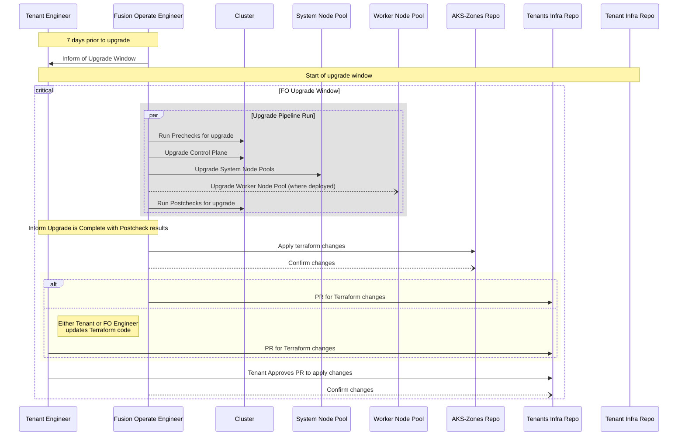
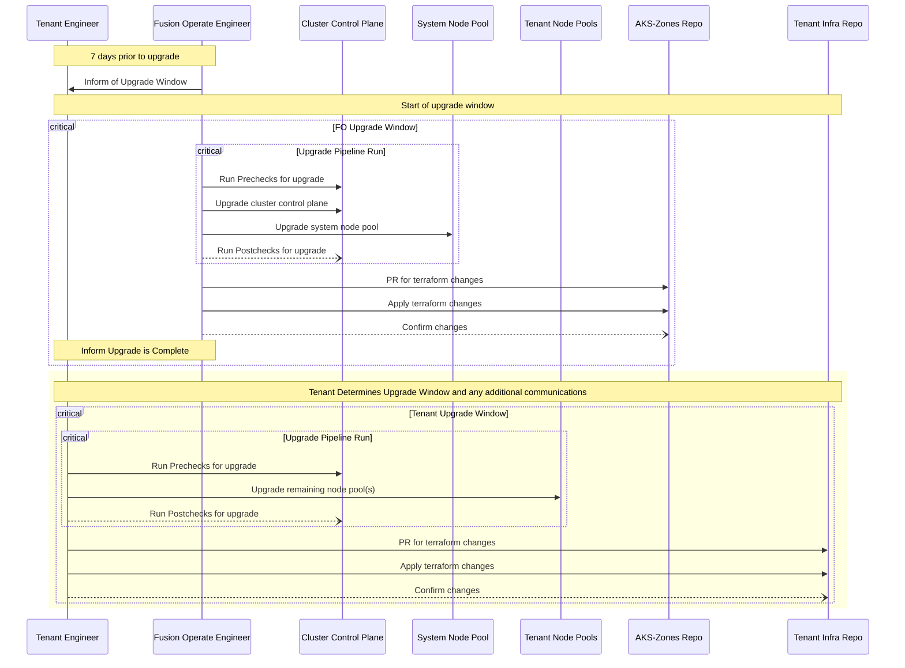
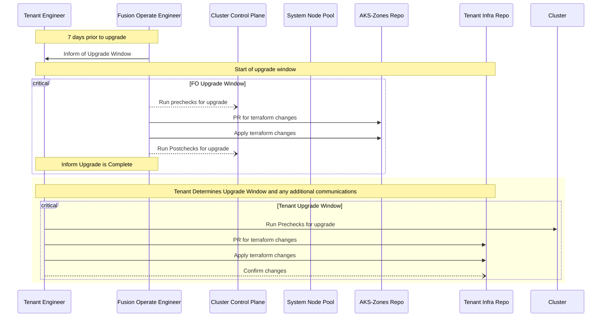

## Status

status: accepted\
date: 2024-01-26\
deciders:@Andreas-Frangopoulos_finastra, @russell-yardley_finastra, @Terry-Wallace_finastra, @vladimir-babichev_finastra\
consulted:@Andreas-Frangopoulos_finastra, @russell-yardley_finastra, @Terry-Wallace_finastra, @vladimir-babichev_finastra, @josh-vermast_finastra, @eric-skibicki_finastra, @alejandro-hernandez_finastra\
informed:\

---

## ADR-0007 Kubernetes Node Pool Upgrades

### Context and Problem Statement

Kubernetes upgrades are a routine maintenance process that ensures the cluster is running the supported version of the software and is up-to-date with security patches. The upgrade process for the Fusion Operate (FO) Azure Kubernetes Service (AKS) clusters has changed recently, as the clusters are now deployed using Terraform. Previously, the clusters were not deployed using any stateful tooling, which provided options on how to upgrade the cluster. In addition to the stateful tooling, the tenants are now able and expected to deploy their own Node Pools. This new process has introduced a new set of constraints that need to be considered when upgrading the cluster.

### Decision Drivers

- Timely upgrades occur on all nodes (control plane and node pools)
- User Experience (UX) for the tenants
- Availability and reliability requirements for the tenants
- Security implications

### Considered Options

- Fusion Operate is responsible for upgrading both the cluster control plane and all node pools. Upgrade to be conducted using existing automation with the subsequent update of Terraform code in the FO Zone and Tenant Environment repositories.
- Fusion Operate is responsible for upgrading only the cluster control plane and the system node pool. Upgrade to be conducted using existing automation with the subsequent update of Terraform code in the FO Zone repository. Tenants are responsible for upgrading Tenant node pools using their own mechanisms.
- Fusion Operate is responsible for upgrading only the cluster control plane and the system node pool. Upgrade to be conducted by updating Terraform code in the FO Zone repository. Tenants are responsible for upgrading Tenant node pools using their own mechanisms.

### Decision Outcome

Chosen option:
Based on the community feedback, the decision is to go with a mixture of two different options.

**Process:**

By default, FusionOperate will be responsible for running the upgrades on all zones. Tenants can opt-in to manage their own upgrades. Regardless of the team managing the upgrade process, the IaC configuration will be the responsibility of the Tenants to ensure that the code matches the deployed version.

_\*There is a strong recommendation for Tenants, where possible, to reference the current cluster version as the value for the node pool version. This minimizes any changes required after an upgrade has been completed._

**Technology:**

All upgrades shall be performed through the Kubernetes upgrade pipeline running on [GitHub](https://github.com/finastra-platform/ FusionOperate-AKS-Upgrade). This provides a standardized means of running and logging upgrades across the estate. The pipeline will be expanded to include the option of upgrading only the control plane and select node pools, enabling Tenants to be selective in how they handle the upgrade process. FusionOperate-managed upgrades will update all components of the cluster to the new version.

#### Consequences

- **Good**, because Tenants get a choice in how much they want to interact with the base platform

- **Good**, because upgrades can be managed in a standardized way with everyone using the same tools

- **Good**, because all upgrades will be logged with the user, date, and time the upgrade was run

- **Bad**, because the existing pipeline doesn't support all the required functionality

- **Bad**, because there will be additional monitoring/alerting to identify clusters/nodes that are soon to be out of support

### Pros and Cons of the Options

#### FO to upgrade cluster control plane and node pools at the same time, then apply Terraform changes

This option, which mirrors the existing process, offers a streamlined approach to upgrading both the cluster control plane and node pools simultaneously, all under the expert guidance of an FO Engineer. The key enhancement here is the deployment of the cluster via Terraform. This necessitates the application of Terraform changes post cluster upgrade, adding a layer of complexity to the process.

What sets this option apart is its simplicity. It seamlessly integrates into the current framework, eliminating the need for any modifications to the upgrade pipeline. This ease of implementation makes it a compelling choice.

However, it's worth noting that as the platform expands to accommodate more tenants, the complexity of the process may proportionally increase.

- **Good**: The tenant is not required to possess knowledge on how to upgrade node pools, simplifying their role in the process.
- **Good**: The existing upgrade pipeline remains intact, eliminating the need for any modifications.
- **Good**: Kubernetes control plane and data plane versions stay in sync, preventing potential incompatibility issues caused by version skew.
- **Good**: We're one step closer to enabling automated patch upgrades for Kubernetes, as per [Microsoft's recommendation](https://docs.fusionoperate.io/docs/fo_internal_docs/aks/aks_cluster_best_practices/#best-practice-2).
- **Good**: Tenant needs to communicate only one maintenance window to the end client (bank/financial institution/etc).
- **Neutral**: The upgrade process is controlled by the FO, centralizing the responsibility.
- **Neutral**: The tenant is tasked with approving Terraform changes, ensuring they have a say in the process.
- **Neutral**: The tooling used by the tenant could differ from that used by the FO (e.g., Terragrunt), which could lead to variability in the process.
- **Bad**: The FO needs access to create PRs for Terraform changes.
- **Bad**: The FO needs to understand the tenant's Infra Repo, which could require additional training or knowledge transfer.

#### FO to upgrade cluster control plane via upgrade script/pipeline then apply Terraform changes, Tenant to upgrade node pools via upgrade script/pipeline then apply Terraform changes

This option presents a somewhat mixed approach. It bears resemblance to the first option where the FO upgrades the cluster control plane and applies Terraform changes. However, a key distinction lies in the tenant's responsibility to upgrade the node pools. This introduces a higher level of complexity compared to the first option, as it necessitates the tenant to have proficiency in upgrading node pools or utilizing the FO tooling for upgrades. FO Engineers would be available to provide assistance or consultation during the upgrade process.

On the flip side, this option does provide a degree of flexibility. The tenant has the liberty to upgrade the node pools at their convenience, provided they adhere to the FO supported releases. This allows the tenant the possibility to operate different environments on the same cluster at varying versions. However, this flexibility could potentially lead to inconsistencies and management challenges, particularly if they choose to run different versions.

- **Good**: The tenant has the autonomy to upgrade node pools according to their own schedule, providing a level of control and flexibility.
- **Good**: The upgrade process offers flexibility, allowing node pools to be upgraded at different times based on the tenant's needs.
- **Good**: FO Engineers are not required to access the tenant's Infra Repo, enhancing the security and privacy of the tenant's infrastructure.
- **Good**: The upgrade process for the control plane is simplified, reducing complexity and potential for errors.
- **Neutral**: The tenant is tasked with upgrading node pools, which could introduce variability in the process depending on the tenant's proficiency and approach.
- **Neutral**: Tenants have the flexibility to prioritize work according to their individual schedules, potentially resulting in the acceptance of inconsistencies and security risks.
- **Bad**: This approach necessitates changes to the existing upgrade process, which could introduce disruption and require additional resources for implementation.
- **Bad**: The enforcement of supported releases for node pools could limit flexibility and require additional monitoring to ensure compliance.
- **Bad**: The upgrade script(including pre and post checks) would need to be modified to support runs against the control plane only and node pools.
- **Bad**, Fusion Operate will need to develop an upgrade pre-check that restricts the node-pool version from lagging excessively behind the control plane version.
- **Bad**, Fusion Operate will need to develop an automation to track permissible node-pool version skew relative to each control plane version.
- **Bad**, Fusion Operate will need to update existing automation to exclude node-pool upgrades from the flow.
- **Bad**, Fusion Operate will need to develop a new set of pre- and post-checks for tenant node-pool upgrades.
- **Bad**, Kubernetes versions 1.25 and above allow a three minor version skew between the control plane and node-pools, there's a risk that tenant node-pools may remain unupgraded and without important security updates potentially for up to a year.
- **Bad**, Version skew can lead to compatibility issues, possibly resulting in system instability and unplanned downtime.
- **Bad**, Tenants may need to schedule multiple maintenance windows with their clients for the same Kubernetes upgrade, which may also conflict with existing contractual obligations.
- **Bad**, Smaller teams will be tasked to possess Kubernetes Operator expertise to utilize Fusion Operate, which could be seen as counterintuitive to the platform's goal of simplifying operations and broadening accessibility.

#### FO Upgrades Cluster via Terraform, Tenant Upgrades Node Pools via Terraform

This option would be a different approach to the first two options. It would have a FO Engineer upgrade the cluster control plane via Terraform and notify the tenants when completed. The tenant would then be responsible for upgrading the node pools via Terraform within a provided time frame. This option allows the tenant to upgrade the node pools in the same manner as they were deployed(via Terraform), providing a level of consistency. However there would still be benefit in running pre and post checks to ensure the upgrade was successful outside of Terraform.

- **Good**: The tenant has the autonomy to upgrade node pools according to their own schedule, providing a level of control and flexibility.
- **Good**: Infrastructure as Code (IaC) is used for both the cluster control plane and node pools, ensuring consistency and reducing complexity.
- **Neutral**: Pre-checks and Post-checks would be run separate from the Terraform upgrade process.
- **Bad**: Issues during the upgrade process would be different to troubleshoot as Terraform would be handling the upgrade.
- **Bad**: Only applicable to the FO 2.x platform, as the 1.x platform does not use Terraform for the cluster control plane.
- **Bad**: The enforcement of supported releases for node pools could limit flexibility and require additional monitoring to ensure compliance.
- **Bad**, Fusion Operate will need to develop an upgrade pre-check that restricts the node-pool version from lagging excessively behind the control plane version.
- **Bad**, Fusion Operate will need to develop an automation to track permissible node-pool version skew relative to each control plane version.
- **Bad**, Fusion Operate will need to develop a new set of pre- and post-checks for tenant node-pool upgrades.
- **Bad**, Kubernetes versions 1.25 and above allow a three minor version skew between the control plane and node-pools, there's a risk that tenant node-pools may remain unupgraded and without important security updates potentially for up to a year.
- **Bad**, Version skew can lead to compatibility issues, possibly resulting in system instability and unplanned downtime.
- **Bad**, Tenants may need to schedule multiple maintenance windows with their clients for the same Kubernetes upgrade, which may also conflict with existing contractual obligations.
- **Bad**, Smaller teams will be tasked to possess Kubernetes Operator expertise to utilize Fusion Operate, which could be seen as counterintuitive to the platform's goal of simplifying operations and broadening accessibility.

### More Information

#### Upgrade Components

Azure Kubernetes Service (AKS) has a few different components that make up the resource. In a typical FO 2.x (STIZ or MTIZ) deployment there will be the Kubernetes Control Plane, the System Node Pool and the Worker Node Pools. (Legacy FO 1.x zones might only have the Control Plane and a System Node Pool depending on the cluster.)

The AKS Control Plane dictates which version API's are available for use on the cluster. This means with deprecated API's, once the Control Plane is upgraded those resources will no longer be able to be deployed onto the Node Pool's.

The existing upgrade pipeline is leverages the AZ CLI commands to upgrade all the components of the cluster (Control Plane, System Node Pools and Worker Node Pools). AZ CLI also provides the capability to only upgrade the Control Plane or specify different Node Pools to upgrade. [AZ CLI AKS Upgrade Reference](https://learn.microsoft.com/en-US/cli/azure/aks?view=azure-cli-latest#az-aks-upgrade) [AZ CLI AKS Node Pool Upgrade Reference](https://learn.microsoft.com/en-us/cli/azure/aks/nodepool?view=azure-cli-latest#az-aks-nodepool-upgrade)

#### Deprecation Policy

AKS follows the upstream Kubernetes Policy in regards to deprecating features and API's. This policy is available on the [Kubernetes docs](https://kubernetes.io/docs/reference/using-api/deprecation-policy/) page.

Once an API has reached Beta stage, there is a minimum of 9 months or 3 releases (which ever is longer) before that API is no longer functional. This provides time to migrate either the new version of the API. API's that have reached the GA stage are required to stay functional for 12 months or 3 releases after the deprecation notice.

#### Terraform Upgrades

All new environments are deployed via Terraform using the `azurerm_kubernetes_cluster` resource. This resources takes in a variable for the Kubernetes version which can either be `major.minor` or `major.minor.patch`.

When the version is specifically called out as `major.minor.patch`, Terraform will only trigger an upgrade on a change of that value.

When the version is referred to only using the `major.minor` value, the the latest GA patch version available is used. This setup can cause upgrades to occur with no changes to the value. ([Terraform Docs](https://registry.terraform.io/providers/hashicorp/azurerm/latest/docs/resources/kubernetes_cluster#kubernetes_version))

When an upgrade is triggered via Terraform on the `azurerm_kubernetes_cluster` resource, Terraform will upgrade the Control Plane and the System Node Pool. Any additional Node Pools created would be required to upgrade there version after the `azurerm_kubernetes_cluster` has completed it's run.
