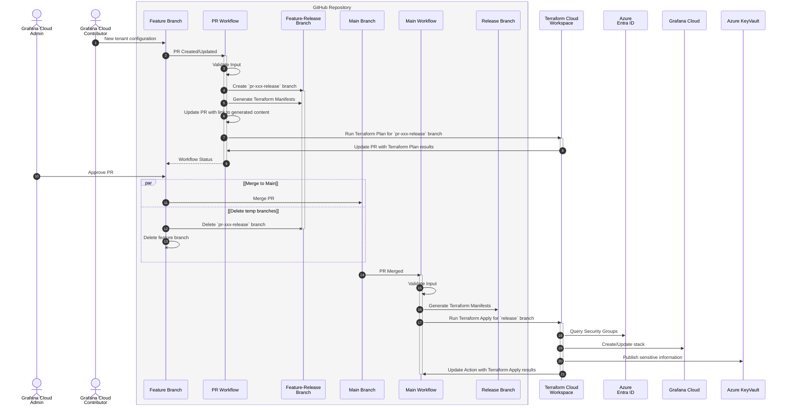

# Full Conversation Transcript — Grafana Cloud Org Structure Project

> **Purpose:** Complete handoff document for Antigravity (or any AI coding assistant) to continue the work.
> **Owner:** Usman Malik
> **Project:** Finastra Grafana Cloud Org Structure Redesign (SPS-1989 / SPS-2000)
> **Date:** April 30, 2026 (Day 1 of onboarding)
> **Language note:** Conversation conducted in Hinglish (Hindi-English mix). All technical terms preserved.

---

## 📌 How to use this document

This is a complete chat transcript between Usman (new hire at Finastra, observability pod) and an AI assistant on his first day. It documents:

1. **Context understanding** — meeting notes, project scope, team structure
2. **Existing design analysis** — Pattern 005 (per-product Grafana stacks)
3. **New design direction** — BU-aligned stacks (5-6 instead of 100+)
4. **Open questions** — what needs Vladimir's clarification
5. **Action plan** — what to do in next 11 days

**For Antigravity / next AI tool:** The user needs help building the actual design document, including:
- Markdown design doc (in style of existing Pattern 005)
- Mermaid diagrams (org structure, naming, consumption, management flow)
- YAML configuration schemas
- Migration plan
- Counter-arguments document (v1 vs v2)

---

## 🎯 Quick Project Summary

### What's the goal?
Design new Grafana Cloud organizational structure for Finastra:
- **From:** 100+ per-product stacks (current mess)
- **To:** 5-6 per-Business-Unit stacks with folder-based product segmentation

### 5 Business Units identified:
1. Lending
2. Payment
3. Universal Banking
4. TCM
5. Cornerstone & SES

### Naming convention (existing):
```
AZR - C03 - 0402 - CORE
↓     ↓     ↓      ↓
Provider Region Product Index
(Azure)  (Central US) (Fusion Operate) (Specific)
```

### Proposed new naming (BU-based):
```
AZR - C03 - LEND - PROD
↓     ↓     ↓      ↓
Provider Region BU   Environment
```

### Key existing infrastructure (preserved from v1):
- Single Finastra Org in Grafana Cloud
- GitOps workflow (main + release branches)
- Terraform Cloud for execution
- Azure Entra ID for security groups
- Azure Key Vault for secrets
- CODEOWNERS pattern
- LBAC (Label-Based Access Control)

### Critical conflict to resolve:
Existing Pattern 005 argues for **per-Product stacks** (6 reasons: customization, empowerment, scalability, isolation, privacy, cost showback). New design must **counter each argument** while proposing per-BU model.

---

## 👥 Team Context

| Person | Role |
|--------|------|
| Vladimir Babichev | Senior architect, design owner, reviewer |
| Johann | Automation lead (Backstage + Terraform) |
| Julia Antonova | PM/Coordinator (Jira, planning) |
| Liliana | Onboarding support |
| Usman Malik | New hire — drafting org structure design |

---

## 🗓️ Timeline

- **April 29, 2026** — Project start
- **April 30, 2026** — Day 1 onboarding (this conversation)
- **May 11, 2026** — First draft due + Enterprise Monitoring alignment call
- **June 30, 2026** — Final design ready

---

## 📚 Source Materials Referenced

1. **Existing Pattern 005**: `finastra-platform/PlatformArchitecture-docs/patterns/005-grafana-cloud-management.md` (full content shared in conversation)
2. **Confluence**: `https://confluence.finastra.com/spaces/ESM/pages/354558880/Monitoring+2.0`
3. **PDFs to read**:
   - `Grafana Org Clean-Up v1.2.pdf`
   - `004-grafana-logs.pdf`
   - `005-grafana-cloud-management.pdf`
4. **Live Grafana stack observed**: `https://finfoprod105.grafana.net` (suggests 100+ similar stacks exist)
5. **Planning docs**: `Q1-Q3 Planning.xlsx` — "Alignm on Q2 Observability Pod" tab

---

# 🗨️ FULL CONVERSATION TRANSCRIPT

---

## [Message 1] Usman shares meeting notes (3 images)

**Usman:**
> [Shares 3 screenshots of Copilot-generated meeting notes covering:
> - Grafana Cloud Organization Management and Stack Design
> - Current Stack Model Challenges (hundreds of stacks, dashboard duplication, etc.)
> - Proposed Stack Model (BU-level consolidation)
> - Cost Attribution and Isolation
> - Regulatory and Data Locality Considerations
> - Automation and Backstage Integration
> - Application Observability and Dashboard Strategy
> - Enablement, Auto-Instrumentation, and Proofs of Concept
> - Follow-up tasks for Usman, Julia, Vladimir, Liliana]

> "pehle ye pura padho and btao kya hai kya nahi me usman hu and hm hinglish me bat karenge and ye onboard me diya huaa h"

**Assistant Response:**

Provided complete breakdown in Hinglish covering:

**Meeting Discussion Points:**
1. **Grafana Cloud Stack Design Problem** — Current setup has hundreds of per-product stacks causing operational overhead, dashboard duplication, inconsistent alerting, complex RBAC, cost tracking issues
2. **New Proposed Model (Usman's idea)** — Consolidate stacks at business unit level (payments, lending, universal banking, CTO/shared services). Use folders for product/domain segmentation, team-based RBAC, standardized labels (business unit, product, service, owner, environment, region)
3. **Cost & Isolation** — Vladimir emphasized flagging high-cost data sources, keeping competing products isolated using LBAC
4. **Regulatory/Data Locality** — Allow dedicated stack exceptions for products with strict residency needs
5. **Automation + Backstage Integration** — Backstage as developer entry point, Terraform Cloud for execution, Git as source of truth
6. **Service Ownership** — Backstage as system of record; Grafana Cloud consumes for alerting/on-call/access control. ServiceNow integration considered
7. **Observability Strategy** — Shift from manual dashboards to Grafana Cloud built-in features (OTEL, Kubernetes dashboards), Grafana Assistant AI tool
8. **Auto-Instrumentation + POCs** — Kubernetes operators, VM-level library injection (Java, .NET), running POCs in Lending and Payments BUs

**Action Items for Usman:**
- Access Provisioning (Liliana, Julia)
- PM Boards & Stories (Julia)
- Epic Definition for Observability Platform (Julia)
- Design Doc sharing — PDF from Vladimir
- Reference Architecture from Vladimir
- Team Formation for Collaboration (Vladimir)

**Identified gaps in meeting notes:**
1. No specific timelines/deadlines/milestones
2. No budget/cost estimates
3. No migration strategy
4. No success metrics/KPIs
5. No rollback plan
6. No stakeholder buy-in process
7. Usman's exact scope/title unclear
8. Existing Backstage maturity unknown
9. Security/compliance review process not mentioned
10. No training plan for developers

Asked Usman: Is this his first week, and what's his exact role in the project?

---

## [Message 2] Usman confirms Day 1

**Usman:**
> "ab mera aaj pehla din tha isme"

**Assistant Response:**

Congratulated Usman and provided Day 1-3 practical roadmap:

**Position assessment:**
- Vladimir = senior architect/lead
- Johann = automation/Backstage
- Julia & Liliana = support
- Usman = key contributor (his BU-level proposal already discussed in meeting)

**Day 1-3 Priorities:**

🔴 Urgent (today):
1. Confirm access (Grafana Cloud admin/editor, Backstage, Terraform Cloud, Git repos, Confluence ESM, Jira, ServiceNow, Slack, VPN/SSO)
2. Request design doc + reference architecture from Vladimir
3. Read Confluence Monitoring+2.0 page

**Week 1 Tasks:**
4. Understand existing setup (stack count, BUs onboarded, Backstage maturity, Terraform modules)
5. Build stakeholder list (BU owners — payments, lending, universal banking, CTO/shared)
6. Start personal learning doc (acronyms, team members, open questions, decisions)

**Smart questions for Vladimir/Julia:**
1. Target date or phase plan?
2. Migration approach — big bang or gradual?
3. Key BU stakeholders to connect with first?
4. Existing Terraform modules or Backstage templates to review?
5. Success criteria at 3 and 6 months?
6. Security/compliance review process?
7. Decision-making authority vs Vladimir's sign-off?

**Mindset tips:**
- Listen more, talk less
- Take notes (don't rely solely on Copilot summaries)
- Ask "stupid" questions now
- Find quick wins (1-2 week deliverables)
- Don't over-promise

**Asked about exact title and contract type.**

---

## [Message 3] Julia's Teams chat shared

**Usman:**
> [Shares full Teams chat with Julia Antonova covering:
> - Yesterday 4:19 PM: Julia adds Usman to Jira, SharePoint, and creates "Alignm on Q2 Observability Pod" tab in Q1-Q3 Planning.xlsx
> - 8:24 AM: Julia follows up about access; shares vacation tracker and JIRA estimation guide
> - 9:49 AM: Julia shares dev environment setup doc (WSL on Finastra GitHub link)]

> "ye bat hui meri ussse to kya hai ye bhi btao ab"

**Assistant Response:**

Praised Julia as proactive and organized. Listed what Julia provided:

**1. Jira Board access** — for tracking Usman's tasks
**2. SharePoint space** — single source of truth for project docs
**3. Q1-Q3 Planning.xlsx** with new "Alignm on Q2 Observability Pod" tab — defines Q2-Q3 scope
**4. Vacation Tracker** — must update before any leave + notify team
**5. JIRA Estimation Guide** — task estimation pattern
**6. Dev Environment Setup Doc** — WSL setup on Windows

**Insights from chat:**
- Usman is in "Q2 Observability Pod" — dedicated team
- Julia is PM/Coordinator — first point of contact for blockers
- Tech stack: Windows + WSL, GitHub (finastra-platform), Jira, SharePoint, Excel

**Priority Actions:**

🔴 Urgent (today):
1. Verify all access (Jira, SharePoint, Q1-Q3 Planning.xlsx, "Alignm on Q2 Observability Pod" tab, vacation tracker, GitHub)
2. Send proper update to Julia (close the loop on "I'll check" message)

🟡 Important (tomorrow):
3. Read Q1-Q3 Planning.xlsx in detail (own pod's tab, scope, deliverables, timeline)
4. Setup WSL following GitHub doc
5. Add name to vacation tracker

🟢 This week:
6. Explore Jira board (existing tickets, estimation patterns, assigned tickets)
7. Scan SharePoint docs

**Critical observation:**
Vladimir = technical architecture lead (what to build)
Julia = delivery/PM lead (when and how to build)

Need to work with both differently — Vladimir for design discussions, Julia for sprints/blockers/estimates.

**Communication tips for Julia:**
- Reply within 1-2 hours
- Specific updates, not vague
- Confirm completion of tasks
- Accept/decline calendar invites timely

**Asked:** WSL setup experience? Primary background (DevOps/SRE, Backend dev, Cloud architect, Observability)?

---

## [Message 4] Usman mentions sending Excel

**Usman:**
> "me aapko q1-q3 planning bhejta hu hmare task ke related jo excel sheet thi vco"

**Assistant Response:**

Explained what would be analyzed:

1. **Pod scope** — "Alignm on Q2 Observability Pod" tab specifically
2. **Timeline & Milestones** — quarter-wise breakdown, deadlines, dependencies
3. **Team Structure** — pod members, roles, Vladimir/Johann/Julia/Liliana involvement
4. **Other Pods context** — what they're doing, dependencies, cross-pod collaboration
5. **Gaps & Questions** — what's missing, unclear, needs clarification
6. **Action items for Usman** — first week focus, quick wins, risk areas

Reminded about confidentiality — redact sensitive info before uploading.

---

## [Message 5] Usman uploads q2-q3-planing.xlsx

**Usman:**
> [Uploads Excel file]

**Assistant Response:**

Read and analyzed Excel. Key findings:

**Sheet structure (only 1 sheet, 7 columns):**
- A: DELIVERABLES
- B: Business Outcome
- C: Acceptance Criteria
- D: Target End Date
- E: Status
- F: Notes
- G: Dependencies

**4 Main deliverable buckets:**
1. **Grafana Cloud Organization Management and Stack Design** (TBD) — only this is detailed
2. **Automation and Backstage Integration** (TBD) — blank
3. **Application Observability and Dashboard Strategy** (TBD) — blank
4. **Enablement, Auto-Instrumentation, and Proofs of Concept** (TBD) — blank

**Bucket 1 actual tasks:**

**Task 1: Big Design Deliverable**
- Outcome: Business unit-aligned stack model with standardized labels and governance
- Deadline: June 30, 2026 (8 weeks)
- Status: To Do

**Task 2: First concrete deliverable**
- Review existing design + create 1st draft of new org structure (with pros/cons)
- Acceptance criteria: Existing design reviewed, 1st draft ready
- Deadline: May 11, 2026 (~11 days from Day 1!)
- Status: To Do

**Task 3: Alignment Meeting**
- Review call with Enterprise Monitoring Team
- Deadline: May 11, 2026

**Hidden action items in notes:**
- Week 11-17: Sync with Enterprise Monitoring team
- Design must be ready in 8 weeks
- Next week focus: access + design analysis + 1st draft
- Implementation breakdown after design
- Send DH account to Vladimir (for Copilot license)

**Issues identified in sheet:**
1. Acceptance criteria missing for main deliverable
2. No Owner/Assignee column — assume sole ownership of Bucket 1
3. Dependencies column completely empty
4. Buckets 2-4 blank — Q3 plan? Owner?
5. Date format inconsistent (D4 has serial number 46153, D5 has text "5/11/2026")

**11-day plan suggested:**

Week 1 (Apr 30 – May 4): Discovery
- Confirm all access
- Get existing design doc from Vladimir
- Read existing design, note gaps
- Get reference architecture
- Send DH account to Vladimir
- Read Confluence Monitoring+2.0

Week 2 (May 5 – May 11): Draft + Align
- Create 1st draft (BU-aligned org structure)
- Document pros & cons
- Add regulatory exceptions section
- Share draft with Vladimir 1-2 days before review call
- Attend May 11 alignment call

---

## [Message 6] Usman shares 2 Jira tickets

**Usman:**
> [Shares full content of SPS-2000 and SPS-1989 Jira tickets including:
> - SPS-2000: "Design organizational structure" with subtasks (review existing pattern 005, review PDFs, design new structure, share with Vladimir)
> - SPS-1989: "Grafana Cloud Org management design" with target dates, problem statement, deliverable list including all the meeting discussion points]

> "ye do jira task h mere pass and mere pass sab chizo ka access hai yaha tak ki confluence ka bhi tum chaho to tumhe review ka pdf bhej dunga
> pr ab merko ye btao ki isme krna kya h"

**Assistant Response:**

Explained relationship between tickets:

```
SPS-1989 (Parent / Big picture)
   │
   │  "Grafana Cloud Org Management Design — full project"
   │  Apr 29 → Jun 30 (2 months)
   │
   └─► SPS-2000 (Child / Concrete first task)
          "Design organizational structure"
          First actual deliverable
          Output: Design doc in GitHub repo, reviewed by Vladimir
```

**SPS-2000 has 8 steps:**
1. Review `005-grafana-cloud-management.md`
2. Review `Grafana Org Clean-Up v1.2.pdf`
3. Review `004-grafana-logs.pdf`
4. Review `005-grafana-cloud-management.pdf`
5. Review Confluence: Monitoring+2.0
6. Design org structure with pros & cons
7. Push to GitHub
8. Get review from Vladimir

**3-Phase roadmap:**

🔴 Phase 1: Research (3-4 days)
- Day 1-2: Confluence + Org Clean-Up PDF
- Day 2-3: 005 markdown + PDF
- Day 3-4: Notes consolidation

🟡 Phase 2: Drafting (4-5 days)
- Markdown design doc with sections:
  1. Executive Summary
  2. Current State Analysis
  3. Proposed Organization Structure (Stack Hierarchy, Folder Structure, RBAC, Labeling)
  4. Special Cases (Cost, Regulatory)
  5. Pros & Cons (3 options compared)
  6. Migration Considerations
  7. Open Questions
  8. References

🟢 Phase 3: GitHub + Review (2-3 days)
- Push to PlatformArchitecture-docs repo
- Branch: `pattern/006-grafana-cloud-org-structure` (existing was 005)
- PR + reviewer Vladimir

**4 Key suggestions:**
1. Branch naming check — existing branch was `pattern/005-grafana-cloud-org-structure` — Vladimir clarification needed
2. PDFs request — to summarize for Usman
3. Outline approval first, then full design
4. Daily/2-day update cycle to Vladimir

---

## [Message 7] Usman asks if assistant can do all 5 docs

**Usman:**
> "kya aapko me 1 to 5 tak ki sabhi chize du to aap kr paoge ?"

**Assistant Response:**

Honest capability assessment:

✅ Can do:
1. Read all 5 documents
2. Provide structured summary of each
3. Identify common themes and gaps
4. Comparative analysis (overlaps, conflicts)
5. Markdown design draft with sections, pros/cons, Mermaid diagrams, references
6. GitHub-ready format
7. Executive summary for Vladimir

❌ Cannot do:
1. Internal Finastra context (politics, preferences)
2. Vladimir's personal preferences
3. Existing 005 pattern content (without seeing it)
4. Final decisions
5. Confidential data handling

**2-stage approach proposed:**
- Stage 1: User sends docs → AI provides analysis (per-doc summary, master notes, open questions, recommended approach)
- Stage 2: User reviews analysis, confirms direction → AI writes full design

**Confidentiality reminder:** NDA terms, sensitive info redaction, security marking.

---

## [Message 8] Usman asks for short version

**Usman:**
> "ye sb to thik h ab merko mota mota ye btao isme hmko krna kya hai aur kaise krna hai short me btao"

**Assistant Response (short version):**

**What to do:**
Create a design document explaining how to organize Grafana Cloud at Finastra.
Currently 100+ stacks (mess) → propose 5 stacks (by business unit: payments, lending, banking, etc.)

**Output:**
Markdown file in GitHub with:
- Current problem
- New proposed structure
- Pros & cons
- Diagrams

**How (4 steps):**
1. **READ** → 5 documents (3-4 days)
2. **THINK** → Notes, design decisions (1 day)
3. **WRITE** → Markdown design (3-4 days)
4. **SHARE** → GitHub + Vladimir (1 day)

**Deadline:** May 11 first draft, June 30 final

**Today's tasks:**
1. Message Vladimir: "Pattern 005 already exists — update or new 006?"
2. Send DH account to Vladimir (Copilot license)
3. Send 5 documents for AI to summarize

---

## [Message 9] Usman asks about "100+ stacks"

**Usman:**
> "isko me smja nahi 100+ stacks means"

**Assistant Response:**

Explained "stack" with WhatsApp analogy:

**Stack** = separate Grafana Cloud instance/workspace with its own dashboards, alerts, logs/metrics, users.

Like WhatsApp groups — each is separate.

**Current Finastra problem:**
Each product has its own Grafana stack → 100-200+ stacks created → mess.

```
Product A → Stack A
Product B → Stack B
...
Product 200 → Stack 200
```

**Problems (like having 200 WhatsApp groups):**
- Hard to find anything
- Same message duplicated everywhere
- Notification chaos
- User management nightmare
- Storage waste

Same in Finastra Grafana:
- Dashboard duplication
- Inconsistent alerts
- Complex RBAC
- Cost tracking impossible

**New solution:**
5 big stacks (by business unit) with folders inside:

```
Stack 1: PAYMENTS
├── 📁 Folder: Product 1
├── 📁 Folder: Product 2
└── 📁 Folder: Product 3

Stack 2: LENDING
Stack 3: UNIVERSAL BANKING
...
```

**Office building analogy:**
- Before: 200 separate buildings (huge cleaning/security/maintenance cost)
- After: 5 big buildings with floors for departments (efficient)

---

## [Message 10] Usman shows folder list from Grafana

**Usman:**
> "Dashboards
> Recently deleted
> ...
> Active Directory Infrastructure
> Archive
> Azure Capacity
> Azure NVA Inventory
> Azure Virtual WAN
> CCM
> Central-MSSQL
> Cisco-ESXi
> CISO"

**Assistant Response:**

Explained Usman is looking inside ONE Grafana stack (Finastra Infrastructure).

**Folders observed:**
- Active Directory Infrastructure
- Archive
- Azure Capacity, NVA Inventory, Virtual WAN
- CCM, Central-MSSQL, Cisco-ESXi, CISO

**What this tells us:**
Most folders are infrastructure-related → this is an "infrastructure-focused stack". Application/product stacks are likely separate.

**Tasks suggested:**

1. **Find total stacks count** — check Grafana Cloud Portal upper-left corner for stack URL pattern
2. **Look at stack URL** — usually `https://<stack-name>.grafana.net`
3. **Note folder naming pattern** — inconsistencies (e.g., abbreviations vs full names)

**3 investigation questions:**
1. How many stacks total in Finastra?
2. What pattern does each stack follow?
3. How are folders named?

**Asked about Grafana Cloud admin access.**

---

## [Message 11] Usman shares Grafana screenshot (URL visible)

**Usman:**
> [Shares screenshot showing https://finfoprod105.grafana.net/dashboards with sidebar features (Assistant, Alerts & IRM, AI & ML, Testing & synthetics, Observability, Connections) and folder list]

> "abhi ye h"

**Assistant Response:**

🎯 Major breakthrough — URL `finfoprod105` decoded:
- **fin** = Finastra
- **info** = Infrastructure
- **prod** = Production
- **105** = Number 105 → suggests 100+ similar stacks exist!

This is **live evidence** of the "hundreds of stacks" problem Vladimir mentioned.

**Naming pattern hypothesis:**
- finfoprod001 to finfoprod200+ exist
- finfodev105 might be dev version
- fin<bu>prod<n> for different BUs

**Important features observed in sidebar:**
- Assistant (Grafana AI)
- Alerts & IRM
- AI & ML
- Testing & synthetics
- Observability
- Connections

These are Grafana Cloud features Vladimir wants to leverage.

**Confirmed:** finfoprod105 is infrastructure-focused stack. Application stacks likely separate.

**Investigation tasks:**

Priority 1: Get total stacks list
- Method A: Grafana Cloud Portal (admin view shows all stacks)
- Method B: Ask Vladimir/Julia
- Method C: Search Confluence

Priority 2: Explore 2-3 different stack types
- Infrastructure stack (finfoprod105 — already done)
- Payment product stack
- Lending stack
- Shared services stack

Priority 3: Build inventory table
| Stack URL | Type | Folders Count | Naming Pattern | Issues |

**Strategic note:** Use this real data in design doc as "Current State Analysis" section — evidence-based design > theory-based.

**Today's actions:**
1. Message Vladimir for centralized stack list
2. Try Grafana Cloud Portal
3. Collect screenshots
4. Report back

---

## [Message 12] Usman shares EXISTING PATTERN 005 (huge revelation)

**Usman:**
> [Shares 6 architecture diagrams + FULL markdown content of `005-grafana-cloud-management.md` document including:
>
> **Diagrams:**
> 1. Org Structure (Finastra Org → Product A, B, Z stacks with Grafana/Metrics/Logs)
> 2. Naming convention (AZR-C03-0402-CORE breakdown: Provider-Region ID-Product ID-Index)
> 3. Example org structure with real stacks (AZR-C03-0105-MAIN/CLM, AZR-C03-0402-CORE/FO, AZR-C03-010Z-0001/LPro)
> 4. Management flow (Contributor → main branch → GitHub Action → release branch → Terraform Cloud Workspace → Grafana Cloud + Entra ID + Key Vault)
> 5. Organization Structure with 5 BUs (Lending, Payment, Universal Banking, TCM, Cornerstone & SES) + IT CDM, Platform teams (Fusion Operate & FFDC), Other central teams
> 6. Consumption model showing Pay2Go VM, Pay2Go Cluster, LPro Cluster, Network VMs/Devices feeding into stacks with namespace labels
>
> **Full Markdown content** including:
> - Summary
> - Motivation (issues with imperative system, evolution of Grafana Cloud)
> - Goals (cost showback per Product, arbitrary geographies, standardized provisioning, self-service)
> - Non-Goals
> - Detailed design:
>   - Org structure (per-product stacks under single Finastra org)
>   - 6 reasons for per-product: Customization, Empowerment, Scalability, Isolation, Privacy/Compliance, Cost Showback
>   - Naming convention details
>   - Consumption model with LBAC
>   - Management flow with GitHub Actions, Terraform Cloud, Entra ID, Key Vault
>   - Repository layout (main + release branches)
>   - Main branch structure with organizations folder, defaults, CTIO/Cornerstone/Lending/Payment/TCM/UniversalBanking subfolders
>   - CODEOWNERS pattern
>   - Default main.yaml
>   - Per-Product configuration YAML schema
>   - Release branch structure
> - User stories with Mermaid sequence diagrams:
>   - Story 1: New Product Onboarding
>   - Story 2: Self-Service by Onboarded Teams
>   - Story 3: Cost Showback
> - Drawbacks
> - Alternatives (Imperative Pipeline, Direct Terraform)
> - Adoption strategy (new org, agent updates, read-only old stacks, delete after 2 months)
> - How we teach this
> - Security Implications
> - Links]

**Assistant Response:**

🔥 **MAJOR REVELATION** — User shared the existing complete pattern 005.

**Critical conflict identified:**

| Aspect | v1 (Existing 005) | v2 (New Proposal) |
|--------|-------------------|-------------------|
| Stack level | Per-Product | Per-Business Unit |
| Total stacks | 100+ | 5-6 |
| Segmentation | Stack-level | Folder + LBAC |
| Philosophy | Maximum isolation | Operational efficiency |

**Both are opposite directions** — needs resolution.

**Strategic positioning:**
> "Pattern 005 established excellent foundation — single org, GitOps, Terraform, naming convention. v2 evolves the **stack granularity model** based on operational learnings, while preserving 90% of v1's architecture."

**Existing 005 summary:**

Org structure:
```
Finastra Org (1 org)
├── Stack 1: AZR-C03-0105-MAIN (CLM)
├── Stack 2: AZR-C03-0402-CORE (FO)
├── Stack 3: AZR-C03-010Z-0001 (LPro)
└── ... (per product)
```

5 BUs already identified: **Lending, Payment, Universal Banking, TCM, Cornerstone & SES**

Reusable from v1:
✅ Single Finastra Org
✅ Per-product stacks (will change)
✅ Naming API integration
✅ GitOps workflow (main + release)
✅ Terraform Cloud
✅ Azure Entra ID
✅ Azure Key Vault
✅ CODEOWNERS
✅ LBAC
✅ Cost showback per Product

**Usman's task redefined:**
NOT scratch design. Instead: **Evolve existing 005 to v2**:
1. Take existing design
2. Modify per-product → per-BU
3. Reuse most of architecture
4. Add folder structure within stack
5. Justify why change is needed

**New design doc structure:**

1. What's Changed (most important section)
2. Why per-BU is Better (counter v1's 6 arguments)
3. New Org Structure (BU-aligned)
4. Updated Naming Convention (BU-based)
5. Folder Structure within Stack (NEW)
6. Reused Components from v1
7. Migration from v1 to v2

**Counter-arguments needed:**

| v1 Argument | v2 Counter |
|-------------|-----------|
| Customization | Folders + per-folder permissions = same flexibility |
| Empowerment | Folders + RBAC = same self-service |
| Scalability | Genuine concern — define split criteria when limits hit |
| Isolation | LBAC + ingestion limits per BU |
| Privacy & Compliance | Regulatory exceptions get dedicated stacks |
| Cost Showback | Label-based cost attribution (verify Grafana support) |

**5 Critical questions for Vladimir:**

1. Update existing 005 or create new 006?
2. Has 005 been implemented?
3. Are stacks like `finfoprod105` from 005 or old imperative pipeline?
4. Address each of v1's 6 arguments as counter?
5. Specific data to include (current stack count, alert volume per BU)?

**Email template provided.**

**3-priority action plan:**

🔴 Urgent (today):
1. Send detailed message to Vladimir
2. Get real stack count
3. Read Confluence Monitoring+2.0

🟡 Important (tomorrow):
4. Outline draft (1-page)
5. Book 30-min meeting with Vladimir for outline review

🟢 This week:
6. Full draft by May 11 after approval

**Offer to user:** Detailed comparison, outline draft, counter-arguments doc, Mermaid diagrams.

---

## [Message 13] Usman asks for README export

**Usman:**
> "kya tum hmari puri chat ko readme me export krke de skte ho ?"

**Assistant Response:**

Created comprehensive README.md with 12 sections:
1. Project Overview
2. Stakeholders & Team
3. Onboarding Context
4. The Core Problem
5. Jira Tasks Breakdown
6. Existing Design (Pattern 005)
7. New Proposed Design (BU-Aligned)
8. Critical Conflict to Resolve
9. Action Plan & Timeline
10. Open Questions for Vladimir
11. Key Resources & Links
12. Glossary

Saved to `/mnt/user-data/outputs/README.md`.

---

## [Message 14] Usman wants full transcript for Antigravity

**Usman:**
> "merko apan dono ki conversation chahea puri taki me antigravity ko de sku to vo aage coding ka part dekh lega like diagram and all"

**Assistant Response:**

[This document is the response — full conversation transcript for handoff.]

---

# 🚀 HANDOFF NOTES FOR ANTIGRAVITY (or next AI tool)

## What Usman needs help with NEXT

### Immediate deliverables (May 11 deadline):

1. **Markdown design document** (`006-grafana-cloud-bu-aligned-org-structure.md`)
   - Following same structure as existing 005
   - All sections filled with BU-aligned content
   - Stored in `finastra-platform/PlatformArchitecture-docs/patterns/`

2. **Mermaid diagrams** needed:
   - **Org Structure diagram** — Finastra Org → 5 BU stacks → Folders per product
   - **Naming convention diagram** — AZR-C03-LEND-PROD breakdown
   - **Example org structure** — actual BU stack examples
   - **Consumption model** — VMs/Clusters/Network feeding into BU stacks with labels
   - **Management flow** — GitHub → Terraform Cloud → Grafana Cloud (preserved from v1)
   - **Sequence diagrams** (3 user stories):
     - New BU Onboarding
     - Product team self-service within BU
     - Cost showback (now via labels)

3. **YAML schema** for new BU-level configuration:
   - Update existing schema to support BU stacks
   - Add folder configuration block
   - Add label policy block
   - Add LBAC for product separation within BU

4. **Repository layout proposal**:
   - Update `organisations/` folder structure
   - Show how BUs map to folders
   - CODEOWNERS pattern at BU + folder level

5. **Migration plan**:
   - Phase 1: New BU stacks created alongside existing
   - Phase 2: Migrate dashboards/alerts to folders
   - Phase 3: Old per-product stacks read-only
   - Phase 4: Delete old stacks

6. **Counter-arguments document**:
   - Address each of v1's 6 arguments (customization, empowerment, scalability, isolation, privacy, cost)
   - Provide data-backed counter where possible

### Tools/tech to use:

- **Markdown** — primary doc format
- **Mermaid** — for all diagrams (renders in GitHub)
- **YAML** — for config schemas
- **Bash/Tree** — for repo layout examples

### Style guidelines (match existing 005):

- Use admonitions (`> [!NOTE]`)
- Section headers: H2 for major, H3/H4 for sub
- Code blocks with language specifiers
- Sequence diagrams in Mermaid
- Tables for comparisons
- Bullet points with bold lead-in for definitions

### Key Finastra-specific context:

- **Naming API**: `https://api.providesops.cloud/dataproxy/api/ui/`
- **Provider docs**: `https://docs.providesops.cloud/docs/reference/naming/`
- **Region C03** = Central US
- **AZR** = Azure provider
- **Existing products mentioned**: Fusion Operate (FO), LaserPro (LPro), Centralised Log Management (CLM), Pay2Go
- **GitHub org**: `finastra-platform`
- **Repo**: `PlatformArchitecture-docs`

### Confidentiality:

- Internal Finastra IP — don't share publicly
- AI tools usage should comply with NDA
- Redact specific client names if any appear

### Open questions blocking final design:

(These need Vladimir's answers before final design — but draft can proceed with assumptions noted)

1. Update 005 or create 006? (Affects branch name, file name)
2. Has 005 been implemented? (Affects migration plan complexity)
3. Origin of finfoprod105 stacks? (Old vs new pipeline)
4. Current alert/SLO volume per BU? (Affects scalability argument)
5. Grafana Cloud label-based cost attribution support? (Affects cost showback argument)

---

# 📊 Reference: Existing Pattern 005 Key Details

## YAML Schema (existing — to be evolved)

```yaml
# Per-Product configuration (current)
product:
  sortName: FusionOperate_OperatingPlatform
stacks:
  - provider: azure
    region: 001
    accessPolicies:
      test_access_policy:
        displayName: Test Access Policy
        socpes:
          - metrics:read
          - logs:read
        labelSelectors:
          - '{namespace="default"}'
          - '{env != "dev"}'
        tokens:
          test_token:
            displayName: Test Token
            expires_at: 2022-12-31T23:59:59Z
    serviceAccounts:
      test_service_account:
        role: admin
        disabled: false
        tokens:
          - test_token
    grafanaInstance:
      organization:
        theme: system
        timezone: utc
        weekStart: monday
        homeDashboardId: 1
      dashboards:
        finastra:
          permissions:
            - role: Editor
              team_id: fusion_operate
      dataSources:
        # ...
```

## Repository Layout (existing — to evolve)

```bash
# Main branch (current)
├── .github/
│   ├── workflows/
│   └── CODEOWNERS
├── organisations/
│   ├── defaults/
│   │   └── dashboards/
│   ├── CTIO/
│   │   ├── defaults/
│   │   ├── 013a/
│   │   │   └── main.yaml
│   │   ├── 0402/
│   │   │   ├── dashboards/
│   │   │   └── main.yaml
│   │   └── main.yaml
│   ├── Cornerstone/
│   ├── Lending/
│   ├── Payment/
│   ├── TCM/
│   ├── UniversalBanking/
│   └── main.yaml
├── .gitignore
├── .markdownlint.yaml
├── .pre-commit-config.yaml
└── README.md
```

## CODEOWNERS Pattern (existing)

```
*                             @finastra-platform/fusionoperatestability-admin
/organisations/CTIO/013a/     @finastra-platform/productid013a-admin
/organisations/CTIO/0402/     @finastra-platform/productid0402-admin
```

## Existing Mermaid Sequence Diagram (Story 1: New Product Onboarding)



---

## ✅ Final note for next AI

This conversation captures Day 1 of Usman's onboarding at Finastra. He's been thrown into a high-stakes project — designing the new Grafana Cloud organizational structure for the entire enterprise. He has 11 days for first draft, 8 weeks for final design.

The work needed next is:
- **Heavy on diagrams** (Mermaid)
- **Heavy on YAML schemas**
- **Markdown writing** in style of existing 005
- **Counter-argumentation** (defending BU-aligned approach against per-Product approach)

He has full access to GitHub, Confluence, Jira, Grafana Cloud, and Vladimir/Julia for clarifications.

**Recommend starting with:** Outline draft (1-page) for Vladimir's pre-approval before writing full design doc.

---

*End of conversation transcript.*

**Document version:** 1.0
**Generated:** April 30, 2026
**Total messages exchanged:** 14
