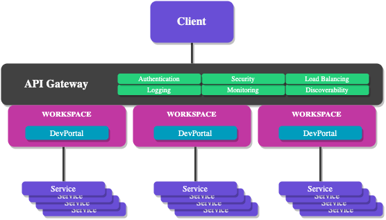
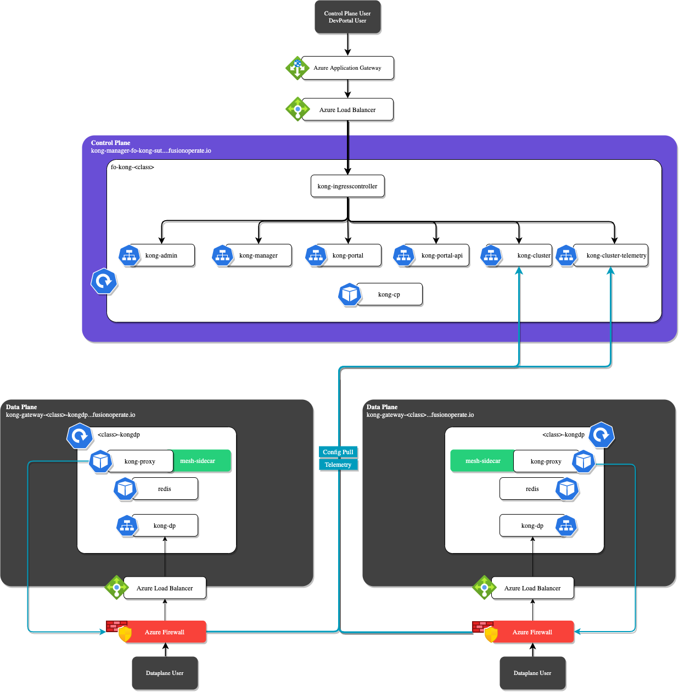
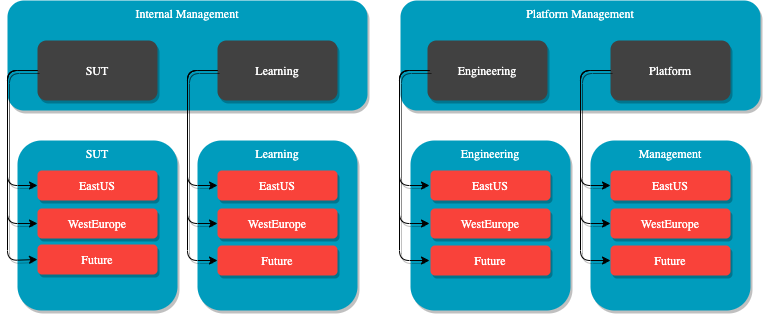
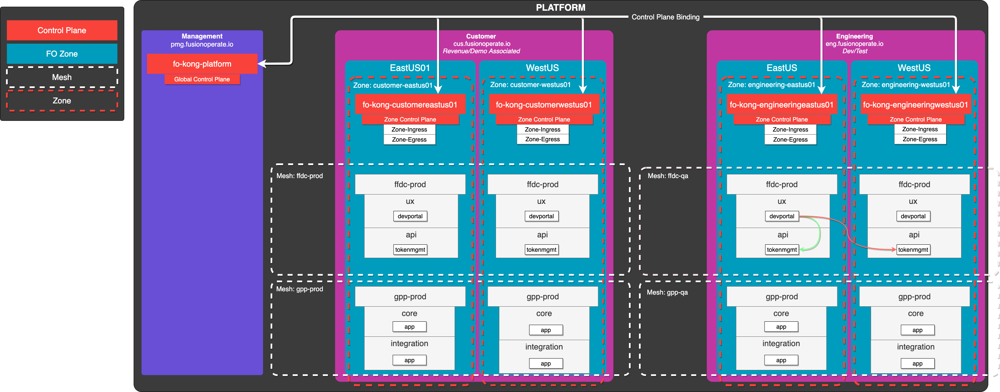
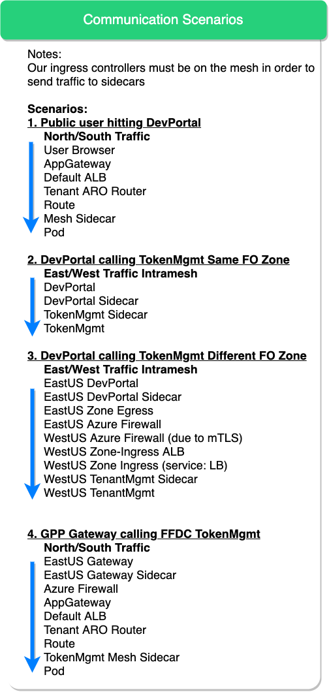
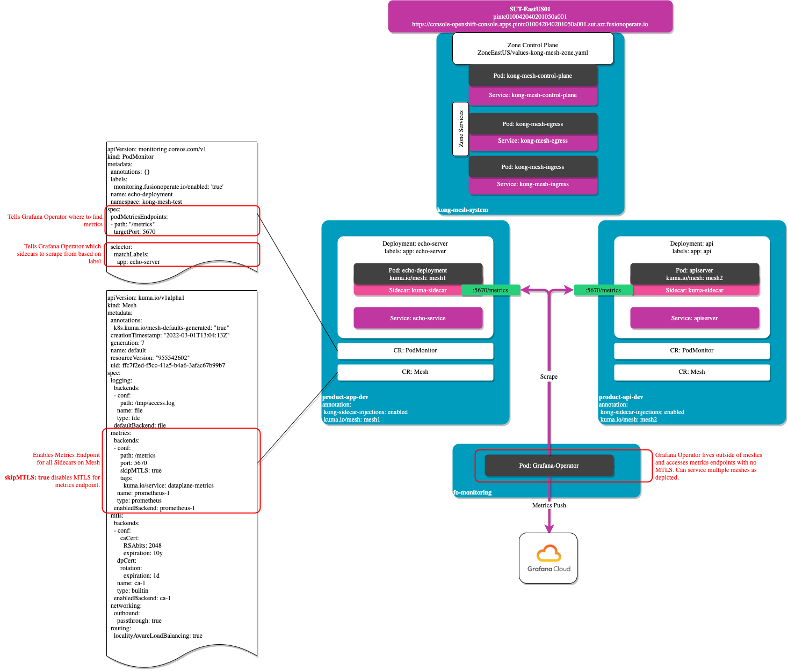

- [Kong API Gateway](#kong-api-gateway)
  - [Overview](#overview)
  - [Requirements](#requirements)
    - [Control Plane](#control-plane)
    - [Data Planes](#data-planes)
    - [Workspaces](#workspaces)
  - [Architecture](#architecture)
  - [Scenarios](#scenarios)
    - [Control Plane Scopes](#control-plane-scopes)
- [Kong Mesh](#kong-mesh)
  - [Overview](#overview-1)
  - [Requirements](#requirements-1)
    - [Control Plane](#control-plane-1)
    - [Data Planes](#data-planes-1)
    - [Meshes](#meshes)
  - [Architecture](#architecture-1)
  - [Scenarios](#scenarios-1)
  - [Monitoring](#monitoring)
    - [Diagram](#diagram)
    - [Grafana Cloud](#grafana-cloud)

# Kong API Gateway

## Overview

Kong is an open source API gateway and platform that acts as middleware between compute clients and the API-centric applications. The platform easily extends the capabilities of APIs with the use of plugins.



## Requirements

### Control Plane

1. Control Planes scope should be limited to no larger scope than a Tier of Fusion Operate
2. Control Planes should be exposed via FO 2.0 Edge Local Architecture and secured with TLS
3. Control Planes should be secured using RBAC and OIDC integration with Azure Active Directory
4. Provisioning and Configuration of Workspaces and Users/Admins should be available via Self Service/GitOps automation by the tenants.
5. Control Planes should publish alerts to contracted Monitoring and Alerting Stack

### Data Planes

1. Data Planes should be available per FO Zone, pulling configuration from the respective Control Plane
2. Data Plane connections to Control Planes should be secured using mTLS
3. Data Plane ingresses must have Metrics published to be consumed by contracted monitoring platform.
4. Data Plane pods should utilize HPA to automatically scale out and back to support requests from the consumers.
5. Data Planes should by default mirror traffic to the contracted API Protection Platform.
6. Data Planes should by default utilize a rate limiting plugin. (still required?)
7. Data Planes provisioning should be decoupled from Control Planes in a 1:many relationship.

### Workspaces

1. Workspaces should by default use path based routing with the pattern of {dataplaneURL}/{workspaceName}/{routeName}

## Architecture



## Scenarios

### Control Plane Scopes



# Kong Mesh

## Overview

_What is a Kong Service Mesh?_

## Requirements

### Control Plane

1. Control Planes scope should be limited to no larger scope than a Tier of Fusion Operate
2. Control Planes UI must be secured with Openshift OAuth Proxy
3. Control Planes must expose metrics endpoint.
4. Control Planes must be deployed in a namespace with labels:

```yaml
fusionoperate.io/product-id: "010k"
fusionoperate.io/product: FOCloud
fusionoperate.io/domain: core
fusionoperate.io/env: INT/PLA
```

5. Control Planes must have a ServiceMonitor deployed.

### Data Planes

1. Dataplane sidecar should be deployed by adding the following annotation at the namespace level:

```yaml
kuma.io/sidecar-injection: enabled
```

### Meshes

1. Mesh monitoring must able to be enabled at the Product-Env level.
2. Application mesh configuration of individual applications must be able to be enabled at the Application Helm level.
3. Mesh should be dedicated to a specific Product-Env
4. Tenants should be able to provision a mesh using some sort of self service capability

## Architecture

_Architecture decisions in progress and could change_



## Scenarios

The following are example scenarios of mesh communication and the path they take to achieve the communication.



## Monitoring

Mesh monitoring is achieved by enabling the metrics endpoint at the mesh level, this instructs all dataplanes on that mesh to create the /metrics endpoint on port 5670 upon creation of the sidecar.

```yaml
apiVersion: kuma.io/v1alpha1
kind: Mesh
metadata:
  annotations:
    k8s.kuma.io/mesh-defaults-generated: "true"
  creationTimestamp: "2022-03-01T13:04:13Z"
  generation: 7
  name: default
  resourceVersion: "955542602"
  uid: ffc7f2ed-f5cc-41a5-b4a6-3afac67b99b7
spec:
  logging:
    backends:
      - conf:
          path: /tmp/access.log
        name: file
        type: file
    defaultBackend: file
  metrics:
    backends:
      - conf:
          path: /metrics
          port: 5670
          skipMTLS: true
          tags:
            kuma.io/service: dataplane-metrics
        name: prometheus-1
        type: prometheus
    enabledBackend: prometheus-1
  mtls:
    backends:
      - conf:
          caCert:
            RSAbits: 2048
            expiration: 10y
        dpCert:
          rotation:
            expiration: 1d
        name: ca-1
        type: builtin
    enabledBackend: ca-1
  networking:
    outbound:
      passthrough: true
  routing:
    localityAwareLoadBalancing: true
```

PodMonitor resource is used to inform Grafana Cloud Operator which Dataplane sidecars to scrape metrics from. A selector is added to tell the Operator to only target deployments on the mesh that have specific labels. It is up to the tenant to decide the scope of their Grafana monitoring of data planes on their mesh.

```yaml
apiVersion: monitoring.coreos.com/v1
kind: PodMonitor
metadata:
  annotations: {}
  labels:
    monitoring.fusionoperate.io/enabled: 'true'
  name: echo-deployment
  namespace: kong-mesh-test
 spec:
  podMetricsEndpoints:
    - interval: 15s
      relabelings:
      - action: replace
        replacement: $1:5670
        sourceLabels:
        - __address__
        targetLabel: __address__
      - regex: (.*)
        sourceLabels:
        - __meta_kubernetes_pod_annotation_kuma_io_mesh
        targetLabel: mesh
      - regex: (.*)
        separator: .
        sourceLabels:
        - __meta_kubernetes_pod_name
        - __meta_kubernetes_namespace
        targetLabel: dataplane
      scrapeTimeout: 15s
    selector:
      matchLabels:
        app: echo-server
```

It is important to note the `skipMTLS: true` in the Mesh CustomResource. This instructs sidecars to disable mTLS for their metrics endpoints in order to allow the Grafana Cloud Operator which is not part of any mesh to scrape.

### Diagram



### Grafana Cloud

As of now, all data planes send monitoring data to a shared Grafana Cloud workspace. This design is expected to evolve into a better multi-tenant architecture.
