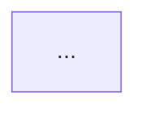
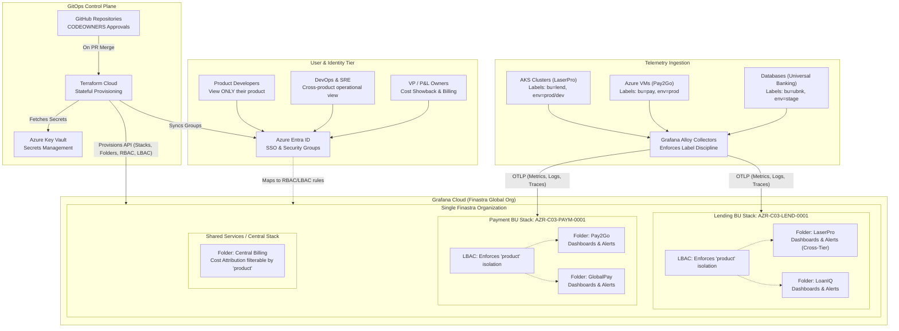
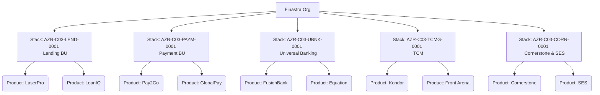
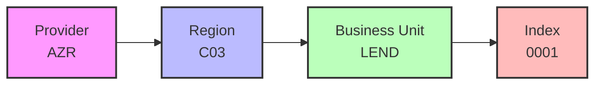
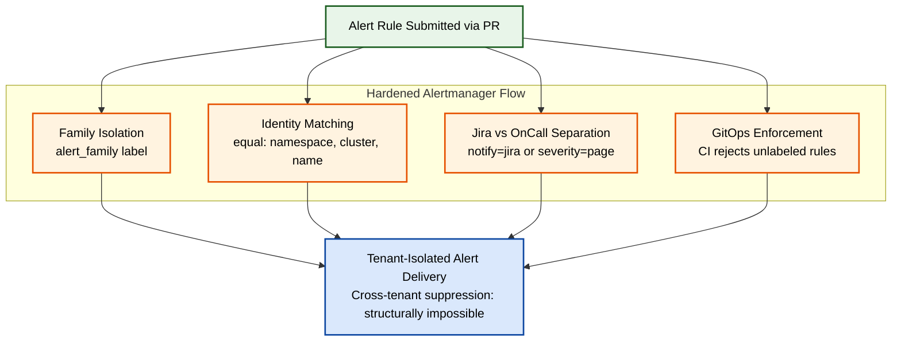
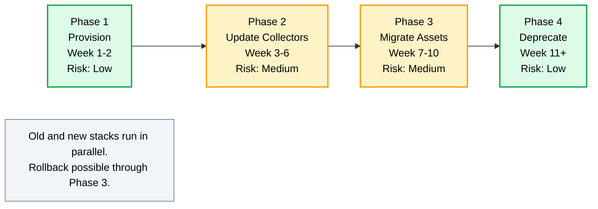

# Antigravity Handoff: Convert 5 Mermaid Diagrams → draw.io

> **Context:** Pattern 006 design document currently uses Mermaid diagrams. Per Johann's feedback and Vladimir's expectations, we need to migrate to draw.io for a more professional appearance and editability.

---

## What I need

Convert all 5 Mermaid diagrams in `observability/03_Future_State/patterns/006-grafana-cloud-bu-aligned-org-structure.md` into draw.io format.

For **each diagram**, produce **3 files**:

1. **`.drawio`** — Editable source file (for future updates)
2. **`.svg`** — Vector format for embedding in Markdown (zoom-proof, primary display format)
3. **`.png`** — High-resolution fallback (300+ DPI)

After conversion, update the MD file to **embed the SVG** and **link to the .drawio source**, removing the Mermaid code blocks entirely.

---

## File Structure

Create a new folder for diagrams:

```
observability/03_Future_State/patterns/diagrams/
├── 01-high-level-architecture.drawio
├── 01-high-level-architecture.svg
├── 01-high-level-architecture.png
├── 02-bu-aligned-org-structure.drawio
├── 02-bu-aligned-org-structure.svg
├── 02-bu-aligned-org-structure.png
├── 03-naming-convention.drawio
├── 03-naming-convention.svg
├── 03-naming-convention.png
├── 04-hardened-alertmanager-flow.drawio
├── 04-hardened-alertmanager-flow.svg
├── 04-hardened-alertmanager-flow.png
├── 05-adoption-strategy.drawio
├── 05-adoption-strategy.svg
└── 05-adoption-strategy.png
```

**Total: 15 files (3 per diagram × 5 diagrams)**

---

## How to Update the MD File

For each Mermaid block in `006-grafana-cloud-bu-aligned-org-structure.md`, replace it with this pattern:

**Before (Mermaid):**

````markdown
### High-Level Architecture

The following diagram illustrates...


````

**After (draw.io):**

```markdown
### High-Level Architecture

The following diagram illustrates...


*Editable source: [01-high-level-architecture.drawio](./diagrams/01-high-level-architecture.drawio)*
```

---

## Style Guidelines (Apply to ALL diagrams)

### Color Palette (use consistently across all 5 diagrams)

| Element Type | Fill Color | Stroke Color | Use Case |
|--------------|------------|--------------|----------|
| **Users / Personas** | `#fff9c4` | `#fbc02d` | User actors, identity tier |
| **Control Plane** | `#f3e5f5` | `#4a148c` | GitHub, Terraform, Key Vault, Entra ID |
| **Ingestion** | `#e8f5e9` | `#1b5e20` | Sources, collectors, alert input |
| **Cloud / Output** | `#e3f2fd` | `#0d47a1` | Grafana Cloud org, output nodes |
| **Stacks** | `#fff3e0` | `#e65100` | BU stacks, guardrail boxes |
| **Folders** | `#ffffff` | `#424242` (dashed) | Product folders inside stacks |
| **Low Risk (green)** | `#dcfce7` | `#16a34a` | Migration phase 1, 4 |
| **Medium Risk (amber)** | `#fef3c7` | `#f59e0b` | Migration phase 2, 3 |
| **Note / Callout** | `#f1f5f9` | `#64748b` (dashed) | Side notes, observations |

### Typography

- **Font family:** Helvetica or Arial (universal)
- **Title text size:** 14-16pt, bold
- **Body text size:** 11-12pt, regular
- **Small label size:** 9-10pt, italic

### Layout & Spacing

- **Stroke width:** 2px for all node borders
- **Arrow style:** Solid lines for main flow, dashed for optional/access flows
- **Node padding:** 8-12px internal padding
- **Diagram canvas:** White background, no grid in export

### Export Settings

For **SVG export:**
- Set viewBox to fit content snugly (no excess whitespace)
- Embed fonts (so SVG renders correctly anywhere)
- Background: transparent or white

For **PNG export:**
- Resolution: **300 DPI minimum** (for high-quality print)
- Background: white
- Anti-aliasing: enabled

For **.drawio source:**
- Save in standard draw.io XML format
- Single page per file
- Page size: auto-fit to content

---

## Diagram 1: High-Level Architecture (MOST IMPORTANT)

**Filename:** `01-high-level-architecture.drawio` / `.svg` / `.png`

**Layout:** Top-down (4 horizontal tiers)

**Current Mermaid code for reference:**



**Critical requirements:**

- **4 distinct tiers visible** (User & Identity / Control Plane / Ingestion / Cloud)
- **Tier labels on the left side** (e.g., "USERS & IDENTITY", "CONTROL PLANE", "INGESTION", "CLOUD BOUNDARY")
- **All 4 user persona boxes** (Product Devs, DevOps & SRE, VPs, Azure Entra ID)
- **All 3 control plane boxes** (GitHub, Terraform Cloud, Azure Key Vault)
- **All 3 ingestion sources** (AKS LaserPro, Azure VMs Pay2Go, Databases UB) flowing into Grafana Alloy
- **3 BU stacks shown** (Lending with LaserPro+LoanIQ folders, Payment with Pay2Go+GlobalPay folders, Shared Services with Central Billing)
- **LBAC nodes** inside Lending and Payment stacks
- **All arrow labels** preserved: "On PR Merge", "Fetches Secrets", "Syncs Groups", "Provisions API (Stacks, Folders, RBAC, LBAC)", "OTLP (Metrics, Logs, Traces)", "Maps to RBAC/LBAC rules"
- **Dashed arrows** for the LBAC → folders relationships and Entra → Org access flow
- **Solid arrows** for all main data/control flows

**Visual hierarchy tip:** Use slightly larger boxes for the parent containers (User Tier, Control Plane subgraph, Cloud Org) and smaller boxes for child elements inside.

---

## Diagram 2: BU-Aligned Org Structure

**Filename:** `02-bu-aligned-org-structure.drawio` / `.svg` / `.png`

**Layout:** Top-down tree

**Current Mermaid code for reference:**



**Critical requirements:**

- **3 levels visible:**
  - Level 1: "Finastra Org" (top, single node)
  - Level 2: 5 BU stacks with full naming convention (AZR-C03-LEND-0001, AZR-C03-PAYM-0001, AZR-C03-UBNK-0001, AZR-C03-TCMG-0001, AZR-C03-CORN-0001)
  - Level 3: 2 products per BU (10 total)
- **Stack name + BU name** on two lines in each Level 2 node
- **Product nodes** styled differently from stack nodes (use folder color/style — white with dashed border)
- **Connecting lines** clean, no overlaps
- **Horizontal alignment:** Try to keep products from the same BU close together

**Style:** Stack nodes use orange (`#fff3e0` with `#e65100` border), product nodes use folder style (white with dashed gray border).

---

## Diagram 3: Naming Convention

**Filename:** `03-naming-convention.drawio` / `.svg` / `.png`

**Layout:** Left-to-right, 4 segments

**Current Mermaid code for reference:**



**Critical requirements:**

- **4 segments side-by-side**, connected with arrows
- **Each segment** has 2 lines: label name (e.g., "Provider") on top, value (e.g., "AZR") below in larger/bolder font
- **Distinct colors per segment** (4 different colors to show they're conceptually different parts):
  - Provider: pink/magenta tint (`#fce4ec`, border `#c2185b`)
  - Region: blue tint (`#e3f2fd`, border `#1565c0`)
  - Business Unit: green tint (`#e8f5e9`, border `#2e7d32`)
  - Index: orange tint (`#fff3e0`, border `#e65100`)
- **Below the diagram**, leave space for example: `AZR-C03-LEND-0001` (this is in the MD text already, but ensure diagram has good vertical clearance)

**Visual goal:** Make this look like a "label/badge" composition — like a name tag breaking down its parts.

---

## Diagram 4: Hardened Alertmanager Flow

**Filename:** `04-hardened-alertmanager-flow.drawio` / `.svg` / `.png`

**Layout:** Top-down (Input → 4 Guardrails in parallel → Output)

**Current Mermaid code for reference:**



**Critical requirements:**

- **3 layers vertically:**
  - Top: Input node (green) — "Alert Rule Submitted via PR"
  - Middle: 4 guardrail nodes (orange) in horizontal row, inside a labeled container "Hardened Alertmanager Flow"
  - Bottom: Output node (blue) — "Tenant-Isolated Alert Delivery / Cross-tenant suppression: structurally impossible"
- **Each guardrail node** has 2 lines: title (e.g., "Family Isolation") on top, code-style label (e.g., `alert_family label`) below in monospace font
- **Code-style labels** should look like code/config (use Consolas, Courier, or similar monospace font, slight gray background or bordered)
- **Arrows from Input** fan out to all 4 guardrails (4 arrows down)
- **Arrows from each guardrail** converge to Output (4 arrows down)
- **Subgraph "Hardened Alertmanager Flow"** has a dashed orange border around the 4 guardrails
- **Output node text** has 2 lines: "Tenant-Isolated Alert Delivery" (bold) and "Cross-tenant suppression: structurally impossible" (italic, smaller)

---

## Diagram 5: Adoption Strategy (4 Phases)

**Filename:** `05-adoption-strategy.drawio` / `.svg` / `.png`

**Layout:** Left-to-right (4 phases sequentially)

**Current Mermaid code for reference:**



**Critical requirements:**

- **4 phase boxes side-by-side** (left-to-right) with thick arrows between them
- **Each phase box** has 4 lines:
  - Line 1: "Phase 1" (small, uppercase)
  - Line 2: Action verb (e.g., "Provision") in large bold
  - Line 3: Week range (e.g., "Week 1-2") in italic
  - Line 4: Risk badge (e.g., "Risk: Low") in colored bold text matching the box border
- **Risk-based coloring:**
  - Phase 1 (Provision) → Green/Low risk
  - Phase 2 (Update Collectors) → Amber/Medium risk
  - Phase 3 (Migrate Assets) → Amber/Medium risk
  - Phase 4 (Deprecate) → Green/Low risk
- **Below the 4 phases**, a centered Note box (gray, dashed border):
  - Text: "Old and new stacks run in parallel. Rollback possible through Phase 3."
- **Arrows between phases** should be thick navy with triangle endpoints
- **Risk: Low** label color: green (`#16a34a`)
- **Risk: Medium** label color: amber (`#f59e0b`)

---

## Final MD File Update Pattern

After creating all the diagrams, update the MD file (`006-grafana-cloud-bu-aligned-org-structure.md`) by **replacing each Mermaid code block** with the SVG embed pattern:

### Pattern for each section:

**Section 1: High-Level Architecture (line ~65-145)**

Replace the entire ` ```mermaid ... ``` ` block with:

```markdown


*Editable source: [01-high-level-architecture.drawio](./diagrams/01-high-level-architecture.drawio)*
```

**Section 2: BU-Aligned Org Structure (line ~151-173)**

Replace with:

```markdown


*Editable source: [02-bu-aligned-org-structure.drawio](./diagrams/02-bu-aligned-org-structure.drawio)*
```

**Section 3: Naming Convention (line ~184-194)**

Replace with:

```markdown


*Editable source: [03-naming-convention.drawio](./diagrams/03-naming-convention.drawio)*
```

**Section 4: Hardened Alertmanager Flow (line ~216-238)**

Replace with:

```markdown


*Editable source: [04-hardened-alertmanager-flow.drawio](./diagrams/04-hardened-alertmanager-flow.drawio)*
```

**Section 5: Adoption Strategy (line ~317-336)**

Replace with:

```markdown


*Editable source: [05-adoption-strategy.drawio](./diagrams/05-adoption-strategy.drawio)*
```

---

## Quality Checklist (verify before finishing)

For each of the 5 diagrams, confirm:

- [ ] `.drawio` file opens correctly in https://app.diagrams.net/
- [ ] `.svg` file renders crisply at multiple zoom levels (100%, 200%, 500%)
- [ ] `.png` file is at least 300 DPI and looks sharp
- [ ] Color palette matches the table in "Style Guidelines"
- [ ] All node labels match the original Mermaid content exactly
- [ ] All arrows and arrow labels are preserved
- [ ] Text is readable at default zoom
- [ ] No overlapping nodes or arrows
- [ ] Background is white or transparent (not gray/colored)

For the MD file:

- [ ] All 5 Mermaid code blocks removed
- [ ] All 5 sections now have SVG embed + drawio source link
- [ ] Image paths use relative paths (`./diagrams/...`) so they work on GitHub
- [ ] Section structure (headings, surrounding text) preserved exactly

---

## Constraints (must not violate)

- **Do not change** any text content in the MD file outside the Mermaid blocks
- **Do not modify** any other section (Executive Summary, Goals, etc.)
- **Do not introduce** new diagrams that weren't in the original
- **Do not change** the file structure of the observability folder (other than adding `diagrams/`)
- **Do not delete** any existing files

---

## Output Expectations

When done, share:

1. The 15 diagram files (organized in `observability/03_Future_State/patterns/diagrams/`)
2. The updated `006-grafana-cloud-bu-aligned-org-structure.md` with all Mermaid replaced
3. A brief summary of what was created (file list + any notes)

---

## Why This Matters

- **Vladimir** (senior architect) explicitly expects to walk through a draw.io diagram, not Mermaid
- **Johann** suggested this migration in his review feedback
- **SVG format** ensures the diagrams stay crisp at any zoom level (no pixelation when Vladimir zooms in during review)
- **`.drawio` source files** in the repo allow future edits without starting from scratch
- **Professional consistency** across the design doc

---

Thanks!