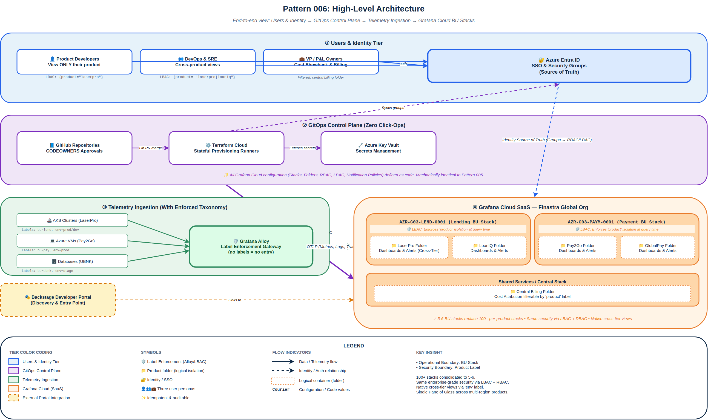
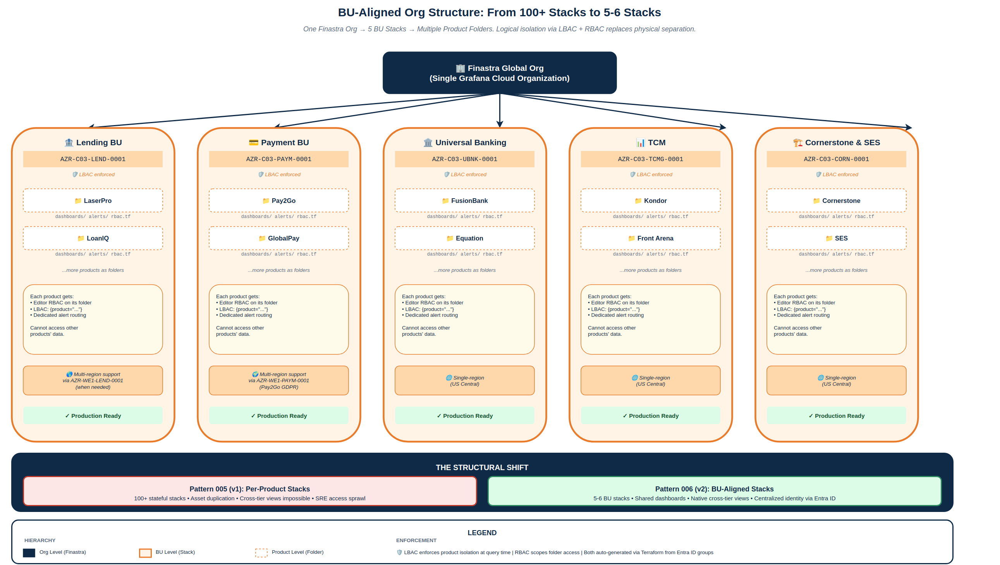
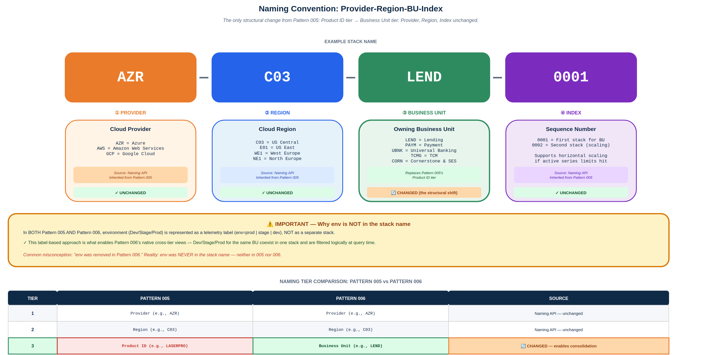
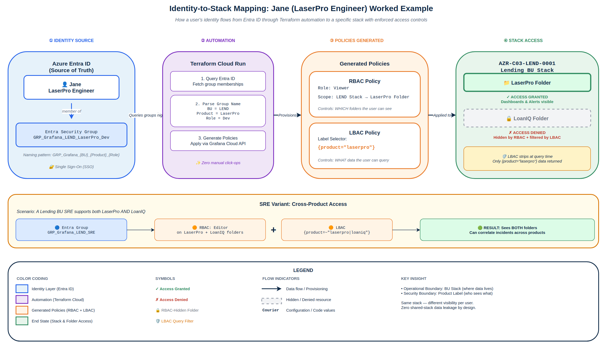
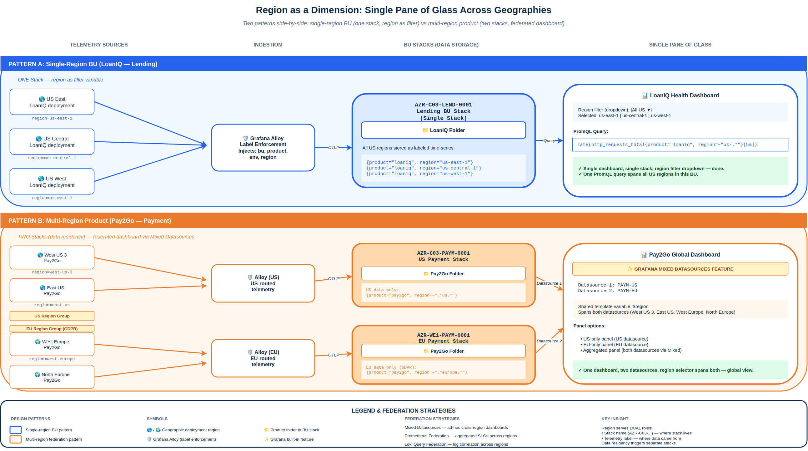
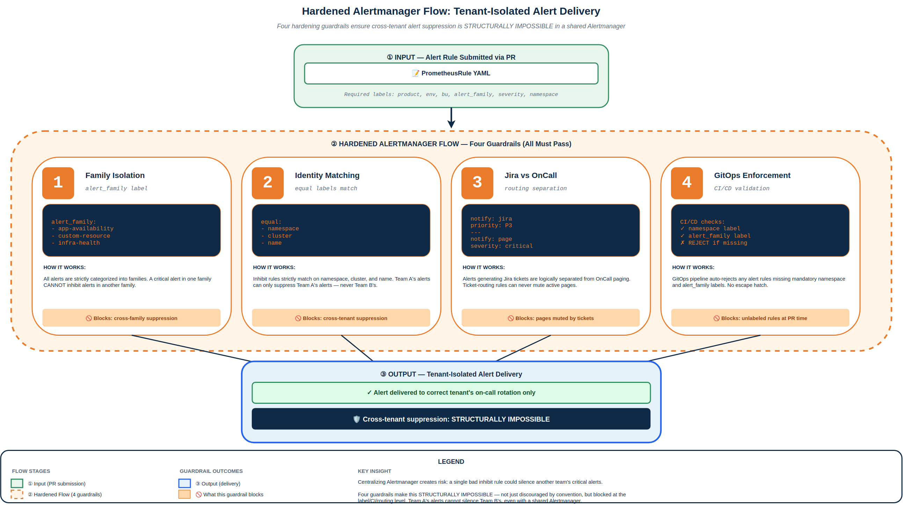
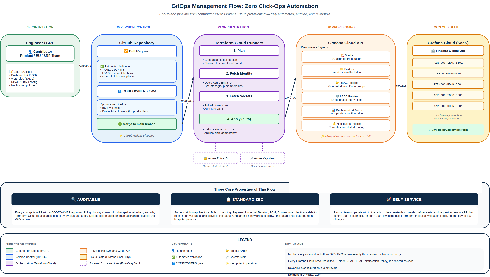
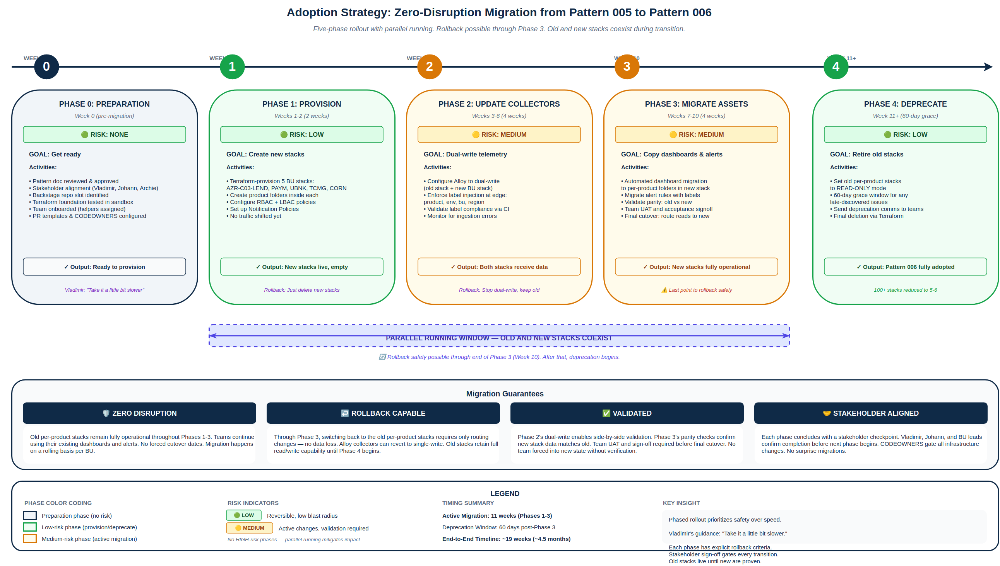

- Start Date: 2026-05-01
- Requirement/Feature Request Issue Num: SPS-2000

## Table of Contents

- [Table of Contents](#table-of-contents)
- [Executive Summary](#executive-summary)
- [Strategic Rationale](#strategic-rationale)
  - [Goals & Requirements](#goals--requirements)
  - [Non-Goals](#non-goals)
- [Detailed Design](#detailed-design)
  - [High-Level Architecture](#high-level-architecture)
  - [BU-Aligned Org Structure](#bu-aligned-org-structure)
  - [Naming Convention](#naming-convention)
  - [Consumption & Isolation](#consumption--isolation)
    - [Identity-to-Stack Mapping](#identity-to-stack-mapping)
    - [Region as a Dimension — Single Pane of Glass](#region-as-a-dimension--single-pane-of-glass)
  - [Centralized Alerting & Noise Reduction](#centralized-alerting--noise-reduction)
    - [Operational Flow — A 3 AM Incident Walkthrough](#operational-flow--a-3-am-incident-walkthrough)
  - [Management Flow](#management-flow)
  - [Repository Layout](#repository-layout)
  - [User Stories](#user-stories)
- [Comparative Analysis — Pattern 005 vs Pattern 006](#comparative-analysis--pattern-005-vs-pattern-006)
- [Acknowledged Drawbacks](#acknowledged-drawbacks)
- [Alternatives Considered](#alternatives-considered)
- [Adoption Strategy](#adoption-strategy)
- [Stakeholder Review — Resolved Concerns & Open Items](#stakeholder-review--resolved-concerns--open-items)
- [Enablement & Education](#enablement--education)
- [Security Implications](#security-implications)

---

## Executive Summary

This Pattern (v2) represents the strategic evolution of the Grafana Cloud stack management framework originally established in [Pattern 005](https://github.com/finastra-platform/PlatformArchitecture-docs/blob/main/patterns/005-grafana-cloud-management.md). Pattern 006 is purpose-built upon the consolidated **single Finastra Grafana Cloud organization** that Pattern 005 successfully delivered (unifying the four previously fragmented organizations — Development, QA, Pre-Production, and Production — into a coherent enterprise-grade platform).

While Pattern 005 established the foundational principles that have served Finastra well — a single tenant, GitOps-driven workflow, and Terraform-based automation — its implementation choice of a **per-Product stack model** has, at scale, produced significant architectural debt. This debt manifests as unsustainable operational sprawl, an escalating Total Cost of Ownership (TCO), and fragmented cross-product observability that impedes the operational excellence the platform was designed to enable.

Pattern 006 introduces a deliberate architectural shift to a **Business Unit (BU) aligned stack model**, consolidating an ecosystem of more than one hundred per-product stacks into approximately five to six BU-aligned stacks (Lending, Payment, Universal Banking, TCM, and Cornerstone). This consolidation is achieved without compromising the enterprise-grade security guarantees that Pattern 005 established.

The architectural insight that makes this consolidation safe is a clear separation between two distinct boundaries:

- **The View Stack (BU Level)** serves as the **Operational Boundary** — defining the scope of dashboards, alert routing, and SRE governance.
- **The Product Label** serves as the **Security Boundary** — enforcing strict, query-time data isolation between products that share a stack.

The model leverages Azure Entra ID as the canonical source of truth for identity, with Terraform automation generating Role-Based Access Control (RBAC) and Label-Based Access Control (LBAC) policies that bind directly to Entra security groups. Critically, Pattern 006 treats **region as a telemetry dimension** rather than an isolation boundary, enabling a true Single Pane of Glass experience for products such as Payments-to-Go that are deployed across multiple global geographies.

---

## Strategic Rationale

The original implementation of Pattern 005's per-Product stack model, while architecturally clean in isolation, has produced unsustainable operational consequences as the platform has scaled to support Finastra's full product portfolio. The accumulated architectural debt manifests in five distinct dimensions:

- **Operational Overhead at Enterprise Scale.** Governing, upgrading, patching, and auditing over one hundred individual stateful Grafana Cloud stacks consumes disproportionate platform engineering capacity. What scales linearly in stack count scales super-linearly in operational complexity.

- **Asset Duplication Across the Ecosystem.** Foundational infrastructure dashboards — Kubernetes cluster health, node utilization, network performance — must be deployed, versioned, and synchronized across every product stack. A single dashboard improvement requires more than one hundred coordinated deployments.

- **Identity Sprawl and Access Management Complexity.** DevOps and SRE teams that support multiple products are required to maintain disparate role assignments across dozens of isolated physical boundaries. This produces both an operational burden and an elevated security risk surface as access grants drift over time.

- **Siloed Cross-Tier Observability.** Physical separation between stacks inherently blocks cross-tier views (Development to Staging to Production), preventing precisely the regression analysis that distributed systems most need. Cross-product correlation within a single Business Unit is similarly precluded.

- **Fragmented Multi-Region Visibility.** Products with global footprints (Payments-to-Go is deployed across West US 3, East US, West Europe, and North Europe) require SREs to context-switch between disparate stacks to construct what should be a single global view. This fragmentation directly contradicts the operational excellence the platform was designed to enable.

Consolidation at the Business Unit level mitigates the blast radius of any individual misconfiguration while unlocking material gains in operational efficiency, scalability, and centralized governance. The enterprise-grade security posture is fully preserved — the change is structural, not regressive.

### Goals & Requirements

Pattern 006 is designed to strictly satisfy ten architectural requirements established by the Observability Pod leadership:

1. **Scalability.** The architecture must accommodate more than 2,500 users and over 100 products distributed across Business Units. Grafana Cloud's per-stack active series limits are explicitly accounted for by distributing load across BU-aligned stacks.

2. **Strict Product Isolation.** No product team may access telemetry data or operational assets (dashboards, alert rules) belonging to another product, even when those products coexist within the same BU stack. Isolation is enforced structurally through the combination of Folders, RBAC, and LBAC.

3. **Environment Tiering.** Development, Staging, and Production environments are logically separated to prevent operational noise, while residing within the same BU stack to enable opt-in cross-tier comparison views — a capability impossible under Pattern 005.

4. **Self-Service Operation.** Product teams are empowered to create, update, and delete their configuration assets (dashboards, alert rules, data source wiring) through Infrastructure-as-Code, without central team bottlenecks.

5. **Data Residency Compliance.** Stacks are provisioned in the specific Grafana Cloud regions that align with the data residency obligations of the workloads they observe.

6. **Cross-Product SRE Access.** DevOps and SRE teams may be granted precise access to the products they support across a Business Unit, without receiving blanket access to unrelated products.

7. **Cost Attribution.** All consumption is strictly attributable to specific products through the enforced label taxonomy, enabling accurate P&L chargeback even within consolidated stacks.

8. **Fully Automated Infrastructure-as-Code.** Zero manual click-ops. Stack creation, RBAC provisioning, and configuration wiring are one hundred percent automated.

9. **Single Pane of Glass.** Unified visibility for products deployed across multiple Azure regions is enabled without requiring users to switch between stacks.

10. **Identity-Driven Security.** Azure Entra ID group memberships map directly to Grafana permissions through automated provisioning, eliminating manual access management.

### Non-Goals

The following are explicitly out of scope for Pattern 006:

- **Application-level telemetry generation** — this Pattern relies on standard OpenTelemetry instrumentation practices and does not prescribe how individual products emit telemetry.
- **PCI-DSS and heavily regulated workload migration** — environments that require dedicated, physically isolated stacks for compliance reasons will continue to operate under Pattern 005's per-product model as explicit, documented exceptions. Physical isolation is preserved where regulation demands it.
- **Identity source replacement** — Pattern 006 inherits Pattern 005's Azure Entra ID identity model without modification. No new identity infrastructure is introduced.

---

## Detailed Design

### High-Level Architecture

The diagram below illustrates the end-to-end control plane, telemetry ingestion tier, and Grafana Cloud boundary that compose the BU-aligned model.



*Editable source: [01-high-level-architecture.drawio](./diagrams/01-high-level-architecture.drawio)*

The architecture is organized into four cooperating tiers: a Users and Identity tier anchored on Azure Entra ID; a GitOps Control Plane that orchestrates all configuration changes through Terraform Cloud; a Telemetry Ingestion tier where Grafana Alloy enforces label discipline at the edge; and the Grafana Cloud SaaS environment where five to six BU-aligned stacks host product folders and provide isolation through LBAC and RBAC policies.

### BU-Aligned Org Structure

The physical boundary transitions from over one hundred per-product stacks to approximately five to six BU-aligned stacks. Within each BU stack, individual products are logically segregated into dedicated folders.



*Editable source: [02-bu-aligned-org-structure.drawio](./diagrams/02-bu-aligned-org-structure.drawio)*

This structural model addresses the operational concerns of Pattern 005 while preserving all isolation requirements:

- **Empowerment Within Boundaries.** Product teams receive Editor and Administrator rights scoped specifically to their product folder through RBAC. They retain full self-service capability within their domain.
- **Data Residency Accommodation.** A single BU may operate multiple stacks across different geographies when required — for example, `AZR-C03-LEND-0001` in US Central and `AZR-WE1-LEND-0001` in West Europe — to satisfy regulatory data residency obligations.

### Naming Convention

The naming convention introduces precisely one structural change from Pattern 005: the **Product ID tier is replaced by the Business Unit tier**. The Provider, Region, and Index tiers continue to follow the Naming API conventions established in Pattern 005 without modification.



*Editable source: [03-naming-convention.drawio](./diagrams/03-naming-convention.drawio)*

Example: `AZR-C03-LEND-0001`

**A clarification on environments.** Neither Pattern 005 nor Pattern 006 includes `env` in the stack name. Environments (Development, Staging, Production) are represented as a telemetry label (`env=prod|stage|dev`), not as a separate stack. This characteristic is inherited unchanged from Pattern 005, and it is precisely what enables Pattern 006's native cross-tier views — Dev, Staging, and Production for the same BU coexist in a single stack and are filtered logically at query time through the `env` label.

**Naming Tier Comparison:**

| Tier | Pattern 005 | Pattern 006 | Source |
|------|-------------|-------------|--------|
| 1 | Provider (e.g., `AZR`) | Provider (e.g., `AZR`) | Naming API — unchanged |
| 2 | Region (e.g., `C03`) | Region (e.g., `C03`) | Naming API — unchanged |
| 3 | **Product ID** (e.g., `LASERPRO`) | **Business Unit** (e.g., `LEND`) | **Changed** — enables consolidation |
| 4 | Index (e.g., `0001`) | Index (e.g., `0001`) | Naming API — unchanged |

### Consumption & Isolation

Pattern 006 introduces a deliberate and important distinction between how the platform operates and how it secures data:

1. **The Operational Boundary — The Stack.** The physical Grafana Cloud stack defines the boundary for SRE operations, dashboard sharing, and BU-level governance. This is where platform engineering acts.

2. **The Security Boundary — The Label and Folder.** Access to data and operational assets is strictly controlled at the Product level through Labels (via LBAC) and Folders (via RBAC). This is where product teams are isolated from one another.

This distinction is foundational. Rather than relying on physical stack boundaries for isolation, Pattern 006 enforces isolation through three coordinated mechanisms: **Standardized Labels** that are mandatory on all ingested data, **RBAC** that scopes user permissions to specific folders, and **LBAC** that filters data at query time based on identity.

**Label Taxonomy — Mandatory on All Ingested Data:**

- `bu` — the Business Unit (e.g., `lending`)
- `product` — the Product identifier (e.g., `laserpro`)
- `env` — the Environment (e.g., `prod`, `stage`, `dev`)
- `region` — the deployment region (e.g., `eastus`, `westeurope`)

**How Isolation Requirements Are Fulfilled:**

- **Product Isolation.** LBAC policies generated by Terraform bind directly to Entra ID groups. A user in the LaserPro group receives an LBAC policy of `{product="laserpro"}` and is structurally incapable of querying data tagged with `product="loaniq"` — the query engine itself enforces the boundary.

- **Environment Isolation with Cross-Tier Visibility.** Because Development, Staging, and Production data for LaserPro reside in a single stack, they are separated logically through the `env` label. Dashboards default to `env="prod"` to suppress noise, and users may opt into cross-tier views by adjusting the dashboard variable to `env=~"prod|stage"` — a capability that was structurally impossible under Pattern 005.

- **Cross-Product SRE Access.** An SRE team supporting both LaserPro and Pay2Go is granted an LBAC policy of `{product=~"laserpro|pay2go"}` and assigned RBAC Editor permissions on both product folders. This replaces the multi-stack access management burden of Pattern 005 with a single, declarative policy.

#### Identity-to-Stack Mapping

Azure Entra ID remains the absolute Source of Truth for identity and group memberships — a direct inheritance from Pattern 005.

**Entra ID Security Group Naming Convention:**

```
GRP_Grafana_{BU}_{Product}_{Role}
```

Representative examples:

- `GRP_Grafana_LEND_LaserPro_Dev` — LaserPro developers, read-only access
- `GRP_Grafana_LEND_LaserPro_Admin` — LaserPro administrators, full folder control
- `GRP_Grafana_LEND_SRE` — Cross-product SRE access within the Lending BU
- `GRP_Grafana_PAYM_VP` — Payment BU Vice President, cost showback visibility

**Worked Example — Jane, a LaserPro Engineer in the Lending BU**

The following walkthrough demonstrates how Jane's identity flows from Entra ID through Terraform automation to a specific stack with enforced access controls. This example was prepared in response to a direct question raised during the architecture review: *"Which Grafana stack will I access, and how does access enforcement actually operate?"*

**Step 1 — Identity and Group Membership.** Jane authenticates through Azure Entra ID via Single Sign-On. Her Entra security group membership includes `GRP_Grafana_LEND_LaserPro_Dev`.

**Step 2 — Terraform Auto-Provisioning.** During the nightly Terraform Cloud run, the group `GRP_Grafana_LEND_LaserPro_Dev` is queried from Entra ID. Terraform then generates the following resources in Grafana Cloud:

- An **RBAC Role** granting Viewer permission scoped to `LEND Stack → LaserPro Folder`.
- An **LBAC Policy** of `{product="laserpro"}` bound to the Entra group.

**Step 3 — Stack and Folder Access.** When Jane logs in, she lands in the `AZR-C03-LEND-0001` Lending BU stack. Her experience is shaped entirely by the generated policies:

- She sees only the LaserPro folder. The LoanIQ folder is hidden by RBAC.
- Her queries return only telemetry tagged with `product="laserpro"`, enforced by LBAC at query execution time.
- She is structurally incapable of seeing LoanIQ data, despite that data physically residing in the same stack.

**Step 4 — Multi-Product SRE Variant.** A Lending BU SRE member of `GRP_Grafana_LEND_SRE` receives:

- An **LBAC Policy** of `{product=~"laserpro|loaniq"}`.
- **RBAC Editor permissions** on both the LaserPro and LoanIQ folders.

This SRE sees both folders and can correlate incidents across products within their BU — a workflow that required multi-stack access management under Pattern 005.



*Editable source: [06-identity-to-stack-mapping.drawio](./diagrams/06-identity-to-stack-mapping.drawio)*

#### Region as a Dimension — Single Pane of Glass

Pattern 006 resolves the fragmented multi-region visibility problem inherent in Pattern 005 by treating region as a telemetry dimension rather than an isolation boundary. This design choice — raised explicitly during the architecture review — enables a true Single Pane of Glass experience for products with global footprints.

**Design Choice — Region as Label, Not Boundary**

In Pattern 006, region appears in **two distinct places** with different roles:

| Where | Role | Example |
|-------|------|---------|
| **Stack Name** | Routing and hosting — identifies where the stack physically resides | `AZR-`**`C03`**`-LEND-0001` (Central US) |
| **Telemetry Label** | Query-time filter — identifies where the telemetry originated | `region=us-east-1`, `region=west-europe` |

This dual treatment enables two distinct deployment patterns:

- **Single-region Business Units** (such as Lending, which deploys LoanIQ across US-only regions) operate from a single stack with region used as a dashboard filter variable.
- **Multi-region products** (such as Pay2Go with its global footprint) span multiple stacks via federation when data residency obligations require physical separation.



*Editable source: [07-region-as-dimension.drawio](./diagrams/07-region-as-dimension.drawio)*

**Worked Example 1 — LoanIQ (Single-Region BU)**

- **Deployment footprint:** East US, Central US, West US — all within US Azure regions.
- **Stacks involved:** One — `AZR-C03-LEND-0001` (US Central).
- **How it works:** All three US regions send telemetry to the same Lending stack via Grafana Alloy. Each metric is tagged with its originating region (`region=us-east-1`, `region=us-central-1`, or `region=us-west-1`). Dashboards use region as a template variable for filtering.

**PromQL example:**

```promql
rate(http_requests_total{product="loaniq", region=~"us-.*"}[5m])
```

**SRE experience:** One dashboard, one stack, a region filter dropdown — operational complexity is minimized.

**Worked Example 2 — Payments-to-Go (Multi-Region Global)**

This is the precise scenario raised during the architecture review.

- **Deployment footprint:** West US 3, East US, West Europe, North Europe.
- **Stacks involved:** Two, due to data residency obligations:
  - `AZR-C03-PAYM-0001` — serving US regions
  - `AZR-WE1-PAYM-0001` — serving EU regions
- **How it works:** US-originated telemetry routes to the US stack; EU-originated telemetry routes to the EU stack (preserving GDPR compliance). Cross-region dashboards utilize Grafana's Mixed Datasource feature to unify the view.

**Single Pane of Glass dashboard composition:**

- A single Grafana dashboard with two datasources configured (US PAYM and EU PAYM).
- A shared template variable `$region` that spans both datasources.
- Dashboard panels can display US-only metrics, EU-only metrics, or aggregated metrics across both.

**SRE experience:** One dashboard, two datasources, a region selector that spans both — the global view is achieved without context switching between stacks.

**Federation Strategies — Three Approaches Based on Use Case**

| Strategy | When to Use | How It Works |
|----------|-------------|--------------|
| **Mixed Datasources** | Ad-hoc cross-region views; interactive dashboards | Configure multiple datasources in a single Grafana organization; dashboards reference both |
| **Prometheus Federation** | Aggregated metrics; alerting on global SLOs | Configure the `federate` endpoint between stacks; aggregate metrics at a parent stack |
| **Loki Query Federation** | Log correlation across regions | Utilize Loki's multi-tenant query path with tenant headers |

**Data Residency Considerations**

- Workloads governed by **EU GDPR** or **US data localization** regulations must remain in their regional stack. Raw user data cannot cross boundaries.
- Cross-region querying is permitted for **metadata and aggregate metrics** (request counts, latency percentiles, SLO calculations).
- Cross-region querying is prohibited for **raw user data** (individual transaction logs containing personally identifiable information).
- This restriction is enforced at the LBAC layer for sensitive label values.

### Centralized Alerting & Noise Reduction

Consolidating over one hundred per-product stacks into a shared BU-aligned architecture necessarily centralizes Alertmanager operation. Without rigorous controls, a single poorly written inhibition rule by one product team could inadvertently suppress critical alerts for another product team — a cross-tenant suppression risk that did not exist under Pattern 005's physical isolation model.



*Editable source: [04-hardened-alertmanager-flow.drawio](./diagrams/04-hardened-alertmanager-flow.drawio)*

To eliminate this risk structurally, the architecture implements a **Hardened Alertmanager Flow** comprising four coordinated guardrails:

- **Family Isolation (`alert_family`).** All alerts are strictly categorized into defined families (`app-availability`, `custom-resource`, `infra-health`). A critical alert in one family is structurally incapable of inhibiting alerts in another family.

- **Identity Matching (`equal` labels).** Inhibition rules must strictly match on `namespace`, `cluster`, and `name`. This ensures that Team A's critical database alert can only suppress Team A's own minor database alerts, with Team B completely isolated.

- **Jira and OnCall Separation.** Alerts that generate Jira tickets (`notify: jira` with `priority` labels) are logically separated from OnCall paging alerts (`severity` labels). Ticket-routing rules can never mute active paging alerts.

- **GitOps Enforcement.** The GitOps pipeline automatically rejects any alert rules that lack the mandatory `namespace` and `alert_family` labels. Compliance is enforced before merge, not after deployment.

**Isolated Alert Delivery in a Shared Stack**

Within a shared BU stack, multiple products share a single Alertmanager instance. Tenant isolation is maintained through Label-Routing implemented in four layers:

1. **Enforced Labels.** Every alert rule must include `product` and `env` labels. CI validation rejects non-conforming rules at PR time.

2. **Notification Policies.** Terraform provisions specific Notification Policies in Alertmanager that route alerts based on the `product` label.

3. **Dedicated Receivers.** Alerts for `product="laserpro"` are routed to LaserPro's specific PagerDuty rotation, Slack channels, and email distribution. Alerts for `product="pay2go"` route to their own dedicated receivers. The two cannot intermix.

4. **Inhibition Isolation.** Inhibition rules are strictly scoped to the `product` label, ensuring that an alert in Product A cannot inadvertently suppress alerts in Product B under any circumstance.

#### Operational Flow — A 3 AM Incident Walkthrough

To make the operational behavior concrete, the following walkthrough traces a real-world incident scenario through the architecture from alert firing to delivery. This walkthrough was prepared in response to the architecture review feedback requesting clarity on *how* the system operates, not merely *what* its components are.

**Scenario:** LaserPro's production database begins emitting errors at 3 AM local time.

**Step 1 — Alert Fires.** The PrometheusRule defined in `organisations/Lending/LaserPro/alerts/database.yaml` triggers. The alert carries the following labels:

- `product=laserpro`
- `bu=lend`
- `env=prod`
- `alert_family=app-availability`
- `severity=critical`
- `namespace=laserpro-prod`

**Step 2 — Alertmanager Receives and Evaluates.** The routing tree evaluates the labels in defined precedence order. The match condition `notify=page` combined with `severity=critical` selects the OnCall paging path.

**Step 3 — Inhibition Check Performs Tenant Isolation.** Active inhibition rules are evaluated using the `equal: [namespace, cluster, name]` matcher. Because LaserPro's namespace (`laserpro-prod`) is structurally distinct from LoanIQ's namespace (`loaniq-prod`), cross-product suppression is mathematically impossible. Within LaserPro itself, the same-family check permits inhibition of LaserPro's own lower-priority alerts only.

**Step 4 — Delivery to the Correct Tenant.** The alert is delivered to LaserPro's PagerDuty rotation, as specified by the matching Notification Policy. The LoanIQ team continues sleeping — they are not paged. No Jira ticket is created, because `severity=critical` does not match `notify=jira`.

**Step 5 — Failure Modes and Their Handling.**

- A missing `product` label causes CI rejection at PR time (GitOps Enforcement guardrail).
- A missing `alert_family` label likewise causes CI rejection at PR time.
- A PagerDuty API outage triggers fallback to email delivery as defined in the Notification Policy.
- An empty OnCall rotation triggers escalation to the BU lead, per policy.

This walkthrough demonstrates that cross-tenant suppression is **structurally impossible** in this design — it is prevented by the architecture itself, not merely discouraged by convention or operational practice.

### Management Flow



*Editable source: [05-gitops-management-flow.drawio](./diagrams/05-gitops-management-flow.drawio)*

The deployment and management flow remains mechanically identical to the model defined by Pattern 005, enforcing the "no manual click-ops" principle:

1. A contributor updates Infrastructure-as-Code in the `main` branch.
2. The Pull Request receives approval from Product CODEOWNERS.
3. Merge to `main` triggers GitHub Actions.
4. The release branch triggers Terraform Cloud execution.
5. Terraform reconciles Grafana Cloud state (Stacks, Folders, Data Sources, RBAC, LBAC) and Azure Entra ID groups.

**Terraform Cloud Runners** handle execution and orchestrate the underlying integrations:

- Queries Azure Entra ID to fetch the latest security group memberships.
- Interfaces with the Grafana Cloud API to provision and synchronize organization state.
- Securely retrieves credentials and tokens from Azure Key Vault.

**Backstage Integration.** Per architectural alignment with the Platform Engineering team (Taylor and Johann), the Grafana Cloud ecosystem will integrate into the **Backstage Developer Portal** for discovery, access linkage, and self-service onboarding. The exact integration slot within the Backstage repository layout is being finalized — see [Open Items](#stakeholder-review--resolved-concerns--open-items).

### Repository Layout

The repository layout is structured to group configurations first by Business Unit and then by Product, mirroring the operational hierarchy:

```bash
├── .github/
│   └── CODEOWNERS               # Permission configuration per BU and Product
├── organisations/               
│   ├── Lending/                 # BU Level
│   │   ├── main.yaml            # BU-level defaults
│   │   ├── LaserPro/            # Product folder
│   │   │   ├── dashboards/      # Product-specific dashboards
│   │   │   ├── alerts/          # Product-specific alert rules
│   │   │   └── main.yaml        # Product configuration (RBAC, LBAC mappings)
│   │   └── LoanIQ/
│   │       ├── dashboards/
│   │       ├── alerts/
│   │       └── main.yaml
│   ├── Payment/
│   │   ├── main.yaml
│   │   ├── Pay2Go/
│   │   │   ├── dashboards/
│   │   │   ├── alerts/
│   │   │   └── main.yaml
│   │   └── GlobalPay/
│   │       ├── dashboards/
│   │       └── main.yaml
│   └── main.yaml                # Global fallback configuration
```

### User Stories

> [!NOTE]
> The user stories below illustrate the design intent across the primary personas this architecture serves. More granular technical user stories — covering failure recovery, audit workflows, and sandbox validation — will be drafted during implementation sprint planning.

#### Story 1 — Cost Attribution

> **As** a Finastra Vice President
> **I want** to see precisely how much Grafana Cloud consumption is attributable to the LaserPro product
> **So that** I can accurately chargeback the cost to the appropriate P&L.

**Implementation:** With stacks consolidated by Business Unit, billing at the stack level reflects the BU's total consumption. Terraform provisions cost-attribution dashboards within each stack that filter the `grafanacloud_usage` metrics by the enforced `product` label, surfacing exact active series counts, log volume, and trace span costs per product.

#### Story 2 — Multi-Region Single Pane of Glass

> **As** a Pay2Go SRE
> **I want** to see latency metrics across all four deployment regions (US East, US West 3, West Europe, North Europe) within a single dashboard
> **So that** I can identify regional performance regressions immediately, without context-switching between stacks.

**Implementation:** A single Pay2Go dashboard is provisioned with two Grafana datasources — `PAYM-US` and `PAYM-EU` — each pointing to the corresponding regional stack. A shared `$region` template variable allows the SRE to filter by individual region or aggregate across all four. Mixed datasource panels display both regions side by side. See [Region as a Dimension](#region-as-a-dimension--single-pane-of-glass) for the full technical treatment.

#### Story 3 — Cross-Product SRE Access

> **As** a Lending BU SRE
> **I want** access to observability data for both LaserPro and LoanIQ
> **So that** I can correlate incidents across products within my BU without requiring access to multiple stacks.

**Implementation:** The SRE is added to the `GRP_Grafana_LEND_SRE` Entra security group. Terraform automatically provisions an LBAC policy of `{product=~"laserpro|loaniq"}` along with RBAC Editor permissions on both product folders within the `AZR-C03-LEND-0001` stack. The SRE accesses unified dashboards correlating data across both products from a single Grafana session.

#### Story 4 — Strict Product Isolation

> **As** a LaserPro developer
> **I want** to access only LaserPro telemetry, never LoanIQ data
> **So that** my BU enforces strict product boundaries even within a shared stack.

**Implementation:** The developer is added to `GRP_Grafana_LEND_LaserPro_Dev`. Terraform generates an LBAC policy of `{product="laserpro"}` along with RBAC Viewer permission scoped exclusively to the LaserPro folder. The LoanIQ folder is hidden from the developer's UI, and direct PromQL queries for LoanIQ data return zero results — the isolation is enforced at the query engine level, not by policy convention.

#### Story 5 — New Product Onboarding

> **As** a Product Owner for a new product joining Finastra's observability platform
> **I need** to onboard my product with the appropriate access controls and folder structure
> **So that** my team can begin collecting and visualizing telemetry quickly, without manual intervention by the platform team.

**Implementation:** The Product Owner submits a Pull Request to `organisations/{BU}/{NewProduct}/main.yaml` defining the product's Entra group mappings, folder permissions, and label requirements. Upon merge, Terraform Cloud automatically:

1. Creates the product folder within the appropriate BU stack.
2. Generates RBAC policies derived from the specified Entra groups.
3. Provisions an LBAC policy of `{product="newproduct"}`.
4. Configures the Alloy ingestion endpoint with enforced label injection.
5. Creates default dashboard scaffolding for the team to customize.

End-to-end provisioning typically completes within fifteen to thirty minutes following PR merge. No manual click-ops in the Grafana UI are required.

---

## Comparative Analysis — Pattern 005 vs Pattern 006

| Dimension | Pattern 005 (Per-Product Stacks) | Pattern 006 (BU-Aligned Stacks) |
|-----------|----------------------------------|----------------------------------|
| **Management Overhead** | High — over 100 stacks to maintain | Low — approximately 5 to 6 stacks |
| **Cross-Tier Environment Views** | Structurally impossible | Natively supported via `env` label |
| **Cross-Region Single Pane of Glass** | Difficult — requires stack switching | Native via region labels and datasource federation |
| **SRE Multi-Product Access** | Complex — multi-stack access management | Simple — combined LBAC and RBAC in one stack |
| **Data Isolation** | Physical (Stack level) | Logical (LBAC + RBAC level) |
| **Cost Attribution** | Native (per-stack billing) | Label-based (requires disciplined labeling) |
| **Identity Integration** | Per-stack RBAC | Centralized via Entra ID groups |
| **Alert Tenant Isolation** | Implicit (separate Alertmanagers) | Explicit (Hardened Alertmanager with label routing) |
| **Operational Blast Radius** | Contained to a single product | Mitigated by hardened guardrails |
| **Upgrade and Patching** | Coordinated across 100+ instances | Coordinated across approximately 5 to 6 |

---

## Acknowledged Drawbacks

Pattern 006 introduces material benefits, but it is not without trade-offs. The following drawbacks are explicitly acknowledged:

- **Reliance on Label Discipline.** Isolation and cost attribution depend entirely on the strict enforcement of ingestion labels (`product="xyz"`). Should ingestion pipelines fail to inject these labels, data attribution will fail. This risk is mitigated by enforcing label injection at the Alloy collector level and rejecting non-conforming telemetry at ingestion.

- **Cost Attribution Complexity.** Pattern 005 offered native per-stack billing, which provided straightforward attribution. Pattern 006 requires label-based filtering of `grafanacloud_usage` metrics — more complex to implement, but capable of providing product-level granularity that Pattern 005 could not.

- **Alertmanager Centralization Risk.** A misconfigured inhibition rule could, in principle, affect multiple products within the same BU stack. This risk is mitigated by the four-guardrail Hardened Alertmanager Flow described above, which makes cross-tenant suppression structurally impossible.

- **Multi-Region Migration Complexity.** Products distributed across the four legacy Finastra organizations (Dev, QA, PreProd, Prod) require careful staged migration with parallel operation. The Adoption Strategy addresses this through phased rollout with rollback capability through Phase 3.

---

## Alternatives Considered

Three alternative architectures were considered and explicitly rejected:

- **Continue with Pattern 005 (Per-Product Stacks).** Rejected due to the unsustainable operational burden of managing hundreds of stateful environments and the structural inability to provide cross-tier observability. The status quo is not viable at projected scale.

- **Single Finastra Global Stack.** Rejected due to guaranteed scaling-limit breaches (active series limits per stack) and an excessive blast radius if any configuration is corrupted. A single global stack would convert every minor incident into a platform-wide event.

- **Per-Region Stacks (Geographic Boundary).** Rejected because this approach fragments product views across geographies and forces SREs to context-switch between stacks for global products such as Pay2Go — the precise problem Pattern 006 sets out to solve.

---

## Adoption Strategy

The adoption strategy is intentionally measured. Per the architecture review guidance, the rollout prioritizes safety and validation over speed. Old and new stacks operate in parallel throughout the transition, and rollback is technically possible through the end of Phase 3.



*Editable source: [08-adoption-strategy.drawio](./diagrams/08-adoption-strategy.drawio)*

**Phase 0 — Preparation (Week 0).** Before any provisioning begins, several preconditions must be met:

1. Pattern 006 reference architecture approved by all stakeholders (Vladimir, Johann, Archie).
2. Backstage integration slot identified through alignment with Taylor and Johann.
3. Terraform foundation validated in a sandbox environment.
4. Team members onboarded with assigned responsibilities from the observability pod.

**Phase 1 — Provision New Stacks (Weeks 1 to 2, Risk: Low).** Create the BU-aligned stacks via Terraform. No telemetry traffic is shifted at this stage; the new stacks exist in parallel with the existing per-product stacks.

**Phase 2 — Update Collectors (Weeks 3 to 6, Risk: Medium).** Shift telemetry ingestion endpoints from the old per-product stacks to the new BU-aligned stacks. Alloy collectors operate in dual-write mode during this phase, sending telemetry simultaneously to both old and new stacks while enforcing label injection (`product`, `env`, `bu`, `region`) at the edge.

**Phase 3 — Migrate Assets (Weeks 7 to 10, Risk: Medium).** Use automation to copy dashboards and alert rules from old stacks into their corresponding product folders in the new stacks. Validate parity between old and new before any read-path cutover. This is the final phase in which rollback remains straightforward.

**Phase 4 — Deprecate (Week 11 and Beyond, Risk: Low).** Set old per-product stacks to read-only mode. Maintain a 60-day grace window to surface any late-discovered issues. Delete the deprecated stacks via Terraform after the grace window concludes.

---

## Stakeholder Review — Resolved Concerns & Open Items

### Concerns Resolved During Architecture Review (May 2026, with V. Babichev)

**Q1: Which Grafana stack does a product user land in, and how does the access path operate?**

**Resolution:** A complete identity-to-stack mapping is documented in the [Identity-to-Stack Mapping](#identity-to-stack-mapping) section, including the Jane (LaserPro engineer) worked example that traces the full flow from Entra ID group membership through Terraform-generated policies to enforced folder and data access. An accompanying diagram (`06-identity-to-stack-mapping`) provides the visual reference.

**Q2: How does multi-region Single Pane of Glass operate for products such as Pay2Go that are deployed across multiple geographies?**

**Resolution:** The [Region as a Dimension](#region-as-a-dimension--single-pane-of-glass) section documents this in full, with two contrasting worked examples — LoanIQ (single-region, one stack with region as filter) and Pay2Go (multi-region, two stacks with Mixed Datasource federation). Three federation strategies are catalogued for different use cases. An accompanying diagram (`07-region-as-dimension`) shows both patterns side by side.

**Q3: Why is region treated as a telemetry label rather than as an isolation boundary?**

**Resolution:** Region appears in both the stack name (for routing and hosting) and as a telemetry label (for query-time filtering). This dual treatment enables federation and unified visibility, while data residency obligations still trigger separate regional stacks where legally required. The design choice and trade-offs are documented in the same section.

**Q4: How does isolated alert delivery operate in a shared Alertmanager environment?**

**Resolution:** The [Operational Flow — A 3 AM Incident Walkthrough](#operational-flow--a-3-am-incident-walkthrough) provides an end-to-end trace from alert firing through inhibition checks to tenant-isolated delivery, including failure modes and their handling. The walkthrough demonstrates that cross-tenant suppression is structurally impossible by design.

### Open Items — To Be Resolved

- **Backstage Repository Integration Slot.** Pending synchronization with the Platform Engineering team (Taylor and Johann) to identify the precise location within the Backstage repository layout where Grafana Cloud integration will reside.

- **Cross-BU SRE Access Workflow.** The approval flow for SREs requesting access that spans multiple Business Units (for example, members of shared platform services teams) will be finalized during the upcoming sprint planning session.

- **Backstage Onboarding Template Structure.** The self-service template for "New Product Onboarding" requires design alignment with the Backstage team before implementation.

- **Sandbox Environment Specifications.** Resource sizing and access controls for the sandbox stack used during Phase 0 are pending capacity review.

---

## Enablement & Education

The successful adoption of Pattern 006 depends on bringing the entire platform user base — engineers, SREs, product owners, and executives — onto a shared mental model of how the architecture operates. The enablement plan addresses this through four streams:

- **Documentation Refresh.** Existing platform documentation will be updated to emphasize Folder and LBAC concepts rather than Stack concepts. The mental model shifts from "find the stack for your product" to "find your folder within your BU."

- **Label Taxonomy Governance.** The labeling taxonomy (`bu`, `product`, `env`, `region`) will be documented as a strict governance artefact with examples, validation rules, and consequences for non-compliance.

- **Persona-Based Runbooks.** Onboarding runbooks will be created for each of the three primary personas — Product Developer, DevOps and SRE, and VP/P&L Owner — guiding each persona through their specific workflows in the new model.

- **Migration Guide.** A comprehensive migration guide will be authored for teams transitioning from Pattern 005 per-product stacks to Pattern 006 BU-aligned folders, including step-by-step instructions, validation checkpoints, and rollback procedures.

---

## Security Implications

Pattern 006 relies materially on LBAC and RBAC as the primary mechanisms of data isolation. A misconfigured LBAC policy in Terraform could, in principle, expose one product's data to another product team within the same stack. To eliminate this risk, the following controls are implemented:

- **Strict PR Validation.** Automated CI checks ensure that all LBAC policies match the `CODEOWNERS` hierarchy. PRs that introduce cross-product LBAC grants without explicit authorization are rejected before merge.

- **Two-Person Review for LBAC Changes.** Any change to an LBAC policy requires approval from both the product CODEOWNER and a member of the platform engineering team. No single individual can unilaterally alter access boundaries.

- **Comprehensive Audit Trail.** All RBAC and LBAC changes are logged through Terraform Cloud audit logs and replicated to Azure Sentinel for security operations review and long-term retention.

- **Drift Detection.** Nightly Terraform plan executions check for manual changes made outside the GitOps flow. Any detected drift triggers an alert to the platform engineering team for investigation.

- **Data Residency Enforcement.** Workloads carrying EU GDPR or other regulated data labels (`residency=gdpr`) are filtered at the LBAC level to prevent inadvertent cross-region exposure, regardless of user role.

These controls operate in defense-in-depth fashion: a single failure does not produce a data exposure, and every security-relevant change is auditable, reviewable, and reversible.