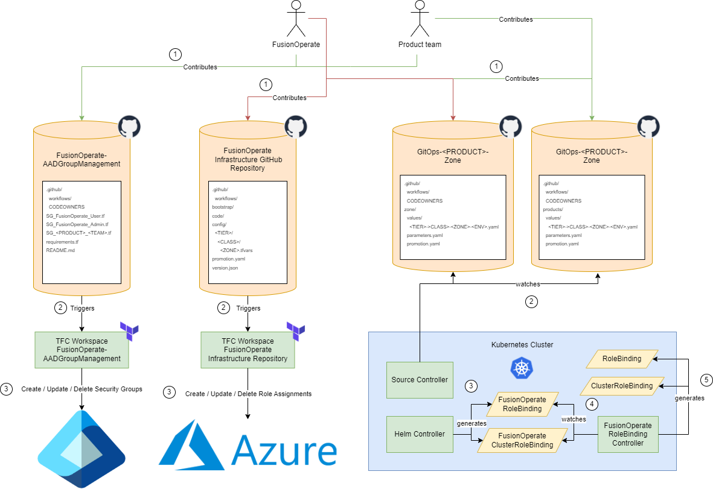

- Start Date: 2024-01-31
- Requirement/Feature Request Issue Num: 23

## Motivation

Management of Azure resource access control for users/teams has not been a very well-documented or formalized process at Finastra.
Some of this management currently occurs using automation (such as provisioning of Microsoft Entra ID Security Groups via Terraform,
zone role assignment via Terraform, etc.) whilst a large part of the management still occurs manually.

The archicture decision record(s) and pattern(s) proposed in this document aim to:

- Formalize Azure resource access control
- Formalize [Microsoft Entra ID](https://learn.microsoft.com/en-us/entra/fundamentals/whatis) authentication integration with services
  providing their own role-based access control (RBAC)

## Summary

This pattern outlines the use of new FusionOperate automation / processes to formalize Azure resource access control as well as access control
for resources that support Microsoft Entra ID authentication integration.

### Overview

Access management for cloud resources is a critical function for any organization that is using the cloud.

[Azure role-based access control (Azure RBAC)](https://learn.microsoft.com/en-us/azure/role-based-access-control/overview) helps you manage
who has access to Azure resources, what they can do with those resources, and what areas they have access to.
Access to Azure resources using Azure RBAC occurs by assigning Azure roles.  An Azure RBAC role assignment consists of three elements:
[security principal](https://learn.microsoft.com/en-us/azure/role-based-access-control/overview#security-principal),
[role definition](https://learn.microsoft.com/en-us/azure/role-based-access-control/overview#role-definition),
and [scope](https://learn.microsoft.com/en-us/azure/role-based-access-control/overview#scope).

Additionally, some Azure and non-Azure resources provide their own role-based access control (RBAC) which can be integrated with Microsoft Entra ID
authentication.  Examples of such resources include: [Azure Kubernetes service (AKS)](https://azure.microsoft.com/en-us/products/kubernetes-service),
[Azure Redhat Openshift (ARO)](https://azure.microsoft.com/en-us/products/openshift), [Aqua](https://www.aquasec.com/),
[MongoDB Atlas](https://www.mongodb.com/atlas/database), and [Grafana Cloud](https://grafana.com/products/cloud/).

The intent of the architecture decision record(s) and pattern(s) referenced in this pattern is to formalize how FusionOperate
will manage security principals, role definitions, and role assignments for Azure resources.

## Security Principal Management

### Patterns

[Security Principal Management](001-tenant-rbac/security-principal-management.md)

## Role Definition Management

### Patterns

[Kubernetes RBAC](001-tenant-rbac/kubernetes-rbac.md)

## Role Assignment Management

### Architecture Decision Records

[Azure resource role assignment](../adr/0008-azure-resource-role-assignment.md)

### Patterns

[Azure resource role assignment](001-tenant-rbac/azure-rbac.md)

[Kubernetes RBAC](001-tenant-rbac/kubernetes-rbac.md)
