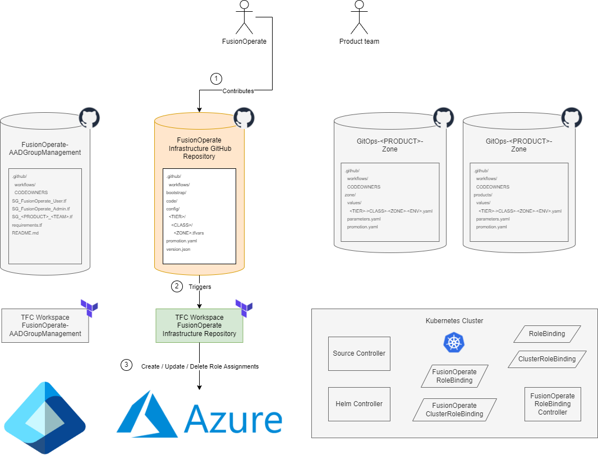
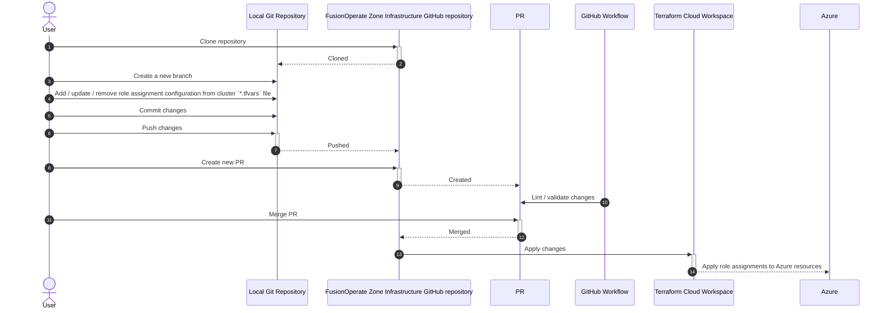
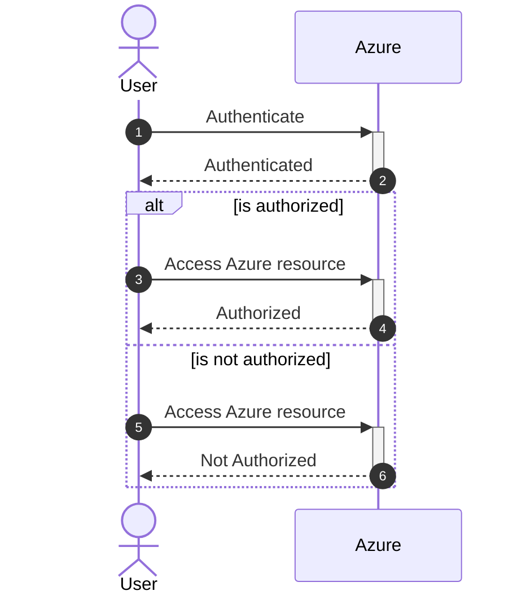

- Start Date: 2024-01-31
- Requirement/Feature Request Issue Num: 23

## Motivation

The process of managing Azure resource access control has not been well defined for some at Finastra.

This pattern aims to define the process and ownership of Azure resource role assignment while building upon existing FusionOperate
role-based access control (RBAC) patterns and processes.

This pattern is being proposed to promote security of Azure resources managed by both FusionOperate as well as Product teams.

## Summary

Access management for cloud resources is a critical function for any organization that is using the cloud.

[Azure role-based access control (Azure RBAC)](https://learn.microsoft.com/en-us/azure/role-based-access-control/overview) helps you
manage who has access to Azure resources, what they can do with those resources, and what areas they have access to.

FusionOperate is __responsible__ and __accountable__ for provisioning and access control of common infrastructure such as Kubernetes clusters, firewalls,
dns zones, etc. (referred to as `Zone` resources) in single-tenant and mult-tenant FusionOperate environments.

Product teams are __responsible__ and __accountable__ for provisioning and access control of their own infrastructure (such as Kubernetes cluster nodepools,
keyvaults, storage accounts, etc.).

This pattern proposes updating existing FusionOperate automation that deploys common FusionOperate infrastructure to perform Azure resource role assignment.
Role assignment will be made using Microsoft Entra ID Security Groups as security principals as proposed in the [Security Principal Management](security-principal-management.md) pattern.

## Detailed Design

### Tools

__Azure role-based access control (RBAC)__

Azure role-based access control (Azure RBAC) helps you manage who has access to Azure resources, what they can do with those resources,
and what areas they have access to.

The way you control access to Azure resources using Azure RBAC is to assign Azure roles.
A role assignment consists of three elements: [security principal](https://learn.microsoft.com/en-us/azure/role-based-access-control/overview#security-principal),
[role definition](https://learn.microsoft.com/en-us/azure/role-based-access-control/overview#role-definition), and
[scope](https://learn.microsoft.com/en-us/azure/role-based-access-control/overview#scope).

For more information about Azure RBAC, see the documentation [here](https://learn.microsoft.com/en-us/azure/role-based-access-control/overview).

__Terraform Cloud Workspace__

[Terraform](https://www.terraform.io/) is an infrastructure as code tool that enables you to safely and predictably provision and manage
infrastructure in any cloud.

Working with [Terraform](https://www.terraform.io/) involves managing collections of infrastructure resources, and most organizations
manage many different collections.

When run locally, Terraform manages each collection of infrastructure with a persistent working directory, which contains a configuration,
state data, and variables.

[Terraform Cloud](https://app.terraform.io) manages infrastructure collections with workspaces instead of directories. A workspace contains
everything Terraform needs to manage a given collection of infrastructure, and separate workspaces function like completely separate working directories.

For more information about Terraform Cloud Workspaces, see the documentation [here](https://developer.hashicorp.com/terraform/cloud-docs/workspaces).

__Microsoft Entra ID Security Group__

Microsoft Entra ID provides several ways to manage access to resources, applications, and tasks. With Microsoft Entra groups, you can grant access and
permissions to a group of users instead of for each individual user.

Leveraging Microsoft Entra groups:

- Simplifies role management
- Ensures consistent access
- Makes auditing permissions more straightforward

Assigning roles to a group instead of individuals allows for easy addition or removal of users from a role and creates consistent permissions
for all members of the group.

For more information about Microsoft Entra ID Security Groups, see the documentation [here](https://learn.microsoft.com/en-us/entra/fundamentals/concept-learn-about-groups).

__FusionOperate AKS Env Terraform Module__

The [app.terraform.io/Finastra/aks_env/fo Terraform module](https://dev.azure.com/ProvidesTerraform/Terraform%20Modules/_git/terraform-fo-aks_env)
bootstraps a FusionOperate `zone` by provisioning Azure infrastructure such as an Kubernetes cluster, virtual network, DNS zones, and keyvault.

### Design

This pattern proposes updating the [FusionOperate AKS Env Terraform Module](https://dev.azure.com/ProvidesTerraform/Terraform%20Modules/_git/terraform-fo-aks_env)
to support configurable role assignment for FusionOperate infrastructure provisioned by the terraform module.  Security principals and the roles they should be
assigned will be passed to the module for each FusionOperate Azure resource provisioned by the terraform module.

Integrating role assignment at the terraform module level where the Azure resources are deployed ensures that appropriate role assignment
permissions are met (the permissions of the security principal provisioning the Azure resources are sufficient for role assignment as well).
Additionally, integrating role assignment at the terraform module level ensures that Azure resource deployment and role assignment occur as one step.

As FusionOperate __owns__ the FusionOperate GitHub repositories containing the terraform code that invokes the terraform module above, FusionOperate
__owns__ the corresponding role assignment configuration.

Existing FusionOperate infrastructure GitHub repositories (such as `AKS-Env` repositories) will be updated with appropriate role assignment configuration.

New FusionOperate infrastructure GitHub repositories (such as `AKS-Env` repositories) will have default role assignment configuration specified, which
can be updated if needed with appropriate role assignment configuration.

Assuming the following Microsoft Entra ID Security Groups have been provisioned for FusionOperate:

- __FusionOperate_User__ (not jit-enabled; may have Product Security Groups as members of this group)
- __FusionOperate_Admin__ (jit-enabled; FusionOperate team only)

default role assignment configuration may be to map:

- __FusionOperate_User__ -> __Reader__
- __FusionOperate_Admin__ -> __Contributor__ or __Owner__

for each FusionOperate Azure resource provisioned by FusionOperate infrastructure GitHub repositories.

FusionOperate will work with Product teams to identify appropriate role assignments for FusionOperate Azure resources.

Product teams __own__ their own process / automation for provisioning and access control of their own infrastructure. 

### Usecases

#### Configure Azure resource role-based access control (RBAC)

__Scenario__

- User clones the FusionOperate GitHub repository managing FusionOperate Zone infrastructure (i.e. `FusionOperate-<Product>-AKS-Zones`).
- User creates a new branch on the locally cloned git repository.
- User adds / updates / removes role assignment configuration from the desired cluster `*.tfvars` file under the `config` directory.
  Role assignment configuration should allow for specifying the role assignment
  [scope](https://learn.microsoft.com/en-us/azure/role-based-access-control/overview#scope) (i.e. Zone infrastructure resource),
  [security principal](https://learn.microsoft.com/en-us/azure/role-based-access-control/overview#security-principal), and
  [role](https://learn.microsoft.com/en-us/azure/role-based-access-control/overview#role-definition) to be assigned.
- User commits the changes above to the locally cloned git repository.
- User pushes the changes above to the FusionOperate GitHub repository managing FusionOperate Zone infrastructure.
- User creates a new PR to merge the changes above to the FusionOperate GitHub repository `master` branch.
- GitHub Workflow lints / validates the changes above.
- User merges PR changes to the FusionOperate GitHub repository `master` branch.
- GitHub Workflows apply the role assignment changes to the Azure resources via a Terraform Cloud Workspace.

__Sequence Diagram__

__Azure Resource RBAC Scenario References__

1. [Azure Resource Management RBAC (control plane) - FusionOperate Azure Resources](<Azure Resource RBAC Scenarios.md#fusionoperate-azure-resources>)

    FusionOperate manages role assignments for __all__ FusionOperate Azure resources.  These role assignments should provide access
    to all of the scenarios described in the link above.

1. [Azure Resource RBAC (data plane) - Azure Keyvaults](<Azure Resource RBAC Scenarios.md#azure-keyvaults>)

    FusionOperate manages role assignments for __all__ FusionOperate Azure resources.  These role assignments should provide access for
    scenarios 1, 2, and 3 described in the link above.

1. [Azure Resource RBAC (data plane) - Azure Storage Accounts](<Azure Resource RBAC Scenarios.md#azure-storage-accounts>)

    FusionOperate manages role assignments for __all__ FusionOperate Azure resources.  These role assignments should provide access for
    scenarios 1, 2, and 3 described in the link above.

1. [Azure Resource RBAC (data plane) - Azure Container Registires](<Azure Resource RBAC Scenarios.md#azure-container-registries>)

    FusionOperate manages role assignments for __all__ FusionOperate Azure resources.  These role assignments should provide access for
    scenarios 1, 2, and 3 described in the link above.

1. [Azure Resource RBAC (data plane) - Azure Log Analytics Workspaces](<Azure Resource RBAC Scenarios.md#azure-log-analytics-workspaces>)

    FusionOperate manages role assignments for __all__ FusionOperate Azure resources.  These role assignments should provide access for
    scenarios 1 and 2 described in the link above.

#### Azure resource authorization

1. Authenticating user has Azure resource permission(s)

   __Scenario__

   - User authenticates against Azure using Azure Portal or `az` cli providing their Entra ID credentials.
   - Azure authorizes user based on user role assignments (including those roles assigned to Micrsoft Entra ID Security Groups that the
     user belongs to).
   - User is able to see / take actions against Azure resource(s) based on authorized permissions.

1. Authenticating user lacks Azure resource permission(s)

   __Scenario__

   - User authenticates against Azure using Azure Portal or `az` cli providing their Entra ID credentials.
   - Azure authorizes user based on user role assignments (including those roles assigned to Micrsoft Entra ID Security Groups that the
     user belongs to).
   - User is unable to see / take actions against Azure resource(s) where they lack permissions.

__Sequence Diagram__

__Azure Resource RBAC Scenario References__

1. [Azure Resource Management RBAC (control plane)](<Azure Resource RBAC Scenarios.md#azure-resource-management-rbac-control-plane>)

   Product teams __own__ their own process / automation for provisioning and access control of their own infrastructure. 

1. [Azure Resource RBAC (data plane) - Azure Keyvaults](<Azure Resource RBAC Scenarios.md#azure-keyvaults>)

   Product teams __own__ their own process / automation for provisioning and access control of their own infrastructure. 

1. [Azure Resource RBAC (data plane) - Azure Storage Accounts](<Azure Resource RBAC Scenarios.md#azure-storage-accounts>)

   Product teams __own__ their own process / automation for provisioning and access control of their own infrastructure. 

1. [Azure Resource RBAC (data plane) - Azure Container Registires](<Azure Resource RBAC Scenarios.md#azure-container-registries>)

   Product teams __own__ their own process / automation for provisioning and access control of their own infrastructure. 

1. [Azure Resource RBAC (data plane) - Azure Log Analytics Workspaces](<Azure Resource RBAC Scenarios.md#azure-log-analytics-workspaces>)

   Product teams __own__ their own process / automation for provisioning and access control of their own infrastructure. 

### Integration with existing ecosystem

FusionOperate Azure resource access control has long been an unformalized process.  Integration of this pattern will allow FusionOperate
the ability to manage authorization to FusionOperate Azure resources in a formal, automated fashion.

This pattern is intended to complement or replace any existing manual or automated Azure role assignment processes.

Product Azure resource role assignment is still owned by product teams and is not impacted by the introduction of this pattern.

### Future State

## Drawbacks
  
## Alternatives

## Adoption strategy

To adopt this pattern

- FusionOperate clusters onboarding the new design will leverage the updated FusionOperate AKS Env Terraform module
  described in the design above.
- Appropriate role assignment configuration (Microsoft Entra ID Security Group / roles) should be identified and configured for the FusionOperate
  Zone infrastructure onboarding the new design.

## How we teach this

- Updated documentation (FusionOperate Zone infrastructure GitHub repo documentation, FusionOperate docs site, etc.)

## Security Implications

The intent of this pattern is to formalize for adoption Azure resource access control processes.  This implies that security of FusionOperate
Azure resources will become more standardized and documented.

## Unresolved questions
