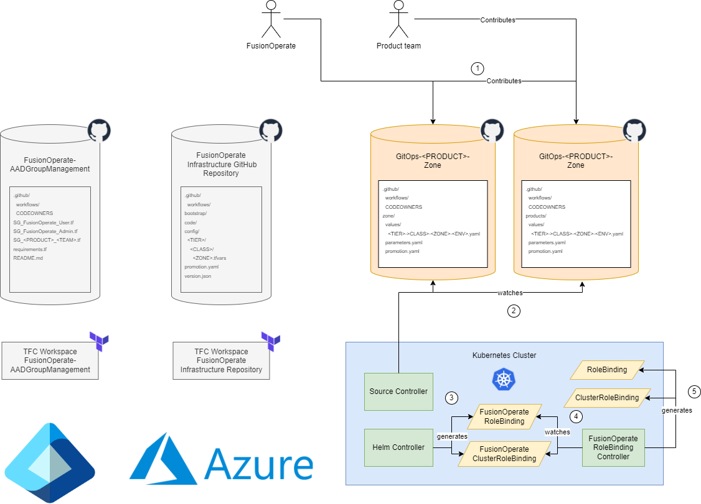
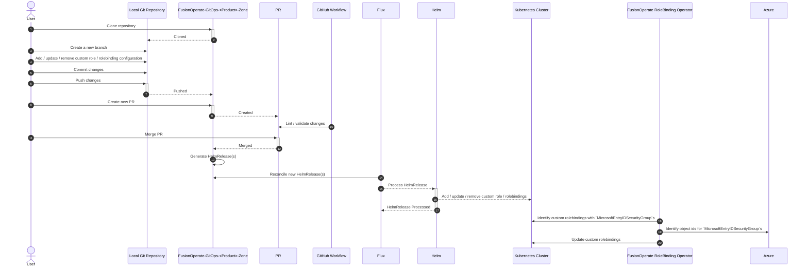
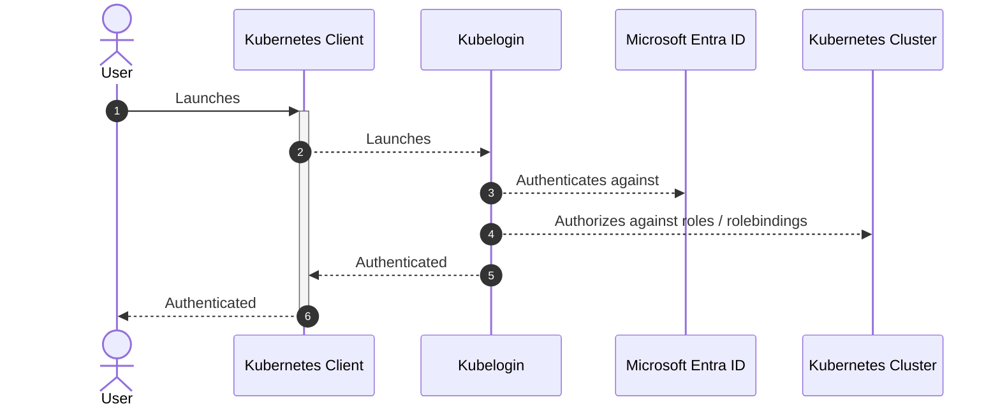

- Start Date: 2024-01-31
- Requirement/Feature Request Issue Num: 23

## Motivation

As part of providing a secure environment for customers leveraging FusionOperate Kubernetes clusters, managing access to the clusters is of paramount
importance.

This pattern proposes a mechanism for managing access to Kubernetes resources by leveraging
[Microsoft Entra ID](https://learn.microsoft.com/en-us/entra/fundamentals/whatis) for user authentication along with
[Kubernetes role-based access control](https://kubernetes.io/docs/reference/access-authn-authz/rbac/).

## Summary

[Kubernetes role-based access control (RBAC)](https://kubernetes.io/docs/reference/access-authn-authz/rbac/) provides a method of regulating access
to Kubernetes computer or network resources based on the roles and group memberships of individual users within your organization.

Azure kubernetes services (such as [AKS](https://learn.microsoft.com/en-us/azure/aks/intro-kubernetes),
[ARO](https://learn.microsoft.com/en-us/azure/openshift/intro-openshift), etc.) can be configured to use
[Microsoft Entra ID](https://learn.microsoft.com/en-us/entra/fundamentals/whatis) for user authentication. With this configuration, you sign in to an Azure
kubernetes service using a Microsoft Entra authentication token. Once authenticated, the built-in
[Kubernetes role-based access control (Kubernetes RBAC)](https://kubernetes.io/docs/reference/access-authn-authz/rbac/) can be used to manage access to
namespaces and cluster resources based on the user's identity or group membership.

## Detailed Design

### Tools

__Microsoft Entra ID__

Microsoft Entra ID is a cloud-based identity and access management service that enables your employees access to external resources.  With Microsoft
Entra groups, you can grant access and permissions to a group of users instead of for each individual user.

For more information about Microsoft Entra ID, see the documentation [here](https://learn.microsoft.com/en-us/entra/).

__Kubernetes role-based access control (RBAC)__

Kubernetes role-based access control (RBAC) is a method of regulating access to computer or network resources based on the roles of individual users
within your organization.

Kubernetes RBAC authorization uses the `rbac.authorization.k8s.io` API group to drive authorization decisions, allowing you to dynamically configure
policies through the Kubernetes API.

For more information about Kubernetes RBAC, see the documentation [here](https://kubernetes.io/docs/reference/access-authn-authz/rbac/).

__FusionOperate RoleBinding Operator__

The FusionOperate RoleBinding Operator is a new [Kubernetes operator](https://kubernetes.io/docs/concepts/extend-kubernetes/operator/) that will
be created that monitors `FusionOperateRoleBinding` and `FusionOperateClusterRoleBinding` custom resources at configurable intervals and generates
appropriate Kubernetes RoleBinding and ClusterRoleBinding resources.

Specifically, this operator will allow users to specify group subjects referencing Microsoft Entra ID Security Groups by name
(`MicrosoftEntraIDSecurityGroup`) and will generate appropriate Kubernetes role bindings with the group subject pointing to the Microsoft Entra
ID Security Group object id.

__FusionOperate Product Environment Helm Chart__

The [product-environment](https://github.com/finastra-engineering/fusion-operate-charts/tree/main/charts/product-environment) helm chart can be used
to deploy namespace(s), service account(s), and rolebinding(s) in a Kubernetes cluster for a Product.  Rolebinding(s) are created for the provisioned
service account(s) to the `cluster-admin` role.

### Prerequisites

This pattern requires that FusionOperate kubernetes services are configured to use [Microsoft Entra ID](https://learn.microsoft.com/en-us/entra/)
for user authentication.

__Azure Kubernetes Service__

Clusters provisioned using the [app.terraform.io/Finastra/aks/azure Terraform module](https://dev.azure.com/ProvidesTerraform/Terraform%20Modules/_git/terraform-azure-aks) have [Kubernetes role-based access control](https://kubernetes.io/docs/reference/access-authn-authz/rbac/) enabled by default.
Additionally, clusters provisioned using the [app.terraform.io/Finastra/aks/azure Terraform module](https://dev.azure.com/ProvidesTerraform/Terraform%20Modules/_git/terraform-azure-aks) are configured to use Microsoft Entra ID for user
authentication.  Configuring the `azure_rbac_enabled` variable of the Terraform module allows you to indicate whether role-based access control will be based on
Azure AD role configuration, or whether [Kubernetes role-based access control](https://kubernetes.io/docs/reference/access-authn-authz/rbac/) will be
the sole source of truth.  By default `azure_rbac_enabled` is set to `false`.

This pattern requires that role-based access control based on Azure AD role configuration is __disabled__.
This ensures that we are using a standard form of role-based access control in __all__ FusionOperate Kubernetes clusters.

Clusters provisioned using the [app.terraform.io/Finastra/isolated_aks_env/azure Terraform module](https://dev.azure.com/ProvidesTerraform/Terraform%20Modules/_git/terraform-azure-isolated_aks_env) have role-based access control based on Azure AD
role configuration `disabled`.

For more information, see the following [documentation](https://learn.microsoft.com/en-us/azure/aks/azure-ad-rbac?tabs=portal).

__Azure Redhat Openshift__

Clusters provisioned using the [app.terraform.io/Finastra/aro_arm_template/azure Terraform module](https://dev.azure.com/ProvidesTerraform/Terraform%20Modules/_git/terraform-azure-aro_arm_template) have
[Kubernetes role-based access control](https://kubernetes.io/docs/reference/access-authn-authz/rbac/) enabled by default.  Such clusters __are not__
configured to use Microsoft Entra ID for user authentication by default.

Clusters provisioned using the [app.terraform.io/Finastra/aro_env/fo Terraform module](https://dev.azure.com/ProvidesTerraform/Terraform%20Modules/_git/terraform-fo-aro_env) __are__ configured to use Microsft Entra ID for user authentication.

For more information, see the following [documentation](https://learn.microsoft.com/en-us/azure/openshift/configure-azure-ad-ui).

### Design

This pattern relies on [Kubernetes role-based access control (RBAC)](https://kubernetes.io/docs/reference/access-authn-authz/rbac/) to regulate
access to FusionOperate Kubernetes cluster resources.

In Kubernetes, [Roles](https://learn.microsoft.com/en-us/azure/aks/concepts-identity#roles-and-clusterroles) define the permissions to grant, and
[RoleBindings](https://learn.microsoft.com/en-us/azure/aks/concepts-identity#rolebindings-and-clusterrolebindings) apply them to desired users or groups.
These assignments can be applied to a given namespace, or across the entire cluster.

When Kubernetes is integrated with Microsoft Entra ID for authentication, Kubernetes RBAC rolebinding(s) can reference Microsoft Entra ID users and groups.
Microsoft Entra ID users should be assigned to rolebinding(s) using the user's `userPrincipalName (UPN)` or `objectId`.  Microsoft Entra ID Security Groups
should be assigned to rolebinding(s) using the group's `objectId`.

As referencing Microsoft Entra ID Security Groups by their `objectId` in Kubernetes role binding(s) is not ideal, a new
[Kubernetes operator](https://kubernetes.io/docs/concepts/extend-kubernetes/operator/) will be introduced into each zone to facilitate translating
Microsoft Entra ID Security Group names to their corresponding object ids in Kubernetes role binding(s).  The operator will monitor
`FusionOperateRoleBinding` and `FusionOperateClusterRoleBinding` custom resources at configurable intervals and generate Kubernetes RoleBinding and
ClusterRoleBinding resources with `MicrosoftEntraIDSecurityGroup` subjects translated to `Group` subjects with names set to their corresponding
Microsoft Entra ID Security Group object ids.

To facilitate bootstrapping of Azure kubernetes service Kubernetes role-based access control configuration, the following changes will be made to
the [product-environment](https://github.com/finastra-engineering/fusion-operate-charts/tree/main/charts/product-environment) helm chart:

1. The helm chart will be enhanced to allow creating role(s)/cluster role(s) as well as FusionOperate rolebinding(s)/cluster rolebinding(s)
   based on passed configuration.

By default, the [product-environment](https://github.com/finastra-engineering/fusion-operate-charts/tree/main/charts/product-environment) helm chart
will **not** create any default role(s) / cluster role(s) or FusionOperate rolebinding(s) / cluster rolebinding(s) as the `product-environment` helm chart
is used for `zone` as well as `products` GitOps initialization.

The [FusionOperate-GitOpsPP-Copier](https://github.com/finastra-platform/FusionOperate-GitOpsPP-Copier) template will be updated so that the `zone`
and `products` releases will generate default role(s) / cluster role(s) and FusionOperate rolebinding(s) / cluster rolebinding(s).  This is to facilitate
bootstrapping `zone` and `products` GitOps repositories with default Kubernetes RBAC configuration.

With these changes FusionOperate will be able to manage [Kubernetes role-based access control (RBAC)](https://kubernetes.io/docs/reference/access-authn-authz/rbac/) configuration for single and multi tenant FusionOperate clusters.  Additionally, Product teams will be able to manage
[Kubernetes role-based access control (RBAC)](https://kubernetes.io/docs/reference/access-authn-authz/rbac/) configuration under the scope of their
purview (whether the Product teams are leveraging a single or multi tenant FusionOperate cluster).

For example, FusionOperate could configure FusionOperate cluster rolebinding(s) for FusionOperate Microsoft Entra ID Security Groups for the `cluster-admin`
role using the `zone` release in the `zone` GitOps repository.  This would allow FusionOperate to manage and access all resources associated with the Kubernetes
cluster.  FusionOperate could then configure Product team rolebinding(s) for Product Microsoft Entra ID Security Groups for the `cluster-admin` role in a
product-specific namespace in the cluster using the `products` release in the `products` GitOps repository.  This would allow the Product team to manage
and access resources only associated with the product-specific namespace in the Kubernetes cluster.  The Product team could also then deploy their own custom
role(s) / rolebinding(s) in the product-specific namespace, allowing them to specify even more granular access control over their resources.

When identifying role(s) / rolebinding(s) to be created, teams should leverage the principle of
[least privilege](https://en.wikipedia.org/wiki/Principle_of_least_privilege).



### Usecases

#### Configure Kubernetes RBAC

1. FusionOperate Kubernetes cluster configured with no custom roles / rolebindings.

   __Scenario__

   - User clones the `FusionOperate-GitOps-<Product>-Zone` GitHub repository.
   - User creates a new branch on the locally cloned git repository.
   - User removes custom role / rolebinding configuration from the `zone` `parameters.yaml` file and
     any cluster specific `values` yaml file.
   - User commits the changes above to the locally cloned git repository.
   - User pushes the changes above to the `FusionOperate-GitOps-<Product>-Zone` GitHub repository.
   - User creates a new PR to merge the changes above to the `FusionOperate-GitOps-<Product>-Zone` GitHub repository `main` branch.
   - GitHub Workflow lints / validates the changes above.
   - User merges PR changes to the `FusionOperate-GitOps-<Product>-Zone` GitHub repository `main` branch.
   - GitHub Workflow generates new HelmRelease(s) on the `FusionOperate-GitOps-<Product>-Zone` GitHub repository `release` branch.
   - Flux invokes Helm to reconcile updated HelmRelease(s)
   - Helm removes custom roles / rolebindings in the cluster

1. FusionOperate Kubernetes cluster configured with custom roles / rolebindings.

   __Scenario__

   - User clones the `FusionOperate-GitOps-<Product>-Zone` GitHub repository.
   - User creates a new branch on the locally cloned git repository.
   - User adds / updates custom role / rolebinding configuration to the `zone` `parameters.yaml` file and / or
     any cluster specific `values` yaml file.
   - User commits the changes above to the locally cloned git repository.
   - User pushes the changes above to the `FusionOperate-GitOps-<Product>-Zone` GitHub repository.
   - User creates a new PR to merge the changes above to the `FusionOperate-GitOps-<Product>-Zone` GitHub repository `main` branch.
   - GitHub Workflow lints / validates the changes above.
   - User merges PR changes to the `FusionOperate-GitOps-<Product>-Zone` GitHub repository `main` branch.
   - GitHub Workflow generates new HelmRelease(s) on the `FusionOperate-GitOps-<Product>-Zone` GitHub repository `release` branch.
   - Flux invokes Helm to reconcile updated HelmRelease(s)
   - Helm generates / updates custom roles / rolebindings in the cluster

1. FusionOperate Kubernetes cluster configured with cutom rolebinding referencing Microsoft Entra ID Security Group

   __Scenario__

   - User clones the `FusionOperate-GitOps-<Product>-Zone` GitHub repository.
   - User creates a new branch on the locally cloned git repository.
   - User adds / updates custom rolebinding configuration referencing Microsoft Entry ID Security Group(s) to the `zone` `parameters.yaml`
     file and / or any cluster specific `values` yaml file.
   - User commits the changes above to the locally cloned git repository.
   - User pushes the changes above to the `FusionOperate-GitOps-<Product>-Zone` GitHub repository.
   - User creates a new PR to merge the changes above to the `FusionOperate-GitOps-<Product>-Zone` GitHub repository `main` branch.
   - GitHub Workflow lints / validates the changes above.
   - User merges PR changes to the `FusionOperate-GitOps-<Product>-Zone` GitHub repository `main` branch.
   - GitHub Workflow generates new HelmRelease(s) on the `FusionOperate-GitOps-<Product>-Zone` GitHub repository `release` branch.
   - Flux invokes Helm to reconcile updated HelmRelease(s)
   - Helm generates / updates custom rolebindings in the cluster
   - FusionOperate RoleBinding Operator identifies that a custom rolebinding generated by Helm above references a Microsoft Entry ID Security Group
   - FusionOperate RoleBinding Operator identifies the correposnding object id for the referenced Microsoft Entra ID Security Group and
     generates a new rolebinding with the object id as a subject.

__Sequence Diagram__



__Azure Resource RBAC Scenario References__

1. [Azure Resource RBAC (data plane) - Azure Kubernetes Cluster](<Azure Resource RBAC Scenarios.md#azure-kubernetes-cluster>)

#### Kubernetes Authentication and Authorization

1. User authenticates into FusionOperate Kubernetes cluster.

   __Prerequisites__

   - User has updated their local kubeconfig with appropriate cluster / user configuration.

     ```shell
     az account set --subscription <subscription>
     az aks get-credentials -n <cluster-name> -g <resource-group>
     ```

   - The kubeconfig current context references the cluster and user mentioned above.

   __Scenario__

   - User launches `kubectl` or similar tool to manage the Kubernetes cluster.
   - `kubelogin` is launched to perform authentication using Microsoft Entra ID
   - User authenticates against Microsoft Entra ID
   - Kubernetes cluster authorizes user based on available roles / rolebindings deployed in the cluster.

1. User associated with Microsoft Entra Security Group authenticates into FusionOperate Kubernetes cluster.

   __Prerequisites__

   - User has updated their local kubeconfig with appropriate cluster / user configuration.

     ```shell
     az account set --subscription <subscription>
     az aks get-credentials -n <cluster-name> -g <resource-group>
     ```

   - The kubeconfig current context references the cluster and user mentioned above.

   __Scenario__

   - User launches `kubectl` or similar tool to manage the Kubernetes cluster.
   - `kubelogin` is launched to perform authentication using Microsoft Entra ID
   - User authenticates against Microsoft Entra ID
   - Kubernetes cluster authorizes user based on available roles / rolebindings deployed in the cluster that
     have a group matching the Microsoft Entra Security Grup associated with the user.

__Sequence Diagram__



__Azure Resource RBAC Scenario References__

1. [Azure Resource RBAC (data plane) - Azure Kubernetes Cluster](<Azure Resource RBAC Scenarios.md#azure-kubernetes-cluster>)

### Integration with existing ecosystem

FusionOperate Kubernetes cluster authorization has long been an unformalized process.  Integration of this pattern will allow FusionOperate as well as Product
teams the ability to manage authorization in FusionOperate clusters in a formal, automated fashion complementary to the existing use of
Kubernetes RBAC by service accounts in FusionOperate clusters today.

Additionally, further enhancements to the [product-environment](https://github.com/finastra-engineering/fusion-operate-charts/tree/main/charts/product-environment) helm chart could be made to allow for the creation of additional services accounts (other than just the `gitops` and `gitops-admin` accounts)
which could leverage the new role / role binding support added to the helm chart discussed above.

### Future State

## Drawbacks
  
## Alternatives

- Leverage a Kubernetes configmap published to each Kubernetes cluster to perform Microsoft Entra ID Security Group name to Microsoft Entra ID
  Security Group object id mapping.  The Kubernetes configmap could be published to the Kubernetes cluster using the
  [FusionOperate AKS Cluster Bootstrap Terraform Module](https://dev.azure.com/ProvidesTerraform/Terraform%20Modules/_git/terraform-fo-aks_cluster_bootstrap).
  This alternative was not chosen as a static list of Microsoft Entra ID Security Groups to be published to the configmap would need to be supplied
  to the FusionOperate AKS Cluster Bootstrap terraform module.  Additionally, there would be the possibility of the Kubernetes configmap data becoming stale
  as the process of managing the configmap is separate from the process of managing the Microsoft Entra ID Security Groups.
- Leverage the Terraform Cloud Operator (TFCO) to lookup Microsoft Entra ID Security Group object ids and generate appropriate RoleBindings /
  ClusterRolebindings in the Kubernetes clusters.
- Leverage [Azure RBAC](https://learn.microsoft.com/en-us/azure/aks/manage-azure-rbac) rather than Kubernetes RBAC for authorization.  This option was not
  chosen as leveraging Kubernetes RBAC is more generic and applicable to multi-cloud.

## Adoption strategy

To adopt this pattern

- FusionOperate clusters onboarding the new design will deploy the FusionOperate RoleBinding Operator.
- FusionOperate clusters onboarding the new design will leverage the updated
  [product-environment](https://github.com/finastra-engineering/fusion-operate-charts/tree/main/charts/product-environment) helm chart described
  in the design above.
- Appropriate configuration (roles / role bindings / Microsoft Entra ID Security Groups) should be identified and configured for the FusionOperate
  clusters onboarding the new design.

## How we teach this

- Updated documentation ([product-environment](https://github.com/finastra-engineering/fusion-operate-charts/tree/main/charts/product-environment)
  documentation, FusionOperate docs site, etc.)

## Security Implications

The intent of this pattern is to formalize for adoption Kubernetes access control processes.  This implies that security of FusionOperate clusters
will become more standardized and documented.

## Unresolved questions
