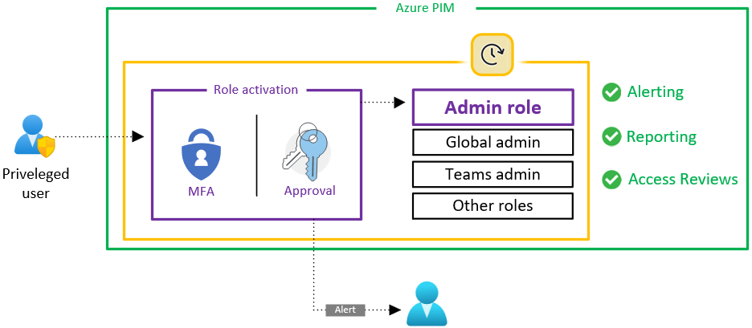
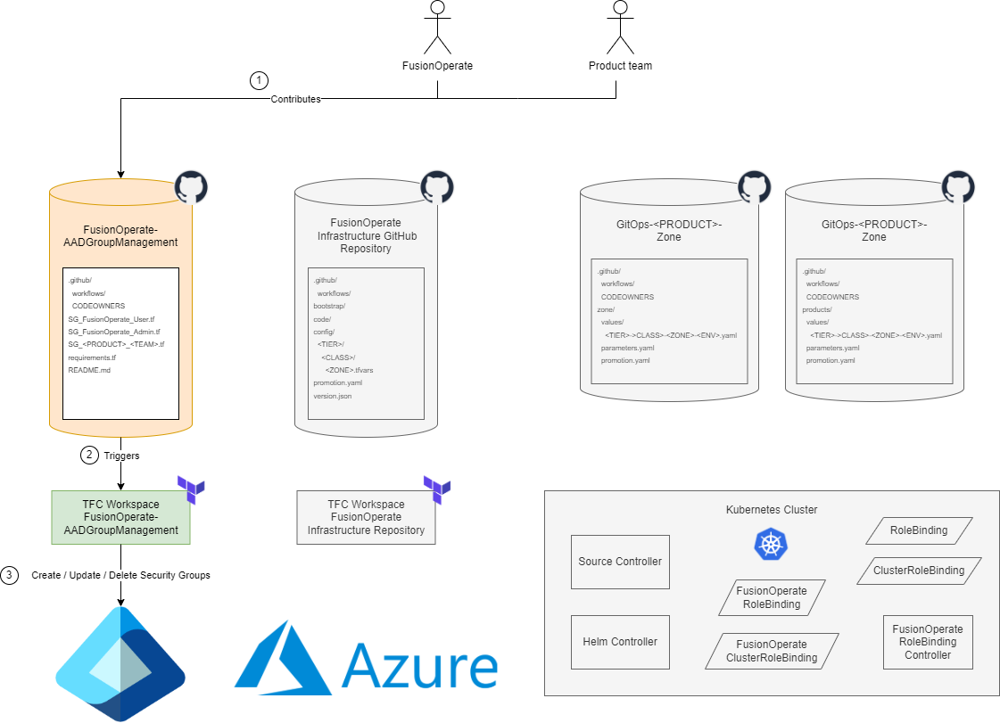
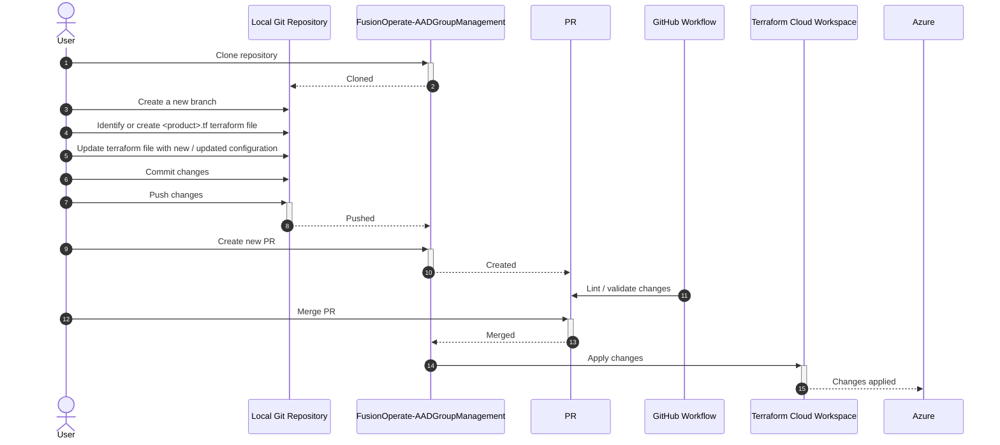
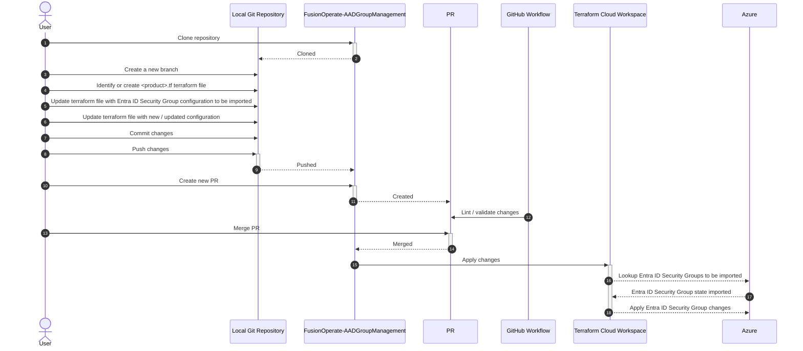
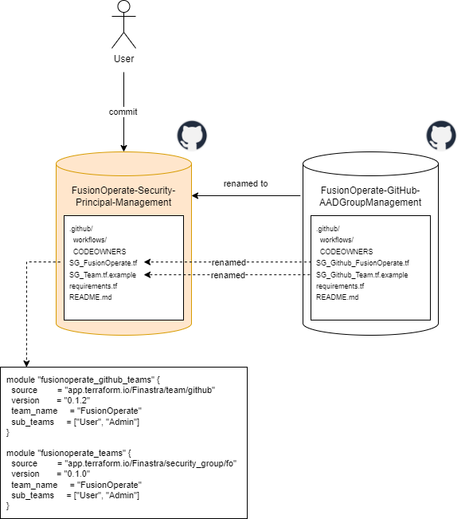
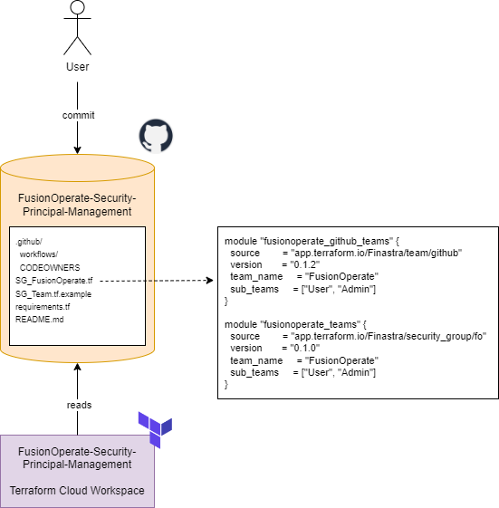
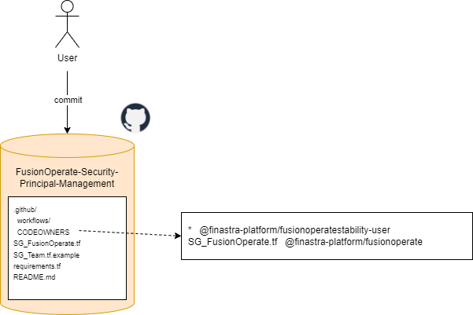
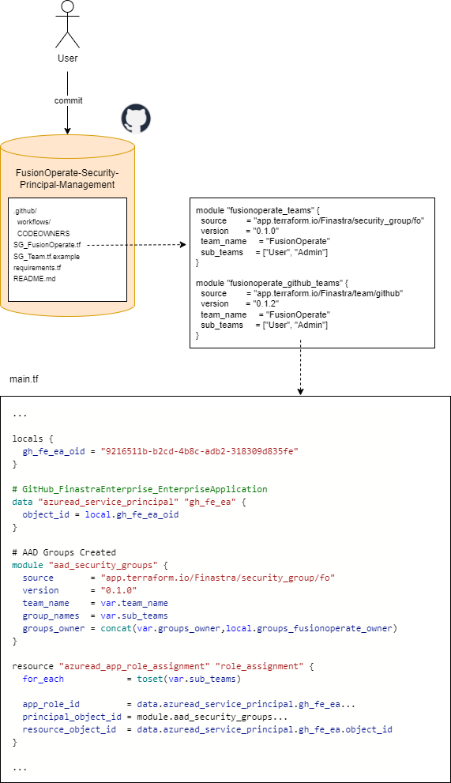
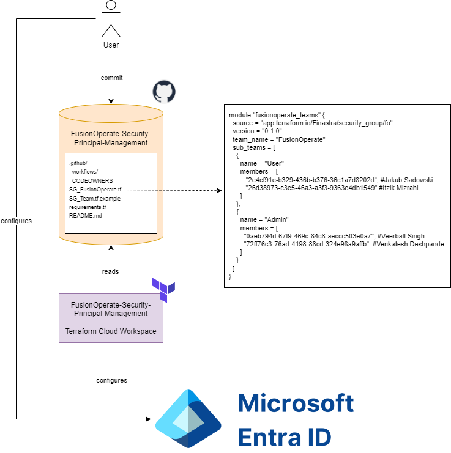

- Start Date: 2024-01-31
- Requirement/Feature Request Issue Num: 23

## Motivation

FusionOperate currently does not provide a formal way of managing security principals that can be used with
[Azure role-based access control (RBAC)](https://learn.microsoft.com/en-us/azure/role-based-access-control/overview)
or with services providing their own role-based access control mechanism that are integrated with Microsoft Entra ID.

This pattern proposes a mechanism for management of security principals using [Terraform](https://www.terraform.io/) and
[Microsoft Entra ID Security Groups](https://learn.microsoft.com/en-us/entra/fundamentals/concept-learn-about-groups).
Additionally, support for just in time (JIT) authorization leveraging
[Microsoft Entra Privileged Identity Management (PIM)](https://learn.microsoft.com/en-us/entra/id-governance/privileged-identity-management/pim-configure)
is proposed.

## Summary

This pattern outlines use of a GitHub repository, Terraform Cloud Workspace, and Microsoft Entra ID Security Groups to manage security principals
for use with role-based access control.

## Detailed Design

### Tools

__GitHub Repository__

A repository is the most basic element of GitHub. It's a place where you can store your code, your files, and each file's revision history.
Repositories can have multiple collaborators and can be either public or private.

For more information about GitHub repositories, see the documentation [here](https://docs.github.com/en/repositories/creating-and-managing-repositories/about-repositories).

__Terraform Cloud Workspace__

[Terraform](https://www.terraform.io/) is an infrastructure as code tool that enables you to safely and predictably provision and manage
infrastructure in any cloud.

Working with [Terraform](https://www.terraform.io/) involves managing collections of infrastructure resources, and most organizations
manage many different collections.

When run locally, Terraform manages each collection of infrastructure with a persistent working directory, which contains a configuration,
state data, and variables.

[Terraform Cloud](https://app.terraform.io) manages infrastructure collections with workspaces instead of directories. A workspace contains
everything Terraform needs to manage a given collection of infrastructure, and separate workspaces function like completely separate working directories.

For more information about Terraform Cloud Workspaces, see the documentation [here](https://developer.hashicorp.com/terraform/cloud-docs/workspaces).

__Microsoft Entra ID Security Group__

Microsoft Entra ID provides several ways to manage access to resources, applications, and tasks. With Microsoft Entra groups, you can grant access and
permissions to a group of users instead of for each individual user.

Leveraging Microsoft Entra groups:

- Simplifies role management
- Ensures consistent access
- Makes auditing permissions more straightforward

Assigning roles to a group instead of individuals allows for easy addition or removal of users from a role and creates consistent permissions
for all members of the group.

When creating a Microsoft Entra group, you are able to mark the group as `isAssignableToRole`.  Marking a Microsoft Entra group as `isAssignableToRole`
allows you to assign Microsoft Entra roles to the group.  For more information on why you might want to assign Microsoft Entra roles to a group, see
the documentation [here](https://learn.microsoft.com/en-us/entra/identity/role-based-access-control/groups-concept#why-assign-roles-to-groups).
For information on how role-assignable groups are protected, see the documentation [here](https://learn.microsoft.com/en-us/entra/identity/role-based-access-control/groups-concept#how-are-role-assignable-groups-protected).

For more information about Microsoft Entra ID Security Groups, see the documentation [here](https://learn.microsoft.com/en-us/entra/fundamentals/concept-learn-about-groups).

__Microsoft Entra Privileged Identity Managmenet (PIM)__

Microsoft Entra Privileged Identity Management (PIM) provides time-based and approval-based role activation to mitigate the risks of excessive, unnecessary,
or misused access permissions on resources that you care about.  It provides just-in-time privileged access to Microsoft Entra ID and Azure resources.

The following activities are required to leverage PIM:

1. Bring a resource under PIM management

   In Microsoft Entra ID, you can use PIM to manage just-in-time membership to a group or just-in-time ownership of a group.
   Groups can be used to provide access to Microsoft Entra roles, Azure roles, and various other scenarios.
   To manage a Microsoft Entra group in PIM, you must bring it under management in PIM.

1. Assign eligibility to a PIM managed resource

   Once a Microsoft Entra group is brought under PIM management, you should assign users as eligible members or owners of the group.
   An eligible role assignment requires a user to perform one or more actions to use the role. If a user has been made eligible for a role,
   that means they can activate the role when they need to perform privileged tasks.

1. Activate an eligible assignment to a PIM managed resource

   As a user with an eligible member or eligible owner assignment to a PIM managed Microsoft Entra group, when you require group membership or ownership,
   you can request activation of the eligible assignment.

1. Approve an eligible assignment request for a PIM managed resource

   As a delegated approver, you receive an email notification when an eligible assignment activation request is pending your approval.  You are then
   able to either deny or approve the activation request. 

For more information about Microsoft Entra PIM, see the documentation [here](https://learn.microsoft.com/en-us/entra/id-governance/privileged-identity-management/pim-configure).

### Design

### Usecases

#### Manage Entra ID Security Groups

1. Provision a new Entra ID Security Group for role-based access control

   __Scenario__

   - User clones the `FusionOperate-AADGroupManagement` GitHub repository.
   - User creates a new branch on the locally cloned git repository.
   - User identifies or creates a terraform file (`<product>.tf`) in the locally cloned git repository for provisioning new Entra ID
     Security Group(s) for role-based access control.
   - User adds/updates terraform code in the terraform file identified above to provision new Entra ID Security Group(s) for role-based access control.

     The following configuration should be provided:
     - Product Name (i.e. `LaserProCloud`)
     - List of new Subteams that Entra ID Security Groups will be provisioned for (i.e. `Stakeholder`, `Architect`, `Developer`, `ProductOwner`)
     - List of Azure security principal object ids that should be added as __owners__ to __all__ subteams defined above.
     - List of Azure security principal object ids that should be added as __members__ to __all__ subteams defined above.

     The following configuration should be provided for each new subteam defined above:
     - Is the Entra ID Security Group generated for the subteam [role assignable](https://learn.microsoft.com/en-us/entra/identity/role-based-access-control/groups-concept)?
     - List of Azure security principal object ids that should be added as __owners__ to the subteam.
     - List of Azure security principal object ids that should be added as __members__ to the subteam.

   - User commits the changes above to the locally cloned git repository.
   - User pushes the changes above to the `FusionOperate-AADGroupManagement` GitHub repository.
   - User creates a new PR to merge the changes above to the `FusionOperate-AADGroupManagement` GitHub repository `main` branch.
   - GitHub Workflow lints / validates the changes above.
   - User merges PR changes to the `FusionOperate-AADGroupManagement` GitHub repository `main` branch.
   - Terraform Cloud Workspace applies state changes by:
     - Provisioning new Entra ID Security Group(s) for the new subteams configured above. 
     - Assigning global and subteam specific __owners__ to each newly provisioned Entra ID Security Group
     - Assigning global and subteam specific __members__ to each newly provisioned Entra ID Security Group

1. Provision a new just in time (JIT) Entra ID Security Group for role-based access control

   __Scenario__

   - User clones the `FusionOperate-AADGroupManagement` GitHub repository.
   - User creates a new branch on the locally cloned git repository.
   - User identifies or creates a terraform file (`<product>.tf`) in the locally cloned git repository for provisioning new just in time (JIT) Entra ID
     Security Group(s) for role-based access control.
   - User adds/updates terraform code in the terraform file identified above to provision new JIT Entra ID Security Group(s) for role-based access control.

     The following configuration should be provided:
     - Product Name (i.e. `LaserProCloud`)
     - List of new Subteams that JIT Entra ID Security Groups will be provisioned for (i.e. `Stakeholder`, `Architect`, `Developer`, `ProductOwner`)
     - List of Azure security principal object ids that should be added as __owners__ to __all__ subteams defined above.
     - List of Azure security principal object ids that should be added as __members__ to __all__ subteams defined above.
     - List of Azure security principal object ids that should be added as __eligible_members__ to __all__ subteams defined above.

     The following configuration should be provided for each new subteam defined above:
     - Is the JIT Entra ID Security Group generated for the subteam [role assignable](https://learn.microsoft.com/en-us/entra/identity/role-based-access-control/groups-concept)?
     - List of Azure security principal object ids that should be added as __owners__ to the subteam.
     - List of Azure security principal object ids that should be added as __members__ to the subteam.
     - List of Azure security principal object ids that should be added as __eligible_members__ to the subteam.

   - User commits the changes above to the locally cloned git repository.
   - User pushes the changes above to the `FusionOperate-AADGroupManagement` GitHub repository.
   - User creates a new PR to merge the changes above to the `FusionOperate-AADGroupManagement` GitHub repository `main` branch.
   - GitHub Workflow lints / validates the changes above.
   - User merges PR changes to the `FusionOperate-AADGroupManagement` GitHub repository `main` branch.
   - Terraform Cloud Workspace applies state changes by:
     - Provisioning new JIT Entra ID Security Group(s) for the new subteams configured above.
     - Enrolling the new JIT Entra ID Security Group(s) with Entra Privileged Identity Management (PIM).
     - Assigning global and subteam specific __owners__ to each newly provisioned JIT Entra ID Security Group
     - Assigning global and subteam specific __members__ to each newly provisioned JIT Entra ID Security Group
     - Assigning global and subteam specific __eligible_members__ to each newly provisioned JIT Entra ID Security Group

1. Update a managed Entra ID Security Group used by role-based access control

   __Scenario__

   - User clones the `FusionOperate-AADGroupManagement` GitHub repository.
   - User creates a new branch on the locally cloned git repository.
   - User identifies the terraform file (`<product>.tf`) in the locally cloned git repository that contains configuration to be
     updated that manages Entra ID Security Group(s) for role-based access control.
   - User updates terraform code in the terraform file identified above to update Entra ID Security Group(s) for role-based access control.
   - User commits the changes above to the locally cloned git repository.
   - User pushes the changes above to the `FusionOperate-AADGroupManagement` GitHub repository.
   - User creates a new PR to merge the changes above to the `FusionOperate-AADGroupManagement` GitHub repository `main` branch.
   - GitHub Workflow lints / validates the changes above.
   - User merges PR changes to the `FusionOperate-AADGroupManagement` GitHub repository `main` branch.
   - Terraform Cloud Workspace applies state changes by:
     - Updating / replacing Entra ID Security Group(s) based on the changes made above.
     - Assigning / removing global and subteam specific __owners__ for each Entra ID Security Group based on the changes made above.
     - Assigning / removing global and subteam specific __members__ to each nEntra ID Security Group based on the changes made above.

1. Update a managed just in time (JIT) Entra ID Security Group used by role-based access control

   __Scenario__

   - User clones the `FusionOperate-AADGroupManagement` GitHub repository.
   - User creates a new branch on the locally cloned git repository.
   - User identifies the terraform file (`<product>.tf`) in the locally cloned git repository that contains configuration to be
     updated that manages just in time (JIT) Entra ID Security Group(s) for role-based access control.
   - User updates terraform code in the terraform file identified above to update JIT Entra ID Security Group(s) for role-based access control.
   - User commits the changes above to the locally cloned git repository.
   - User pushes the changes above to the `FusionOperate-AADGroupManagement` GitHub repository.
   - User creates a new PR to merge the changes above to the `FusionOperate-AADGroupManagement` GitHub repository `main` branch.
   - GitHub Workflow lints / validates the changes above.
   - User merges PR changes to the `FusionOperate-AADGroupManagement` GitHub repository `main` branch.
   - Terraform Cloud Workspace applies state changes by:
     - Updating / replacing JIT Entra ID Security Group(s) based on the changes made above.
     - Enrolling / unenrolling JIT Entra ID Security Group(s) with Entra Privileged Identity Management (PIM) based on the changes made above.
     - Assigning / removing global and subteam specific __owners__ for each JIT Entra ID Security Group based on the changes made above.
     - Assigning / removing global and subteam specific __members__ to each JIT Entra ID Security Group based on the changes made above.
     - Assigning / removing global and subteam specific __eligible_members__ to each JIT Entra ID Security Group based on the changes made above.

1. Delete a managed Entra ID Security Group used by role-based access control

   __Scenario__

   - User clones the `FusionOperate-AADGroupManagement` GitHub repository.
   - User creates a new branch on the locally cloned git repository.
   - User identifies the terraform file (`<product>.tf`) in the locally cloned git repository that contains configuration to be
     updated to remove Entra ID Security Group(s) for role-based access control.
   - User updates terraform code in the terraform file identified above to remove Entra ID Security Group(s) for role-based access control.
   - User commits the changes above to the locally cloned git repository.
   - User pushes the changes above to the `FusionOperate-AADGroupManagement` GitHub repository.
   - User creates a new PR to merge the changes above to the `FusionOperate-AADGroupManagement` GitHub repository `main` branch.
   - GitHub Workflow lints / validates the changes above.
   - User merges PR changes to the `FusionOperate-AADGroupManagement` GitHub repository `main` branch.
   - Terraform Cloud Workspace applies state changes by:
     - Removing Entra ID Security Group(s) based on the changes made above.

1. Delete a managed just in time (JIT) Entra ID Security Group used by role-based access control

   __Scenario__

   - User clones the `FusionOperate-AADGroupManagement` GitHub repository.
   - User creates a new branch on the locally cloned git repository.
   - User identifies the terraform file (`<product>.tf`) in the locally cloned git repository that contains configuration to be
     updated to remove just in time (JIT) Entra ID Security Group(s) for role-based access control
   - User updates terraform code in the terraform file identified above to remove JIT Entra ID Security Group(s) for role-based access control
   - User commits the changes above to the locally cloned git repository.
   - User pushes the changes above to the `FusionOperate-AADGroupManagement` GitHub repository.
   - User creates a new PR to merge the changes above to the `FusionOperate-AADGroupManagement` GitHub repository `main` branch.
   - GitHub Workflow lints / validates the changes above.
   - User merges PR changes to the `FusionOperate-AADGroupManagement` GitHub repository `main` branch.
   - Terraform Cloud Workspace applies state changes by:
     - Unenrolling JIT Entra ID Security Group(s) with Entra Privileged Identity Management (PIM) based on the changes made above.
     - Removing JIT Entra ID Security Group(s) based on the changes made above.
   
__Sequence Diagram__

__Azure Resource RBAC Scenario References__

1. [Azure AD RBAC](<Azure Resource RBAC Scenarios.md#azure-ad-rbac>)

   By [default](https://learn.microsoft.com/en-us/entra/fundamentals/users-default-permissions#compare-member-and-guest-default-permissions),
   Microsoft Entra ID users logged into Azure Portal are able to view Microsoft Entra ID Security Groups.

   A Microsoft Entra ID user could be assigned as an eligible owner of a PIM-enabled Microsoft Entra ID Security Group, requiring them
   to receive approval to be able to manage the security group.

#### Import Entra ID Security Groups

1. Bring an existing Entra ID Security Group used by role-based access control under management

   __Scenario__

   - User clones the `FusionOperate-AADGroupManagement` GitHub repository.
   - User creates a new branch on the locally cloned git repository.
   - User identifies or creates a terraform file (`<product>.tf`) in the locally cloned git repository that will contain configuration
     for the Entra ID Security Group(s) being imported.
   - User adds / updates terraform code in the terraform file identified above to manage the Entra ID Security Group(s) being imported.
   - User commits the changes above to the locally cloned git repository.
   - User pushes the changes above to the `FusionOperate-AADGroupManagement` GitHub repository.
   - User creates a new PR to merge the changes above to the `FusionOperate-AADGroupManagement` GitHub repository `main` branch.
   - GitHub Workflow lints / validates the changes above.
   - User merges PR changes to the `FusionOperate-AADGroupManagement` GitHub repository `main` branch.
   - Terraform Cloud Workspace applies state changes by:
     - Importing the existing state for the Entra Security Group(s)
     - Updating / replacing Entra ID Security Group(s) based on the configuration above.
     - Assigning / removing global and subteam specific __owners__ for each Entra ID Security Group based on the changes made above.
     - Assigning / removing global and subteam specific __members__ to each nEntra ID Security Group based on the changes made above.

1. Bring an existing just in time (JIT) Entra ID Security Group used by role-based access control under management

   __Scenario__

   - User clones the `FusionOperate-AADGroupManagement` GitHub repository.
   - User creates a new branch on the locally cloned git repository.
   - User identifies or creates a terraform file (`<product>.tf`) in the locally cloned git repository that will contain configuration
     for the just in time (JIT) Entra ID Security Group(s) being imported.
   - User adds / updates terraform code in the terraform file identified above to manage the JIT Entra ID Security Group(s) being imported.
   - User commits the changes above to the locally cloned git repository.
   - User pushes the changes above to the `FusionOperate-AADGroupManagement` GitHub repository.
   - User creates a new PR to merge the changes above to the `FusionOperate-AADGroupManagement` GitHub repository `main` branch.
   - GitHub Workflow lints / validates the changes above.
   - User merges PR changes to the `FusionOperate-AADGroupManagement` GitHub repository `main` branch.
   - Terraform Cloud Workspace applies state changes by:
     - Importing the existing state for the Entra Security Group(s)
     - Updating / replacing Entra ID Security Group(s) based on the configuration above.
     - Enrolling / unenrolling Entra ID Security Group(s) with Entra Privileged Identity Management (PIM) based on the configuration above.
     - Assigning / removing global and subteam specific __owners__ for each JIT Entra ID Security Group based on the changes made above.
     - Assigning / removing global and subteam specific __members__ to each JIT Entra ID Security Group based on the changes made above.
     - Assigning / removing global and subteam specific __eligible_members__ to each JIT Entra ID Security Group based on the changes made above.

__Sequence Diagram__

### Integration with existing ecosystem

This pattern aims to be complementary to any existing process being used today to manage Azure security principals (whether automated or manual).

The pattern adds out-of-the-box support for managing Azure security principals where no existing process for provisioning Azure service
principals currently exists.  Additionally, the pattern provides support for automation around just-in-time (JIT) authorization
using Microsoft PIM and saves users the effort of having to automate this themselves.

Leveraging `import` capabilities of Terraform, Microsoft Entra ID Security Groups provisioned outside of the process mentioned in this pattern
can be brought under management of the process mentioned in this pattern.

## Drawbacks

## Alternatives

- Management of member assignment could be removed from the scope of the pattern.  This means the pattern would cover provisioning Microsoft
  Entra ID Security Groups (including enrolling groups with PIM) with owners only.
- Management of owner / member assignment could be removed from the scope of the pattern.  This means the pattern would cover provisioning
  Microsoft Entray ID Security Groups (including enrolling groups with PIM) only.

## Adoption strategy

To adopt this pattern

- Security principal configuration needs to be identified and added to the `FusionOperate-AADGroupManagement` GitHub repository as described
  in the design above.

## How we teach this

- Updated documentation (`FusionOperate-AADGroupManagement` README.md, FusionOperate docs site, etc.)

## Security Implications

The intent of this pattern is to formalize for adoption security principal management.  As the automation is adopted, security principal
management will become more standardized leading to better visibility of security principal configuration and overall better security.

## Unresolved questions

## Resolved questions

1. Which GitHub repository should contain security principal management automation?
   A [FusionOperate-GitHub-AADGroupManagement](https://github.com/finastra-platform/FusionOperate-GitHub-AADGroupManagement) GitHub repository
   already exists which is used to manage Microsoft Entra ID Security Groups associated with GitHub teams.  Should this repository be used for
   general security principal management?

   The existing [FusionOperate-GitHub-AADGroupManagement](https://github.com/finastra-platform/FusionOperate-GitHub-AADGroupManagement)
   GitHub repository will be renamed to `FusionOperate-Security-Principal-Management` and will be leveraged to automate security group management.

   Pros:
   - Less time consuming than generating a new GitHub repository and populating repository content.
   - The GitHub repository name reflects its purpose, avoiding any confusion as to the scope of the repository / repository automation.
   - No new GitHub repository to be managed for Azure RBAC security group automation.
   - If the old GitHub repository name is accessed, it automatically redirects to the new GitHub repository name

   Neutral:
   - GitHub AADGroupManagement automation documentation will need to be updated

   

1. Should GitHub AADGroupManagement automation be merged with security principal management automation?

   Management of security groups (both Azure RBAC and GitHub) occurs using common automation.

   Pros:
   - Need to maintain only one source of automation for security group management (both Azure RBAC and GitHub).
   - Simplifies documentation; documentation only references one source of automation.

   Cons:
   - May break principle of least privilege as the shared automation leverages one service principal which requires permissions
     for both Azure RBAC as well as GitHub security group management.

   
   
1. How should PR approvers be handled (CODEOWNERS, GitHub workflow, etc.)?

   PR approvers wll be listed in the CODEOWNERS file along with the associated file(s) they are required to provide PR approval for.
   Product teams ownboarding to security principal management will require FO-Core PR approval for initial PR(s).

   Pros:
   - Standard GitHub mechanism for managing PR approvers.
   - Allows Product teams designated as CODEOWNERS to manage PR approvals for their own security principals.
   
   Neutral:
   - CODEOWNERS setup for new Product team still requires FO Core approval.

   

1. How are GitHub security groups impacted by the introduction of the security principal management pattern?

   GitHub security groups are provisioned using security principal management automation.  The benefits of
   using security principal management automation (security group membership assignment, PIM enrollment, etc.) apply to
   GitHub security groups.

   Pros:
   - Security principal management features (security group membership assignment, PIM enrollment, etc.) available to GitHub security groups.
   - Enhances authentication / authorization features available to GitHub teams.

   Neutral:
   - Requires some additional implementation time as the GitHub security group automation will need to be updated
   - GitHub security group documentation will need to be updated based on new features.

   

1. How should group membership of Microsoft Entra ID Security Groups be managed?

   Microsoft Entra ID security group membership can be managed either through code or through Azure Portal.  This is the most
   flexible option.

   Pros:
   - Allows for the most flexibility when configuring security group membership.
       
   Cons:
   - May require reconciliation between changes made through code and / or Azure Portal.

   
