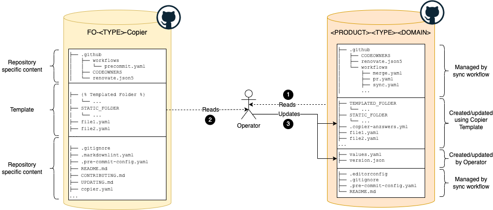
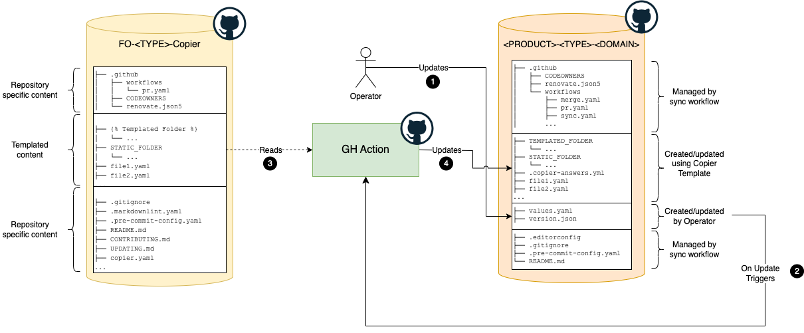
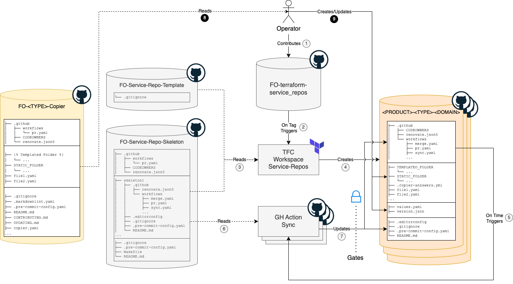

- Start Date: 2023-11-03
- Requirement/Feature Request Issue Num: (leave this empty)

## Motivation
During a new STIZ environment build, after creation of the service repositories they are populated with baseline configurations (required to run the services in the cloud platform) **manually** by referring to the contents of an existing environment service repos and updating it to the current context.
This manual process is **time-consuming** and **error-prone**.  

Changes proposed in this pattern aim to reduce the **time taken to bootstrap** the service repo, **eliminate manual configuration errors** consequentially reducing the **time lost on analysing & fixing** them.

## Summary

This Pattern outlines use of the **Copier** repository templating tool for the standardized management of GitHub repository contents. This will be applicable to general repository upkeep as well as specific use cases within the Fusion Operate managed service ecosystems, such as GitOps Zone, Gitops Products and AKS Zone repositories.

## Copier Tool

The [Copier](https://copier.readthedocs.io/en/stable/#basic-concepts) Template Tool is a CLI and library used for quickly generating (or updating) contents for target projects using a template and user inputs. Copier is composed of these main concepts.

- **Templates** - Source repository. Consists of **project layout** along with **static and dynamic content** from which target project content is generated.
- **Projects** - Destination repository to receive content generated by the Copier tool.
- **Questionaries** - Input parameters used to generate the projects. These params can have **default values** or values provided by operator during runtime via **prompts**, **CLI args** or an **input yaml file**. Some of the examples of inputs are **template version**, values meant for **substitution in templates** like **product id, role ids**, **flags to control inclusion/exclusion of specific content** in the generated content etc.

## Detailed design

This section covers the detailed design including workflows, use-cases, manual/automated processes and their integration into existing process and ecosystem of [managing service repositories](https://docs.fusionoperate.io/docs/fo_internal_docs/services_repository_management/).

### Workflows

Two principal workflows are envisioned for operator interaction with the Copier tool, differentiated by their automation level:

- A completely manual process.
- A process leveraging GitHub Actions for automation.

### Manual Bootstrap/Update of Repository Content

The manual process involves a sequence of steps executed by an operator to synchronize templated content from a source repository to a (or multiple) destination repository.



#### Components

- **Operator**: An individual or automated system responsible for executing the synchronization.
- **Template Repository**: A source repository with standardized files and folders to be distributed.
  - Templated Content: Items designated for replication across various repositories.
  - Repository-Specific Content: Unique files critical for the template repository's functionality, such as workflows, README and CONTRIBUTING guidelines.
- **Product Repository**: A destination repository to receive the templated content.
  - Operator Input: Configuration files specific to Copier, such as template input yaml file.
  - Templated Content: Content generated or updated by the operator using template specifications.
  - Content Managed by Sync Workflow: Items maintained by a synchronization workflow, as defined by [Terraform Service Repos automation](https://docs.fusionoperate.io/docs/fo_internal_docs/services_repository_management/).

#### Steps

1. The operator checks out the destination repository.
1. The operator checks out the template repository.
1. The operator prepares or modifies repository-specific configurations (e.g., copier.yaml, values.yml). 
1. Using a CLI tool, the operator generates/updates the content of the product repository based on the template and repository specific configs. 
1. Commits and pushes the changes following BAU pull request process.

### Leveraging GitHub Action for Automated Bootstrap/Update of Repository Content
This automated workflow mirrors the manual process, with the distinction that templating is executed by a GitHub Action.



#### Usecases 

1. **Bootstrap a new service repo** with content using a copier template and a user supplied copier input yaml file.  
   
   Scenarios:
   
   1.  User creates a copier input yaml file, may contain a **copier template version** configuration. 
   1.  User commits the input yaml file to the root directory of a newly provisioned service repo.
   1.  User creates a new PR for the commit above.
   1.  PR Workflow uses the **configured version** of copier template, or the **latest version** if not configured.
   1.  PR Workflow adds the **template version** in the input yaml file if not configured. 

1. **Update an existing service repo** using a copier template and a user supplied copier input yaml file where update conflicts are **not identified**.

   Scenarios:
   
   1.  User **updates the input yaml file without updating the copier template version**.
   1.  User commits the updated input yaml file to the root directory of an existing service repo. 
   1.  User creates a new PR for the commit above.
   1.  PR Workflow uses the **configured version** of copier template.

   **Sequence diagram (Usecase 01 & 02)**:
   
   ```mermaid
   sequenceDiagram
       autonumber
       actor U as User
       participant R as Service Repo (feature branch)
       alt Bootstrap
         U->>R: User adds copier input yaml file <br/> (may include template version)
       else Update
         U->>R: User updates copier input yaml file
       end
       participant PR as PR Workflow
       R-->>PR: New PR created
       activate PR
       Note over PR: Sync Job
       PR->>PR: copier input yaml exists and has updates, syncing required
       participant TR as Copier Template Repo
       participant M as Service Repo (master branch)
       alt Bootstrap
         TR->>PR: Pull configured version of the copier template <br/> (or latest if not configured)
       else Update
         TR->>PR: Pull configured version of the copier template
       end
       PR->>PR: Generate content using Copier
       PR->>PR: Compare copier generated content to existing service repo content
       PR->>PR: Content diff exists
       PR->>R: Commit content differences <br/>(and template version if not configured) <br/>to service repo
       PR->>PR: Workflow cancelled
       deactivate PR
   
       R-->>PR: Commit (from above step) triggers a new PR Workflow run
       activate PR
       Note over PR: Sync Job
       PR->>PR: copier input yaml exists and has updates, syncing required
       TR->>PR: Pull configured version of the copier template
       PR->>PR: Generate content using Copier
       PR->>PR: Compare copier generated content to existing service repo content
       PR->>PR: No content differences identified
       deactivate PR
   
       activate PR
       Note over PR: Lint Job
       PR->>PR: Check for conflict markers in service repo content
       PR->>PR: No content conflict markers identified
       deactivate PR
   
       activate PR
       Note over PR: Existing PR Workflow process
       PR->>PR: PR Workflow Successfull
       deactivate PR
       R->>M: PR Merged
   ```

1. **Update an existing service repo** using an **updated copier template** and a user supplied copier input yaml file.

   Scenarios:
   
   1.  User updates the **copier template version** used to generate content and commits to an existing service repo.
   1.  User creates a new PR for the commit above.
   1.  PR Workflow uses the **updated copier template** to generate content.
   
   > **Note**  
   > Only upgrades are possible, downgrading to an older template version is not supported.
   
   > **Warning**  
   > Updating contents of a Service repo using an updated version of a **Copier template** has a high risk of overriding crucial configurations, such as module versions etc., resulting in unintended outcomes.
   > All such changes must be through reviewed to understand the implications. 
   
   **Sequence diagram:**
   
   ```mermaid
   sequenceDiagram
       autonumber
       actor U as User
       participant R as Service Repo (feature branch)
       participant PR as PR Workflow
       participant TR as Copier Template Repo
       actor FO as Template Admin
       FO->>TR: Update copier templates and release new version
       U->>R: Update copier template version and commits
       R-->>PR: New PR created
       activate PR
       Note over PR: Sync Job
       PR->>PR: Template version updated, syncing required
       participant M as Service Repo (master branch)
       TR->>PR: Pull updated version of the copier template
       PR->>PR: Generate content using Copier
       PR->>PR: Compare copier generated content to existing service repo content
       PR->>PR: Content diff exists
       PR->>R: Commit content differences to service repo
       PR->>PR: Workflow cancelled
       deactivate PR
   
       R-->>PR: Commit (from above step) triggers a new PR Workflow run
       activate PR
       PR->>PR: PR Workflow Successfull
       deactivate PR
       R->>M: PR Merged
   ```

1. **Update existing service repo content without copier template update or updating existing copier input yaml file.**

   Scenarios:
   
   1.  User updates and then commits content to an existing service repo **without updating an existing copier input yaml file or the copier template version**.
   1.  User creates a new PR for the commit above.
   
   **Sequence diagram:**
   
   ```mermaid
   sequenceDiagram
       autonumber
       actor U as User
       participant R as Service Repo (feature branch)
       U->>R: Commits a change to the Service Repo <br/>(excludes updating the copier input yaml file)
       participant PR as PR Workflow
       R-->>PR: New PR created
       activate PR
       Note over PR: Sync Job
       PR->>PR: copier input yaml exists but doesn't have updates, <br/> syncing not required
       participant M as Service Repo (master branch)
       deactivate PR
   
       activate PR
       Note over PR: Existing PR Workflow process
       PR->>PR: PR Workflow Successfull
       deactivate PR
       R->>M: PR Merged
   ```

1. **Update an existing service repo** using a copier template and a user supplied copier input yaml file where update **conflicts** are identified.

   Scenarios:
   
   1.  User updates the copier input yaml, may also include template version update and other content changes.
   1.  User commits the updates and creates a new PR.
   1.  PR Workflow **identifies** update conflicts.
   
   > **When do update conflicts arise ?**
   >
   > Update conflicts arise when copier generates content from a copier template and copier input and, during diff comparison to existing service repo content, it is identifed that copier generated content changes conflict with changes made to content in the service repo.
   >
   > If changes to service repo content is managed solely by copier, update conflicts should never be encountered.
   > ****
   > 
   > Example 1 - Conflict 
   > - A TF module version is 1.0.0 when the service repo is bootstrapped using copier templates
   > - Renovate / A User updates the module version from 1.0.0 to 1.1.0 in the service repo
   > - Template admin updates the module version from 1.0.0 to 1.2.0 and releases a new version of template
   > - Service repo is updated to use the new template version  
   > - Both Service repo and Templates have updates to the same configuration
   > - A conflict occurs as Service repo has version 1.1.0 and template has version 1.2.0 
   >
   > Example 2 - Conflict
   > - A TF module version is 1.0.0 when the service repo is bootstrapped using copier templates
   > - Renovate / A User updates the module version from 1.0.0 to 1.2.0 in the service repo
   > - Template admin updates the module version from 1.0.0 to 1.1.0 and releases a new version of template
   > - Service repo is updated to use the new template version
   > - Both Service repo and Templates have updates to the same configuration
   > - A conflict occurs as Service repo has version 1.2.0 and template has version 1.1.0
   >
   > Example 3 - Not a Conflict
   > - A TF module version is 1.0.0 when the service repo is bootstrapped using copier templates
   > - Renovate / A User updates the module version from 1.0.0 to 1.1.0 in the service repo
   > - Template admin updates the module version from 1.0.0 to 1.1.0 and releases a new version of template
   > - Service repo is updated to use the new template version
   > - Both Service repo and Templates have updates to the same configuration
   > - However, a conflict doesn't occur as both versions are same 1.1.0
   >
   > Example 4 - Not a Conflict
   > - A TF module version is 1.0.0 when the service repo is bootstrapped using copier templates
   > - Renovate / A User updates the module version from 1.0.0 to 1.2.0 in the service repo
   > - Module version in Template is not updated
   > - Only Service repo has updates
   > - A conflict doesn't occur in the PR Workflow even though Service repo has version 1.2.0 and template has version 1.0.0
   >
   > Example 5 - Not a Conflict
   > - A TF module version is 1.0.0 when the service repo is bootstrapped using copier templates
   > - Template admin updates the module version from 1.0.0 to 1.1.0 and releases a new version of template
   > - Renovate / A User doesn't update the module version in Service repo
   > - Service repo is updated to use the new template version
   > - PR Workflow updates the module version in Service repo from 1.0.0 to 1.1.0 using the new version of template
   > - A conflict doesn't occur as no changes to the Service repo content outside the copier automation

   **Sequence diagram:**

   ```mermaid
   sequenceDiagram
       autonumber
       actor U as User
       participant R as Service Repo (feature branch)
       participant PR as PR Workflow
       participant TR as Copier Template Repo
       actor FO as Template Admin
       FO->>TR: Updates Copier Template & Version
       U->>R: User updates copier input yaml file <br/>(may include template version update <br/> and other content changes)
       participant M as Service Repo (master branch)
       Note over R: Contains Direct Updates
       R-->>PR: New PR created
       activate PR
       Note over PR: Sync Job
       PR->>PR: copier input yaml exists and has updates, syncing required
       TR->>PR: Pull configured version of the copier template
       PR->>PR: Generate content using Copier
       PR->>PR: Compare copier generated content to existing service repo content
       PR->>PR: Content diff exists
       PR->>R: Commit content differences to service repo
       PR->>PR: Workflow cancelled
       deactivate PR
   
       R-->>PR: Commit (from above step) triggers a new PR Workflow run
       activate PR
       Note over PR: Sync Job
       PR->>PR: copier input yaml exists and has updates, syncing required
       TR->>PR: Pull Copier template
       PR->>PR: Generate content using Copier
       PR->>PR: Compare copier generated content to existing service repo content
       PR->>PR: No content differences identified
       deactivate PR
   
       activate PR
       Note over PR: Lint Job
       PR->>PR: Check for conflict markers in service repo content
       PR->>PR: Conflict markers identified in service repo content
       PR->>PR: Fail PR checks
       deactivate PR
   
       U->>R: Fixes code conflict(s) and commits
       R-->>PR: Commit triggers a new PR Workflow run
       activate PR
       Note over PR: Sync Job
       PR->>PR: copier input yaml exists and has updates, syncing required
       TR->>PR: Pull Copier template
       PR->>PR: Generate content using Copier
       PR->>PR: Compare copier generated content to existing service repo content
       PR->>PR: No content differences identified
       deactivate PR
   
       activate PR
       Note over PR: Lint Job
       PR->>PR: Check for conflict markers in service repo content
       PR->>PR: No content conflict markers identified
       deactivate PR
   
       activate PR
       Note over PR: Existing PR Workflow process
       PR->>PR: PR Workflow Successfull
       deactivate PR
       R->>M: PR Merged
   ```

### Integration with existing ecosystem

The integration of the Copier tool is designed to complement and extend the current **Service repo management** system (greyed out) responsible for creating and managing service repositories. This approach ensures that the existing provisioning and pipeline maintenance workflows remain intact and fully operational, adhering to the [established procedures](https://docs.fusionoperate.io/docs/fo_internal_docs/services_repository_management/).

In addition to the existing system only **new template repositories** will be added.



### Future State

A probable future state is to seed the copier input yaml file into service repos by the Service Repo Management process when it sets up the repos. There needs to be further evaluation done on this option as well as reviewing other possibilities.

## Drawbacks

- There is an existing implementation in-place that can handle syncing static files
- Copier is an additional tool added to the Fusion Operate platform
- Currently, deployed repos will need review and updates to be brought into alignment with the template

## Alternatives

There were a few options considered for this pattern.

- One option was to use the existing static file sync tool. This was not chosen because it would require custom scripting, documentation and ongoing maintenance.
- Another option was to use Terraform to dynamically create the files. This was not chosen as GitHub has a limit of 5000 API calls per hour. This limits the number of repos with files that could be managed in this way. Also the GitHub provider for Terraform has some performance issues as the number of items being managed increases.
- The final option was to use other templating tools like Cookiecutter. While Cookiecutter currently has more integration points for custom scripting thru the hooks feature, it does not support the update capability (update repos when a template is updated) which is a key requirement for this pattern.

## Adoption strategy

To adopt this pattern

- New service repositories will be bootstrapped/updated using the templates.  
- Existing service repositories will need to be reviewed, updated to be in alignment with the templates and onboarded to this process.
- Gitops Zone & Product will utilize the **Manual Bootstrap/Update of Repository Content** workflow.
- AKS Zone repos will be leveraging the **GitHub Action for Automated Bootstrap/Update of Repository Content**.

## How we teach this

- FO documentation **STIZ Build Guide** will be updated on usage of this process and best practices.
- The Copier template repos will contain documentation.
- README File within the newly created service repos will also have information on this process, how to configure and best practices.

## Security Implications

Moving to a template based approach will reduce the risk of errors in the service repositories. This will reduce the risk of misconfiguration of the service repositories and allow for systematic analysis of the service repositories to ensure compliance with the baselines.

The copier template implementation for AKS services and GitopsPP requires running custom python script(s) as hooks to generate some configuration files. To use these hooks, a copier argument **--trust** is required to be passed to allow script execution. With this argument, potentially unsafe scripts may be run with the user account running copier.

## Unresolved questions

<!-- Optional, but suggested for first drafts. What parts of the design are still
TBD? -->
