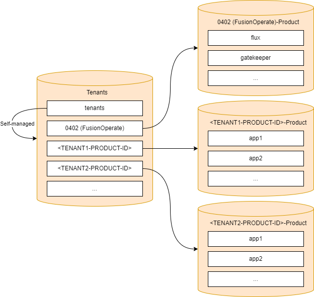

- Start Date: 2024-04-22
- Requirement/Feature Request Issue Num:

## Motivation

The [GitOps promotion pipeline (GitOpsPP)](https://docs.fusionoperate.io/docs/fo_internal_docs/gitopspp/) by design supports
single-tenant and multi-tenant cluster deployments by leveraging the
[app-of-apps approach](https://www.linkedin.com/pulse/learning-platform-engineering-app-apps-pattern-argocd-zahid) where one
GitOps repository is used to onboard other GitOps repositories.

Defining a standard set of required GitOps repositories as well as a standard naming convention for these GitOps repositories
will help simplify management and understanding around GitOps repositories leveraged by FusionOperate single-tenant and multi-tenant
isolated zones (STIZ and MTIZ).

## Summary

The intent of this pattern is to define the GitOps repositories required as well as the naming convention used by GitOps
repositories for FusionOperate single-tenant and multi-tenant isolated zones (STIZ and MTIZ).

## Glossary

**Single-Tenant Isolated Zone**

A single hosting envelope for application deployment environments (including required software and its supporting infrastructure)
managed by FusionOperate which serves a single customer or product.

**Multi-Tenant Isolated Zone**

A single hosting envelope for application deployment environments (including required software and its supporting infrastructure)
managed by FusionOperate which serves multiple customers or products.

**Isolated Zone Identifier *or* Slug**

A FusionOperate generated string or guid which uniquely identifies a single-tenant or multi-tenant isolated zone.  The isolated zone
identifier will be stored, managed, and published  by FusionOperate along with additional metadata associated with the isolated zone,
such as a description and tenants onboarded onto the isolated zone.  Management of isolated zone identifiers and associated metadata
will be described in a separate pattern.

**Tenant Identifier *or* Slug** 

An identifier which uniquely identifies a tenant or product.  The Finastra product id could be used as a suitable tenant identifier.

**Responsibility Assignment Matrix *or* RACI Matrix**

A model that describes the participation by various roles in completing tasks or deliverables for a project or business process.

A *role* is a descriptor of an associated set of tasks. A *role* may be performed by many people, and one person can
perform many *roles*.

In a RACI matrix, there are four key responsibility roles:

**R = Responsible (or recommender)**

Those who perform the work or execute the task. For each task or deliverable, there should be **at least** one responsbile role
defined. If no responsible role is defined for a task or deliverable but an accountable role is defined, it is assumed that the
accountable role is also responsible for the task or deliverable.

**A = Accountable (or approver)**

The one ultimately answerable for the correct and thorough completion of the deliverable or task; the one who ensures a service
meets advertised SLAs. There **must** be only one accountable role specified for each task or deliverable.

**C = Consulted (or consultant)**

Those whose opinions are sought (subject-matter experts) and with whom there is two-way communication.

**I = Informed (or informee)**
Those who are kept up-to-date on progress and with whom there is just one-way communication.

It is generally recommended that each task or deliverable receive **at most** one role participation type.

For more information about RACI matrices, please refer to the documentation
[here](https://en.wikipedia.org/wiki/Responsibility_assignment_matrix).

## Design

### Single-Tenant and Multi-Tenant Isolated Zones

A common set of GitOps repositories will be provisioned and used for each single-tenant as well as each multi-tenant isolated zone:

---

#### Diagram

---
#### FusionOperate-GitOps-<ISOLATED_ZONE_SLUG>-Tenants

##### RACI

| **Capability**                                        | **Tenant** | **FusionOperate** |
| ----------------------------------------------------- | :--------: | :---------------: |
| Repository management (creation, configuration, etc.) |            |         A         |
| Raise PRs                                             |      C     |         A         |
| Approve PRs                                           |            |         A         |

##### Usage

This repository is used to deploy the
[FusionOperate product-environment](https://github.com/finastra-engineering/fusion-operate-charts/tree/main/charts/product-environment)
helm chart for each tenant associated with the isolated zone.  In this model, FusionOperate is considered a tenant as well as each product
being onboarded onto the isolated zone.  The
[FusionOperate product-environment](https://github.com/finastra-engineering/fusion-operate-charts/tree/main/charts/product-environment)
helm chart is used to install namespaces, GitOps service accounts, and Kubernetes RBAC configuration for each tenant.  In addition, the
[FusionOperate product-environment](https://github.com/finastra-engineering/fusion-operate-charts/tree/main/charts/product-environment)
helm chart will register each tenant's `-Product` GitOps repository described below for GitOps processing.  It is expected that PRs against
this repo will be raised by FusionOperate team members and that FusionOperate PR approval will be required for any PRs raised against this repo.
We could allow tenant teams the ability to raise PRs against this repo as well (for example, if they need to provision a new namespace); however,
FusionOperate PR approval will still be required for any raised PRs.

##### GitOps Registration

The repository is registered with a Kubernetes cluster for GitOps processing either
[manually](https://docs.fusionoperate.io/docs/fo_internal_docs/gitopspp/howto/gitopspp_registration/) or using the
[FusionOperate aks_cluster_bootstrap](https://dev.azure.com/ProvidesTerraform/Terraform%20Modules/_git/terraform-fo-aks_cluster_bootstrap)
Terraform module.  Both registration methods leverage the
[FusionOperate product-environment](https://github.com/finastra-engineering/fusion-operate-charts/tree/main/charts/product-environment)
helm chart to generate a [GitRepository](https://fluxcd.io/flux/components/source/gitrepositories/) manifest pointing to the repository.
Once the repository is registered with a Kubernetes cluster for GitOps processing, a deployment of the
[FusionOperate product-environment](https://github.com/finastra-engineering/fusion-operate-charts/tree/main/charts/product-environment)
helm chart should be added to the repository to register GitOps resource updating via the GitOps process.

---
#### FusionOperate-GitOps-<ISOLATED_ZONE_SLUG>-<TENANT_SLUG>-Product

##### RACI

| **Capability**                                        | **Tenant** | **FusionOperate** |
| ----------------------------------------------------- | :--------: | :---------------: |
| Repository management (creation, configuration, etc.) |      I     |         A         |
| Raise PRs                                             |      A     |                   |
| Approve PRs                                           |      A     |                   |

##### Usage

This repository is used to deploy tenant owned services to a FusionOperate isolated zone.  It is expected that PRs against this repo will be raised
by tenant team members and that tenant team PR approval is required for any PRs raised against this repo.

Each isolated zone will host a FusionOperate tenant which will have a `-Product` GitOps repository which will be used to deploy zonal services
owned and operated by FusionOperate to the isolated zone.  It is expected that PRs against this repo will be raised by FusionOperate team members
and that FusionOperate PR approval will be required for any PRs raised against this repo.

##### GitOps Registration

The repository is registered with a Kubernetes cluster for GitOps processing by the deployment of the
[FusionOperate product-environment](https://github.com/finastra-engineering/fusion-operate-charts/tree/main/charts/product-environment)
helm chart for the tenant in the `-Tenants` GitOps repository described above.

### Isolated Zone Migration (STIZ -> MTIZ or MTIZ -> STIZ)

With the proposed GitOps repostories and naming conventions described above, no migration is required to move from a single-tenant to
multi-tenant or multi-tenant to single-tenant isolated zone.

Adding new tenants to an isolated zone is as simple as introducing new
[FusionOperate product-environment](https://github.com/finastra-engineering/fusion-operate-charts/tree/main/charts/product-environment)
deployments in the isolated zone `-Tenants` repository.

Removing tenants from an isolated zone is as simple as removing the tenant
[FusionOperate product-environment](https://github.com/finastra-engineering/fusion-operate-charts/tree/main/charts/product-environment)
deployment in the isolated zone `-Tenants` repository.

## Drawbacks

- Under this pattern, FusionOperate owns and maintains
  [FusionOperate product-environment](https://github.com/finastra-engineering/fusion-operate-charts/tree/main/charts/product-environment)
  helm chart deployments for tenants onboarded into single-tenant and multi-tenant isolated zones (STIZ / MTIZ).  This means that any updates
  to namespaces, service accounts, or RBAC configuration deployed by the helm chart deployments needs to be managed by FusionOperate.
- Existing isolated zone `-Zone` repositories will require migration to conform to the standards outlined in this document.
- Single-tenant isolated zones already exist that __do not__ conform to the GitOps repo structure and naming conventions outlined in this pattern.
  Such isolated zones will require migration to conform to the standards outlined in this document.
- Single-tenant isolated zones already exist that __do not__ conform to the GitOps repo structure and naming conventions outlined in this pattern.
  Tenants leveraging existing single-tenant isolated zones will need to be trained on standards proposed in this document.

## Alternatives

- **Allow ad-hoc GitOps repositories / GitOps repository naming**

  We want to simplify management of repositories leveraged by GitOps and allowing ad-hoc GitOps repositories / GitOps repository naming is not
  conducive to simplifying management.
  
- **FusionOperate-GitOps-<ISOLATED_ZONE_SLUG>-Tenants, FusionOperate-GitOps-<ISOLATED_ZONE_SLUG>-Zone, and
    FusionOperate-GitOps-<ISOLATED_ZONE_SLUG>-<TENANT_SLUG>-Product GitOps repositories**

  Always have two GitOps repositories for each isolated zone in addition to each tenant GitOps repository, `FusionOperate-GitOps-<ISOLATED_ZONE_SLUG>-Tenants`
  and `FusionOperate-GitOps-<ISOLATED_ZONE_SLUG>-Zone`.  The `-Tenants` GitOps repository will serve as a catalog of tenants deployed into the isolated
  zone.  The `-Zone` GitOps repository will host zonal service deployments, and tenant `-Product` GitOps repositories will host product service deployments.
  The need for a `-Tenants` GitOps repository is minimal for single-tenant isolated zones as only one tenant will exist.  If the `-Tenants` GitOps repository
  is used solely as a catalog of deployed tenants, including a `-Tenants` GitOps repository introduces just another GitOps repository to be maintained and
  managed and isn't required from a technical standpoint.  If the `-Tenants` GitOps repository is used to also configure the Flux
  [GitRepository](https://fluxcd.io/flux/components/source/gitrepositories/) for the `-Zone` GitOps repository, it is recommend that the `-Zone` GitOps
  repository be renamed to `-Product` (following the conventions described above) to standardize on naming.

- **FusionOperate-GitOps-<ISOLATED_ZONE_SLUG>-Zone and FusionOperate-GitOps-<ISOLATED_ZONE_SLUG>-<TENANT_SLUG>-Product GitOps repositories**

  Always have a `FusionOperate-GitOps-<ISOLATED_ZONE_SLUG>-Zone` GitOps repository for each isolated zone in addition to each tenant's `-Product` GitOps
  repository.  The `-Zone` GitOps repository will serve as a catalog of tenants deployed into the isolated zone as well as host zonal service deployments.
  Tenant `-Product` GitOps repositories will host product service deployments.  This alternative was not chosen as we would like a separation of concerns
  when it comes to the catalog of tenants deployed into the isolated zone and zonal service deployments.

## Adoption strategy

To adopt this pattern

- New GitOps service repositories will be bootstrapped based on the standards and naming conventions described in this document.
- Existing GitOps service repositories will need to be reviewed and updated to be in alignment with the standards and naming conventions described
  in this document.

## How we teach this

- Updated FusionOperate documentation.
- Knowledge transfer with tenants already on-boarded onto single-tenant or multi-tenant isolated zones.

## Security Implications

Aligning GitOps repositories with the standards outlined in this pattern should improve overall security of GitOps deployment and
Kubernetes cluster access.  Ensuring that FusionOperate owns and controls Kubernetes cluster access (RBAC) configuration for
tenants (via the
[FusionOperate product-environment](https://github.com/finastra-engineering/fusion-operate-charts/tree/main/charts/product-environment)
helm chart) will improve Kubernetes cluster security.

## Unresolved questions
