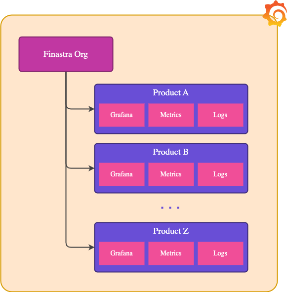
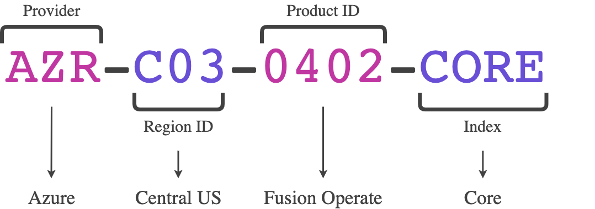
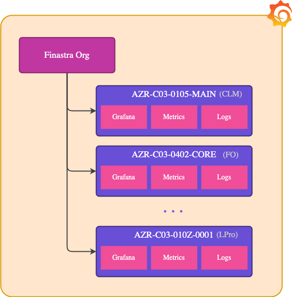
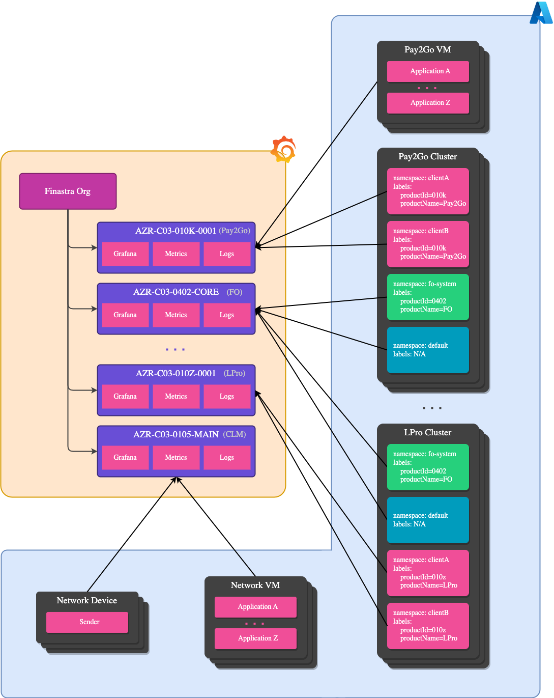
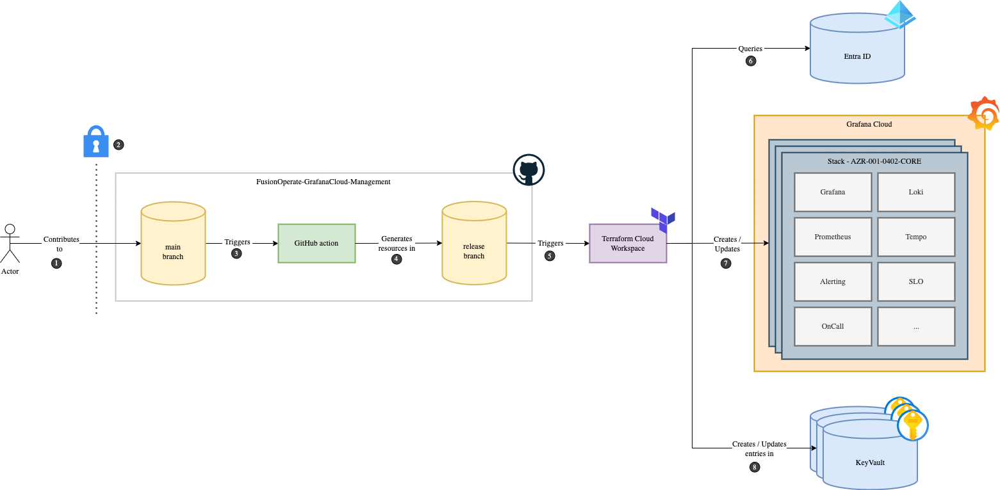
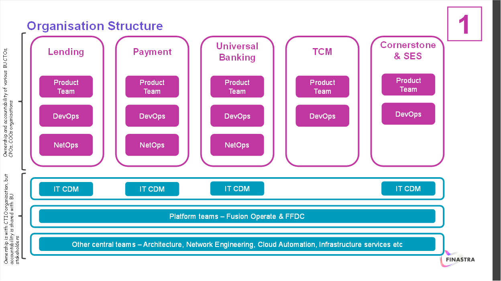
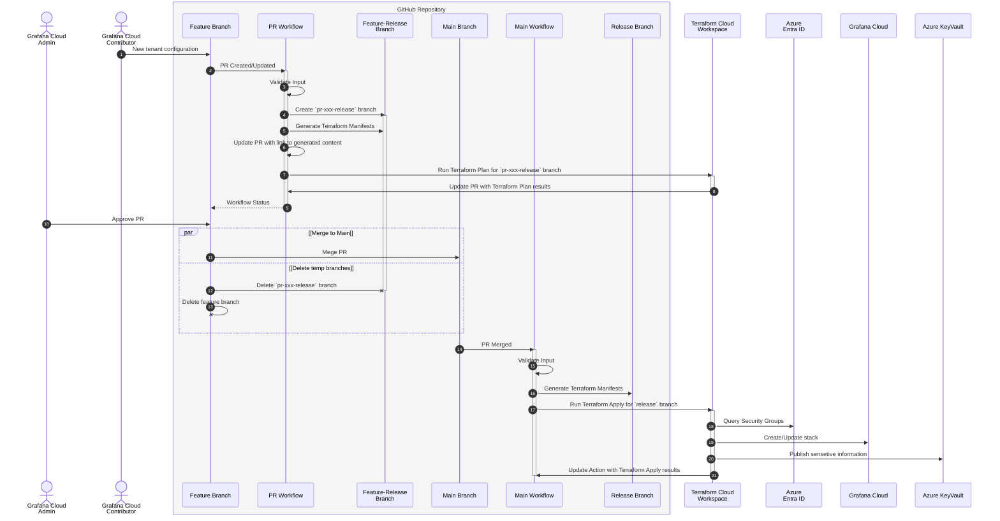
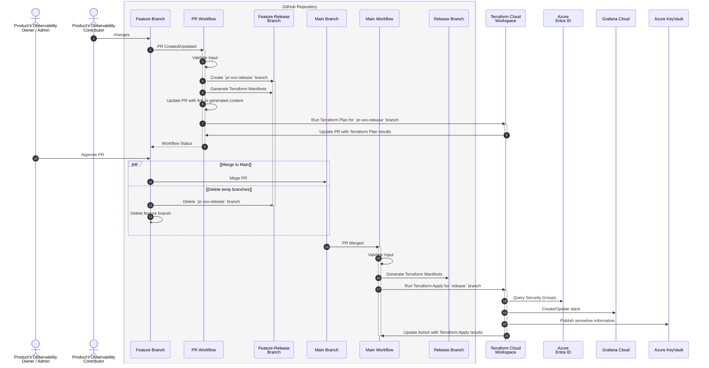
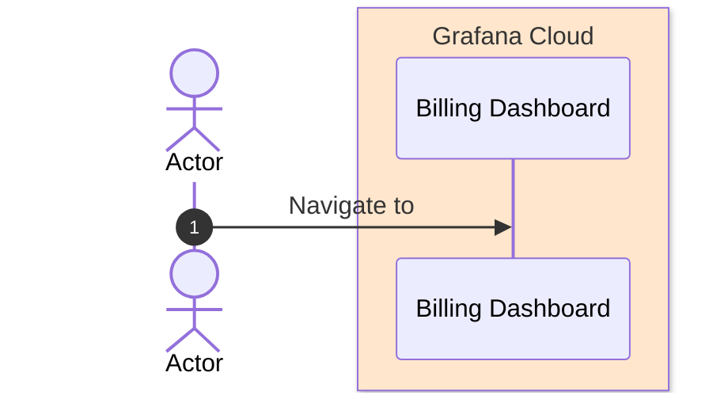

- Start Date: 2024-05-20
- Requirement/Feature Request Issue Num:

## Table of Contents

- [Table of Contents](#table-of-contents)
- [Summary](#summary)
- [Motivation](#motivation)
  - [Goals](#goals)
  - [Non-Goals](#non-goals)
- [Detailed design](#detailed-design)
  - [Org structure](#org-structure)
  - [Naming](#naming)
  - [Consumption](#consumption)
  - [Management](#management)
  - [Repository layout](#repository-layout)
  - [User stories](#user-stories)
- [Drawbacks](#drawbacks)
- [Alternatives](#alternatives)
- [Adoption strategy](#adoption-strategy)
- [How we teach this](#how-we-teach-this)
- [Security Implications](#security-implications)
- [Links](#links)

## Summary

This Pattern defines a comprehensive framework for managing Grafana Cloud stacks within Finastra's organization. It
introduces stateful management, self-service capabilities, and granular access controls, aiming to streamline the
onboarding process for new tenants and ensure consistent adherence to defined standards.

## Motivation

The existing automation system for managing Grafana Cloud stacks has shown to be prone to introducing deviations from defined settings
due to it's imperative nature, resulting in security issues and broken configurations. At the same time, over the last
few years Grafana Cloud has significantly evolved in areas related to automation, management and security. This Pattern
aims to resolve existing issues related to Grafana Cloud stack management by implementing stateful management of Grafana Cloud organization / stack configuration, introduction of
self-service capabilities, enforcement of granular role and label-based access controls, and simplification of the
onboarding process for new tenants. By doing so, we aim to align with current automation standards, improve security,
and offer cost transparency to our tenants.

### Goals

- Enable cost showback per Product.
- Enable stack deployment to arbitrary geographies.
- Standardize automated approach to Grafana Cloud stack provisioning.
- Enable self-service for deploying stacks.

### Non-Goals

- Define contracts for metric ingestion.
- Define patterns for sending observability data to Grafana Cloud.
- Define standards for Grafana Cloud stack management.
- Validate if Grafana Cloud is a suitable solution for the Product team.

## Detailed design

### Org structure

|                                    Organisation Structure                                    |                                               Example                                                |
| :------------------------------------------------------------------------------------------: | :--------------------------------------------------------------------------------------------------: |
|  |  |

The proposed organization structure aims to simplify the management of Grafana Cloud stacks by consolidating all stacks
under a single organization called "Finastra". It also addresses Grafana Cloud limitations related to cost showback, where billing
information is only available in the primary organization and does not cascade to sub-organizations.

Within the "Finastra" organisation, each Product will have its own dedicated Grafana Cloud stack. This separation on a per-product
basis, rather than per-BU or overall Finastra, is considered from several perspectives:

- **Customization**: Different BUs within Finastra operate using distinct principles, methodologies, and technologies.
  Consolidating all BUs into one Grafana Cloud stack would require extensive preparation and migration efforts.
  Similarly, one stack per BU is impractical since BUs can be comprised of multiple products with autonomous operational standards.
- **Empowerment**: Enabling developer teams to have dedicated stacks promotes self-service and reduces lead time for
  changes.
- **Scalability**: Although Grafana ensures no significant limitations on data ingestion, there are clear limits on
  alerts and SLOs per stack. Distributing stacks minimizes potential scaling issues.
- **Isolation**: Minimizing the impact of one Product on another helps avoid situations where one Product could cause a
  Denial of Service by sending unexpectedly high volumes of logs/metrics/traces.
- **Privacy and Compliance**: Separating data storage by Products addresses potential regulatory requirements and
  ensures compliance with local regulations regarding data locality.
- **Cost Showback**: Providing cost transparency on a per-Product basis allows for accurate tracking of resource
  consumption, enabling proper budgeting and cost control for each Product team.

The new structure will reduce the current four Grafana Cloud organizations (Finastra, Finastra DevQA, Finastra PreProd, and Finastra
Prod) into a single Grafana Cloud organization, "Finastra,". It will also consolidate non-production and production metrics, logs and
traces into one Grafana Cloud stack and will leverage granular Label and Role-Based Access Control to ensure secure and efficient data
management.

### Naming

The naming convention for Grafana Cloud stacks is designed to provide clear, useful insights into each stack's purpose
and location. We will use Finastra's existing Naming API, which offers several convenience services and automation
tools.

The proposed naming format is



This convention provides key information about the Grafana Cloud stack:

- **Provider**: Identifies the cloud provider hosting the data, essential for understanding egress implications. Refer
  to [documentation](https://docs.providesops.cloud/docs/reference/naming/cloudproviders/) for the list of supported
  providers.
- **Region**: Specifies the deployment region of the Grafana Cloud stack, aiding in data locality considerations. Refer
  to [documentation](https://docs.providesops.cloud/docs/reference/naming/regions/) for more details or query
  [API](https://api.providesops.cloud/dataproxy/api/ui/#/RegionsV2/get_regions_v2) for the list of supported regions.
- **Product ID**: Denotes the specific Product team that owns the stack, ensuring clear ownership and accountability.
  Refer to [documentation](https://docs.providesops.cloud/docs/overview/productid/) for more details or query
  [API](https://api.providesops.cloud/dataproxy/api/ui/#/ProductsV2/get_products_v2) for the list of available IDs.
- **Index**: Allows for multiple stacks per Product in the same region, supporting scalability and specific use cases.
  It is a free form alphanumeric suffix.



### Consumption



The proposed model envisions Grafana as a Single Pane of Glass for application and infrastructure observability,
centralizing data from various sources (e.g., switches, servers, VMs, containers, Kubernetes) into one place. This
unified approach allows Product teams to gain comprehensive insights into the health of their services and systems,
facilitating data correlations, dependency mapping, service map creation, etc.

A critical consideration is the separation of data by environment to ensure security and compliance - individuals
without access to specific systems must not be able to read those system data (ie, production logs). Grafana's
[label-based access control (LBAC)](https://grafana.com/docs/grafana-cloud/account-management/authentication-and-permissions/access-policies/label-access-policies/)
system will be utilized to enforce this separation. LBAC creates access policies that allow querying only the metrics or
logs that meet specific label requirements. This feature associates multiple sets of Prometheus label selectors with a
policy, ensuring queries return only data matching at least one selector.

The same principle will be used to achieve multi-tenancy within a Grafana Cloud stack, allowing a Product team to provide
services to different clients (e.g., HSBC, Barclays, Citi) while ensuring dedicated support teams have access only to
relevant client data.

<!-- prettier-ignore-start -->
> [!NOTE]
> *PCI-DSS environments are not considered in the current iteration of this design.*
<!-- prettier-ignore-end -->

### Management



The management of Grafana Cloud stacks within the Finastra organization is orchestrated through a structured and
automated flow that involves several key steps and tools:

- **Contribution to Main Branch**: ❶ Changes and updates to the Grafana Cloud stack configurations are made in the
  `main` branch of the repository. Contributors, including Product teams and observability platform owners, define
  policies, dashboards, and other configuration on the `main` branch of the repository. Every contribution requires approval ❷ from the observability owner of
  the respective Product team that the change targets, as defined in the [`CODEOWNERS`](#codeowners-file) file.

- **GitHub Action**: A GitHub Action is triggered ❸ upon changes to the `main` branch. This action is responsible for
  generating the necessary resources and contributing ❹ them to the `release` branch.

- **Terraform Cloud Workspace**: The updates in the `release` branch trigger ❺ Terraform Cloud, which:

  - Queries ❻ Azure Entra ID for the latest information about defined Security Groups.
  - Deploys ❼ stacks in Grafana Cloud, including various components such as Grafana, Prometheus, Loki, Tempo, and others.
    Each stack is managed according to the policies and configurations defined in the repository.
  - Securely ❽ stores Grafana Cloud stack sensitive information and secrets in managed Azure Key Vault(s), ensuring that all data is protected.

As seen from the diagram, the proposed flow implies use of two branches for managing Grafana Cloud organisation configuration. The main
reasons for such approach are:

- allowing users the autonomy to manage their own stacks within predefined boundaries. We build the rails and impose
  boundaries within which changes can be made, ensuring consistency and security.
- prevention of a free-form submission of Terraform code. We mitigate the risk of users exploiting permissions
  associated with the enterprise application used by Terraform Cloud. This ensures that only approved configurations are
  deployed.
- separation of configuration and deployment phases ensures that all changes are vetted and standardized before being
  applied, reducing the risk of errors and misconfigurations.

### Repository layout

#### Main branch

The `main` branch serves as the entrypoint for configuration management within the Grafana Cloud stack repository and
represents Finastra's Organisation Structure.



It contains the source configuration files that define policies, dashboards, and other settings for each Product's
Grafana Cloud stack. Anyone with access to the repository can author a contribution. However, every contribution to the
`main` branch must go through an approval process where the observability owner of the respective Product team (as per
[CODEOWNERS](#codeowners-file) file) will review and approve the changes. This ensures that all modifications align
with the established guidelines and security protocols.

The configuration management structure includes three levels, providing flexibility for teams and reducing configuration
duplication:

- **Per Product Level** (takes precedence over anything else) - controlled by specific Product.
- **Per Organization Level** - controlled by Business Units (BUs).
- **General Default Settings** - controlled by the Grafana Cloud owner.

The `main` branch is structured as follows:

```bash
├── .github/
│   ├── workflows/
│   │   └── ...                  # GitHub Workflows definitions
│   └── CODEOWNERS               # Permission configuration
├── organisations/               # List of BUs and Products onboarded to Grafana Cloud
│   ├── defaults/                # Default resources that are provisioned as part of the bootstrap process
│   │   └── dashboards/
│   │       ├── k8s-node-exporter.json
│   │       └── k8s-system-api-server.json
│   ├── CTIO/
│   │   ├── defaults/            # Default resources that are provisioned as part of the bootstrap process
│   │   │   └── dashboards/
│   │   │       ├── k8s-node-exporter.json
│   │   │       └── k8s-system-api-server.json
│   │   ├── 013a/
│   │   │   └── main.yaml
│   │   ├── 0402/                # Example of Product specific layout
│   │   │   ├── dashboards/      # Defines set of dashboards, deployed and managed as part of bootstrap process
│   │   │   │   ├── flux.json
│   │   │   │   └── kyverno.json
│   │   │   └── main.yaml        # Tenant's Grafana Cloud stack configuration
│   │   └── main.yaml            # Default Grafana Cloud stack configuration for the organisation. Used as a fallback mechanism for per-tenant configuration
│   ├── Cornerstone/
│   │   └── ...
│   ├── Lending/
│   │   └── ...
│   ├── Payment/
│   │   └── ...
│   ├── TCM/
│   │   └── ...
│   ├── UniversalBanking/
│   │   └── ...
│   └── main.yaml                # Default fallback Grafana Cloud stack configuration
├── .gitignore
├── .markdownlint.yaml
├── .pre-commit-config.yaml
└── README.md
```

Key directories and files in the `main` branch:

- **`.github/CODEOWNERS`**: The [`CODEOWNERS`](#codeowners-file) file which defines who has permissions to approve
  changes in the repository.
- **`defaults/`**: Includes default resources, such as dashboards, that are provisioned during the bootstrap process.
- **`organisations/`**: Houses configurations for each Product onboarded to Grafana Cloud. Each Product has its own directory
  containing specific dashboards and a `main.yaml` file for tenant Grafana Cloud stack configuration.

#### CODEOWNERS file

The
[`CODEOWNERS`](https://docs.github.com/en/repositories/managing-your-repositorys-settings-and-features/customizing-your-repository/about-code-owners)
file is used to designate individuals or teams responsible for specific code areas in a repository. When someone opens a
pull request that modifies code owned by them, these code owners are automatically requested for review.

Each Product team is expected to have an Admin GitHub team, linked to a respective Azure Entra ID security group,
identifying privileged users with permissions to approve changes to their Product's Grafana Cloud stack.

Regarding the `CODEOWNERS` file itself, only the Grafana Cloud organization owners will have the permissions to approve
changes to this file.

Configuration example:

```CODEOWNERS
*                             @finastra-platform/fusionoperatestability-admin
/organisations/CTIO/013a/     @finastra-platform/productid013a-admin
/organisations/CTIO/0402/     @finastra-platform/productid0402-admin
```

#### Default `main.yaml` listing

This is the `main.yaml` file located in the root of the `organisations/` folder. It contains default configuration parameters
that can be overriden when required on per-stack basis.

```yaml
# This file contains default settings that can be overriden by per-stack configuration
# It is expected for the python code to execute deep-merge for main.yaml and per-stack main.yaml
grafana:
  # Setting up SSO. Should be defined on the global level
  sso:
    # ...
#### Per-Product configuration listing

The `main.yaml` file has following structure. The end manifest and file schema can be altered during implementation
phase (and will be retrospectively updated in the current document), however it provides a general sense and feel of set
direction.

```yaml
# Product information
# This information should be retrieved from API, based on the ID in the folder name
product:
  sortName: FusionOperate_OperatingPlatform

# List of Grafana Cloud Stacks. Names will be autogenerated following naming convention
stacks:
  - provider: azure
    region: 001
    # Dictionary of access policies scoped to the Grafana Cloud Stack
    accessPolicies:
      test_access_policy:
        # Optional display name
        displayName: Test Access Policy
        socpes:
          - metrics:read
          - logs:read
        # Label selectors. Corresponds to realm section
        labelSelectors:
          - '{namespace="default"}'
          - '{env != "dev"}'
        # Dictionary of tokens scoped to the access policy
        tokens:
          test_token:
            displayName: Test Token # Optional
            expires_at: 2022-12-31T23:59:59Z # Optional expiry date

    # Service accounts. Correspond to grafana_cloud_stack_service_account resource.
    # All resources, that not explicitly defined, scoped to the stack.
    serviceAccounts:
      test_service_account:
        # Role
        role: admin
        disabled: false
        # List of tokens. Correspond to grafana_cloud_stack_service_account_token resource.
        tokens:
          - test_token

    # Grafana Instance Management
    grafanaInstance:
      # Organization settings as per grafana_organization_preferences
      organization:
        theme: system
        timezone: utc
        weekStart: monday
        homeDashboardId: 1
      # Allow deploying dashboards from json files stored in the main branch
      # Every key represents folder that will be created in the Grafana instance
      dashboards:
        finastra:
          # Set of folder permissions, as per grafana_folder_permission resource
          permissions:
            - role: Editor
              team_id: fusion_operate
      # Configuration relevant to grafana_data_source and grafana_data_source_config TF resources
      dataSources:
        # ...
```

#### Release branch

The `release` branch contains GitOps resources generated from the configuration set in the `main` release branch and
stored in the following directory structure:

```bash
./
├── CTIO-013a-SomeOtherTenant/                    # Folder with tenant specific resources
│   └── dashboards/
│       ├── k8s-node-exporter.json
│       └── k8s-system-api-server.json
├── CTIO-0402-FusionOperate_OperatingPlatform/
│   └── dashboards/
│       ├── flux.json
│       ├── k8s-node-exporter.json
│       ├── k8s-system-api-server.json
│       └── kyverno.json
├── CTIO-013a-SomeOtherTenant.tf                  # Tenant specific Terraform definitions generated from `main` branch
├── CTIO-0402-FusionOperate_OperatingPlatform.tf
├── main.tf                                       # Generic Terraform definitions generated from `main` branch
└── variables.tf
```

### User stories

#### Story 1 - New Product Onboarding

<!-- prettier-ignore-start -->
> [!NOTE]
> **As** a Product product owner \
> **I need** access to Grafana Cloud \
> **So that** my team(s) can monitor our services
<!-- prettier-ignore-end -->



#### Story 2 - Self-Service by Onboarded Teams

<!-- prettier-ignore-start -->
> [!NOTE]
> **As** a Product's observability platform owner \
> **I need** ability for my team to manage our dedicated Grafana Cloud stacks \
> **So that** my team can define policies for accessing/managing data \
> **And so that** my team can grant access to our stacks based on Entra ID Groups \
> **And so that** my team can assign defined policies to Entra ID Groups \
> **And so that** my team can configure/define default settings for Grafana Cloud stack \
> **And so that** my team can provision default set of dashboards and/or alerts
<!-- prettier-ignore-end -->

This flow is the same, with the only difference that the actors changed from "Grafana Cloud Owner" to "Product's
Observability Platform Owner / Admin" and "Grafana Cloud Contributor" to "Product's Observability Platform Contributor".



#### Story 3 - Cost Showback

<!-- prettier-ignore-start -->
> [!NOTE]
> **As** a Product product owner, VP or any other interested party \
> **I want** to know my current Grafana Cloud spend sliced by metrics, logs, traces \
> **So that** I can keep control over resource consumption \
> **And so that** I can do a proper budgetting for the service
<!-- prettier-ignore-end -->

For this story, respective persona will need to open a Billing Dashboard in the respective Grafana Cloud stack to get
full insights on cost and resource consumption.



## Drawbacks

- The Grafana Cloud owner must manage and upkeep all Grafana Cloud modules involved in stack management.
- The Grafana Cloud owner is required to oversee and maintain the proposed abstraction layer, including handling tenant
  requirements.

## Alternatives

Due to cost reporting limitations in Grafana Cloud, converging into a single organization is necessary to satisfy the
cost show-back requirement. However, there are several implementation options available:

- Use of Existing Imperative Pipeline to Manage Grafana Cloud Stacks

  This approach has proven to be prone to deviations from defined settings due to its imperative nature, leading to
  security issues and broken configurations. Moreover, it does not align with our strategy of adopting Infrastructure as
  Code (IaC) for all our infrastructure.

- Direct Use of Terraform to Manage Grafana Cloud Stacks

  This is a viable option and is currently utilized in various IaC repositories owned and managed by FusionOperate.
  However, based on our past experiences, this approach has several significant downsides:

  - **High Entry Barrier for Contributions**: Contributors would need substantial knowledge of Terraform and the module
    structure, making it challenging for individuals to make changes to Grafana Cloud stack management.
  - **Risk of Deviations**: Given the self-service goal and permissions granted to tenants, maintaining consistency in
    Terraform code would be difficult. This could result in numerous variations of stack configurations, which means
    while we can codify Grafana Cloud configurations, it won't help much with standardizing stack provisioning.
  - **Security Concerns**: Due to the high level of privileges associated with the Terraform Cloud workspace, the
    Grafana Cloud owner would need to review all pull requests, which completely defeats the purpose of self-service.

## Adoption strategy

To adopt this pattern:

- a new Grafana Cloud organization will be established, and the required stacks will be provisioned within this
  organization;
- cluster or VM agents will be updated with the new stacks' configurations, ensuring the data flow transitions smoothly
  from the old stack to the new one;
- the existing stacks will be transitioned to read-only mode to prevent new data in-flow;
- after two months old stacks will be deleted.

## How we teach this

- Updated FusionOperate documentation with HowTo.
- Detailed HowTo guide in the repository `README.md`.
- Training sessions for observability owners.

## Security Implications

Implementation of this Pattern should improve our security posture by providing granular control on who has access to
the Grafana Cloud organisation itself as well as observability date stored inside Grafana Cloud stacks.

## Links

- [Naming Overview](https://docs.providesops.cloud/docs/reference/naming/overview/)
- [Naming API](https://api.providesops.cloud/dataproxy/api/ui/#/)
- [List of Grafana regions](https://grafana.com/docs/grafana-cloud/account-management/regional-availability/)
- [Discussion thread](https://github.com/finastra-platform/PlatformArchitecture-docs/discussions/40)
