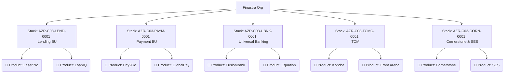
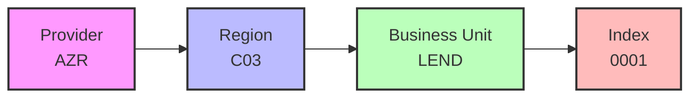
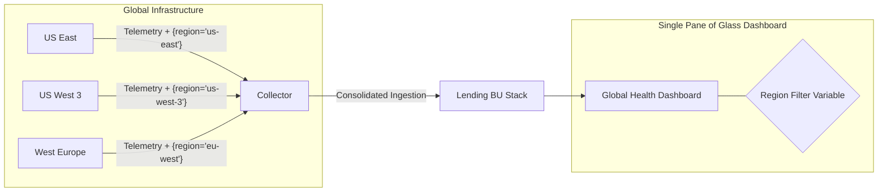
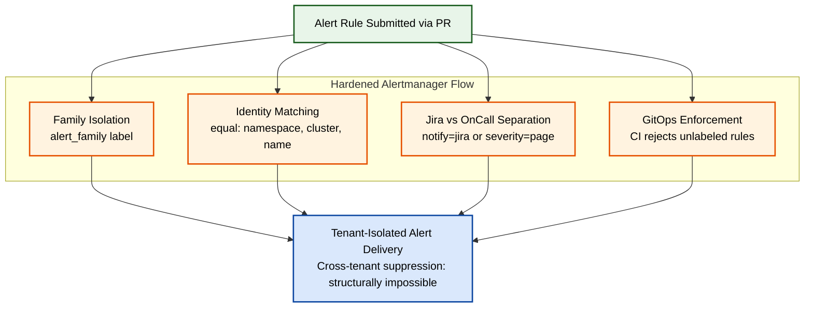
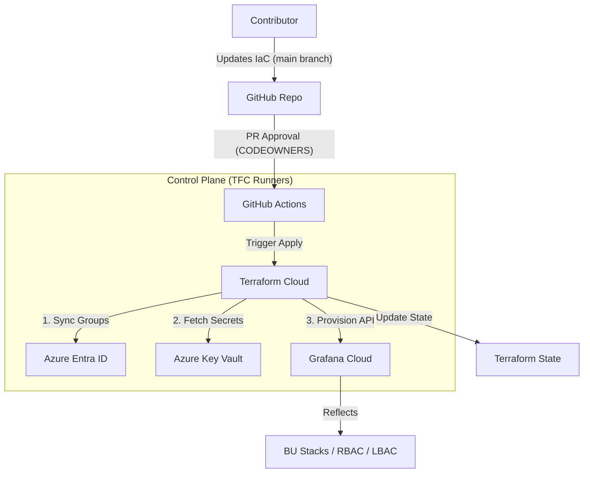
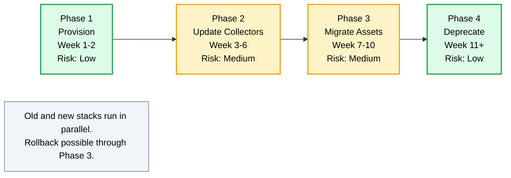

- Start Date: 2026-05-01
- Requirement/Feature Request Issue Num: SPS-2000

## Table of Contents

- [Table of Contents](#table-of-contents)
- [Executive Summary](#executive-summary)
- [Strategic Rationale](#strategic-rationale)
  - [Goals & Requirements](#goals--requirements)
  - [Non-Goals](#non-goals)
- [Detailed Design](#detailed-design)
  - [High-Level Architecture](#high-level-architecture)
  - [BU-Aligned Org Structure](#bu-aligned-org-structure)
  - [Naming Convention](#naming-convention)
  - [Consumption & Isolation](#consumption--isolation)
  - [Identity-to-Stack Mapping](#identity-to-stack-mapping)
  - [Region as a Dimension (Single Pane of Glass)](#region-as-a-dimension-single-pane-of-glass)
  - [Centralized Alerting & Noise Reduction](#centralized-alerting--noise-reduction-hardened-flow)
  - [Management & Automation Flow](#management--automation-flow)
  - [Backstage Integration](#backstage-integration)
  - [Repository Layout](#repository-layout)
  - [User Stories](#user-stories)
- [Pros & Cons (v1 vs v2)](#pros--cons-v1-vs-v2)
- [Drawbacks](#drawbacks)
- [Alternatives](#alternatives)
- [Adoption Strategy](#adoption-strategy)
- [Open Questions & Resolved Concerns](#open-questions--resolved-concerns)
- [How we teach this](#how-we-teach-this)
- [Security Implications](#security-implications)

## Executive Summary

This Pattern (v2) evolves the Grafana Cloud stack management framework defined in Pattern 005. While Pattern 005 established excellent foundational principles (Single Finastra Org, GitOps workflow, Terraform automation), its implementation of a **per-Product stack model** has led to extreme operational sprawl, unsustainable Total Cost of Ownership (TCO), and fragmented observability.

This document outlines a strategic shift to a **Business Unit (BU) aligned stack model**, consolidating the ecosystem into core BU stacks (e.g., Lending, Payment, Universal Banking). In this architecture, the **View Stack (BU Level) serves as the Operational Boundary**, while the **Product Label serves as the Security Boundary**.

This model leverages Azure Entra ID as the source of truth for identity, utilizing Terraform to automatically generate Role-Based Access Control (RBAC) and Label-Based Access Control (LBAC) policies. Crucially, it treats **Region as a telemetry dimension** rather than an isolation boundary, enabling a "Single Pane of Glass" for products deployed across multiple global geographies.

## Strategic Rationale

The initial implementation of Pattern 005's per-Product stacks resulted in an unmanageable proliferation of Grafana Cloud environments. This architecture debt caused:

- **Massive Operational Overhead:** Governing, upgrading, and auditing 100+ individual stateful stacks is not scalable.
- **Asset Duplication:** Common infrastructure dashboards (e.g., Kubernetes, Nodes) required deployment and synchronization across 100+ disparate instances.
- **Complex SRE Access Management:** DevOps/SRE teams supporting multiple products required disparate roles mapped across dozens of isolated physical boundaries, increasing identity sprawl.
- **Siloed Observability:** Physical stack separation inherently blocked cross-tier views (Dev/Stage/Prod) and made cross-product correlation within a BU impossible.
- **Fragmented Multi-Region Visibility:** Products deployed across multiple geographies (e.g., Payments-to-Go in US East, US West, West Europe, North Europe) required SREs to switch between disparate stacks to get a global view.

By consolidating physical boundaries to the Business Unit level, we mitigate the blast radius of misconfigurations while unlocking massive operational efficiency, scalability, and centralized governance.

### Goals & Requirements

Based on the architectural requirements established by the Observability Pod lead, this design strictly satisfies the following:

1. **Scalability:** Accommodate 2,500+ users and 100+ products across BUs. Grafana Cloud's active series limits per stack are accounted for by dividing load across BU-aligned stacks.
2. **Strict Product Isolation:** No product team may access telemetry or assets (dashboards/alerts) of another product, even within the same BU. Enforced structurally via Folders and LBAC/RBAC.
3. **Environment Tiering:** Dev/Stage/Prod are logically separated to prevent noise, but reside in the same BU stack to allow *opt-in cross-tier views*.
4. **Self-Service:** Teams are empowered to create/update/delete their configuration items (dashboards, alert rules, data-source wiring) without central team bottlenecks via IaC.
5. **Data Residency:** Stacks are deployed in specific Grafana Cloud regions matching data residency laws of the monitored workloads.
6. **Cross-Product SRE Access:** DevOps/SRE teams can be granted access to exactly the products they support across the BU, without receiving blanket access.
7. **Cost Attribution:** All consumption is strictly attributable to specific products via enforced label taxonomies.
8. **Automated IaC:** Zero manual click-ops. Stack creation, RBAC, and wiring are 100% automated.
9. **Single Pane of Glass:** Enable unified visibility for products deployed across multiple Azure regions (e.g., US East, West Europe) without switching stacks.
10. **Identity-Driven Security:** Directly map Azure Entra ID group memberships to Grafana permissions via automated provisioning.

### Non-Goals

- Modifying how telemetry data is generated at the application level (this relies on standard OpenTelemetry practices).
- Migrating PCI-DSS or heavily regulated environments that strictly require dedicated, physically isolated stacks (these remain explicitly defined exceptions).
- Replacing existing Azure Entra ID as the identity source — Pattern 006 inherits Pattern 005's identity model unchanged.

## Detailed Design

### High-Level Architecture

The following diagram illustrates the end-to-end control plane, ingestion tier, and cloud boundary for the BU-aligned model.

```mermaid
graph TD
    %% User Personas
    subgraph "User & Identity Tier"
        Dev["Product Developers<br/>View ONLY their product"]
        SRE["DevOps & SRE<br/>Cross-product operational view"]
        VP["VP / P&L Owners<br/>Cost Showback & Billing"]
        Entra["Azure Entra ID<br/>SSO & Security Groups"]
        
        Dev --> Entra
        SRE --> Entra
        VP --> Entra
    end

    %% GitOps Automation
    subgraph "GitOps Control Plane (Zero Click-Ops)"
        GH["GitHub Repositories<br/>CODEOWNERS Approvals"]
        TFC["Terraform Cloud<br/>Stateful Provisioning"]
        AKV["Azure Key Vault<br/>Secrets Management"]
        
        GH -- "On PR Merge" --> TFC
        TFC -- "Fetches Secrets" --> AKV
        TFC -- "Syncs Groups" --> Entra
    end

    %% Telemetry Sources
    subgraph "Telemetry Ingestion (With Enforced Taxonomy)"
        AKS_L["AKS Clusters (LaserPro)<br/>Labels: bu=lend, env=prod/dev"]
        VM_P["Azure VMs (Pay2Go)<br/>Labels: bu=pay, env=prod"]
        DB_U["Databases (Universal Banking)<br/>Labels: bu=ubnk, env=stage"]
        
        Alloy["Grafana Alloy Collectors<br/>Enforces Label Discipline"]
        AKS_L --> Alloy
        VM_P --> Alloy
        DB_U --> Alloy
    end

    %% Grafana Cloud
    subgraph "Grafana Cloud SaaS (Finastra Global Org)"
        TFC -- "Provisions API (Stacks, Folders, RBAC, LBAC)" --> Org
        
        subgraph Org [Single Finastra Organization]
            
            subgraph StackL[Lending BU Stack: AZR-C03-LEND-0001]
                LBAC_L["LBAC: Enforces 'product' isolation"]
                F_Laser["Folder: LaserPro<br/>Dashboards & Alerts (Cross-Tier)"]
                F_Loan["Folder: LoanIQ<br/>Dashboards & Alerts"]
                LBAC_L -.-> F_Laser & F_Loan
            end
            
            subgraph StackP[Payment BU Stack: AZR-C03-PAYM-0001]
                LBAC_P["LBAC: Enforces 'product' isolation"]
                F_Pay["Folder: Pay2Go<br/>Dashboards & Alerts"]
                F_Global["Folder: GlobalPay<br/>Dashboards & Alerts"]
                LBAC_P -.-> F_Pay & F_Global
            end
            
            subgraph StackS[Shared Services / Central Stack]
                F_Billing["Folder: Central Billing<br/>Cost Attribution filterable by 'product'"]
            end
        end
    end

    %% Portal Integration
    Portal["Backstage Developer Portal<br/>(Discovery & Entry Point)"]
    Portal -. "Links to" .-> Org

    %% Data flow
    Alloy -- "OTLP (Metrics, Logs, Traces)" --> StackL
    Alloy -- "OTLP (Metrics, Logs, Traces)" --> StackP
    
    %% Access Flow
    Entra -. "Identity Source of Truth<br/>(Groups map to RBAC/LBAC)" .-> Org

    %% Styling
    classDef users fill:#fff9c4,stroke:#fbc02d,stroke-width:2px,color:#000;
    classDef control fill:#f3e5f5,stroke:#4a148c,stroke-width:2px,color:#000;
    classDef ingestion fill:#e8f5e9,stroke:#1b5e20,stroke-width:2px,color:#000;
    classDef cloud fill:#e3f2fd,stroke:#0d47a1,stroke-width:2px,color:#000;
    classDef stack fill:#fff3e0,stroke:#e65100,stroke-width:2px,color:#000;
    classDef folder fill:#ffffff,stroke:#424242,stroke-width:2px,stroke-dasharray: 5 5;
    classDef portal fill:#e1f5fe,stroke:#01579b,stroke-width:2px,color:#000;

    class Dev,SRE,VP users;
    class Entra,GH,TFC,AKV control;
    class AKS_L,VM_P,DB_U,Alloy ingestion;
    class Org cloud;
    class StackL,StackP,StackS stack;
    class F_Laser,F_Loan,F_Pay,F_Global,F_Billing,LBAC_L,LBAC_P folder;
    class Portal portal;
```



### BU-Aligned Org Structure

The physical boundary moves from 100+ Product stacks to ~5-6 BU stacks. Products are logically segregated into folders within these stacks.



Within each BU stack, Products are segregated into **Folders**. This addresses the operational concerns of v1 while satisfying all isolation requirements:

- **Empowerment:** Product teams get Editor/Admin rights at their specific Folder level via RBAC.
- **Data Residency:** A BU can have multiple stacks in different regions (e.g., `AZR-C03-LEND-0001` for US Central, `AZR-WE1-LEND-0001` for West Europe) to satisfy data laws.

### Naming Convention

The naming convention replaces the **Product ID tier with the Business Unit (BU) tier** — this is the structural shift that enables stack consolidation. Provider, Region, and Index continue to follow the existing Naming API conventions established in Pattern 005.



Example: `AZR-C03-LEND-0001`

**Note on environments:** Neither Pattern 005 nor Pattern 006 includes `env` in the stack name. Environments (Dev/Stage/Prod) are represented as a telemetry label (`env=prod|stage|dev`), not as a separate stack. This is unchanged from Pattern 005 and is precisely what enables Pattern 006's native cross-tier views — Dev/Stage/Prod for the same BU coexist in one stack and are filtered logically at query time via the `env` label.

**Naming Tier Comparison:**

| Tier | Pattern 005 | Pattern 006 | Source |
|------|-------------|-------------|--------|
| 1 | Provider (e.g., AZR) | Provider (e.g., AZR) | Naming API — unchanged |
| 2 | Region (e.g., C03) | Region (e.g., C03) | Naming API — unchanged |
| 3 | **Product ID** (e.g., LASERPRO) | **Business Unit** (e.g., LEND) | **Changed** — enables consolidation |
| 4 | Index (e.g., 0001) | Index (e.g., 0001) | Naming API — unchanged |

### Consumption & Isolation

This model introduces a critical distinction between how we operate and how we secure data:

1. **The Operational Boundary (The Stack):** The physical Grafana Cloud stack represents the boundary for SRE operations, dashboard sharing, and BU-level governance.
2. **The Security Boundary (The Label/Folder):** Access to data and assets is strictly controlled at the Product level using Labels (LBAC) and Folders (RBAC).

Instead of relying on the physical stack boundary for isolation, this model relies heavily on **Standardized Labels**, **RBAC**, and **LBAC (Label-Based Access Control)**.

#### Label Taxonomy

All ingested data MUST contain the following enforced taxonomy:

- `bu` (e.g., lending)
- `product` (e.g., laserpro)
- `env` (e.g., prod, stage, dev)
- `region` (e.g., eastus, westeurope)

**Fulfilling Isolation Requirements:**

- **Product Isolation:** LBAC policies generated by Terraform bind to Entra ID groups. A user in the LaserPro group gets an LBAC policy `{product="laserpro"}`. They physically cannot query data for `product="loaniq"`.
- **Environment Isolation & Cross-Tier Views:** Because Dev, Stage, and Prod data for LaserPro reside in the same stack, they are logically separated by the `env` label. Dashboards default to `env="prod"` to prevent noise, but users can opt-in to cross-tier views by changing the dashboard variable to `env=~"prod|stage"`.
- **Cross-Product SRE Access:** An SRE team supporting both LaserPro and Pay2Go is granted an LBAC policy `{product=~"laserpro|pay2go"}` and assigned RBAC to both product folders.

### Identity-to-Stack Mapping

Azure Entra ID remains the absolute **Source of Truth** for identity and group memberships — directly inherited from Pattern 005.

#### Entra ID Group Naming Convention

Product teams are mapped to specific Entra security groups following a structured naming convention:

```
GRP_Grafana_{BU}_{Product}_{Role}
```

Examples:
- `GRP_Grafana_LEND_LaserPro_Dev` — LaserPro developers (read-only)
- `GRP_Grafana_LEND_LaserPro_Admin` — LaserPro admins (full folder control)
- `GRP_Grafana_LEND_SRE` — Cross-product SRE access within Lending BU
- `GRP_Grafana_PAYM_VP` — Payment BU VP (cost showback view)

#### Automated Provisioning Flow

Terraform Cloud reads these Entra ID group memberships during its execution cycle and automatically generates:

- **RBAC Policies:** Granting specific folder permissions (Viewer/Editor/Admin) to the Entra group.
- **LBAC Policies:** Granting access ONLY to data tagged with the corresponding product label (e.g., `{product="laserpro"}`).

#### Worked Example — LaserPro Engineer

**Scenario:** Jane is a LaserPro engineer in the Lending BU. Here's how she accesses observability data.

**Step 1: Identity & Group Membership**
- Jane logs in via Azure Entra ID (SSO)
- She is a member of: `GRP_Grafana_LEND_LaserPro_Dev`

**Step 2: Terraform Auto-Provisioning**
During the nightly Terraform Cloud run:
- The group `GRP_Grafana_LEND_LaserPro_Dev` is queried from Entra ID
- Terraform generates the following in Grafana Cloud:
  - **RBAC Role:** Viewer permission on `LEND Stack → LaserPro Folder`
  - **LBAC Policy:** `{product="laserpro"}` scoped to the Entra group

**Step 3: Stack & Folder Access**
- Jane lands in: `AZR-C03-LEND-0001` (Lending BU Stack)
- She sees only: `LaserPro` folder (RBAC enforced — LoanIQ folder is hidden)
- Her queries return only: data tagged with `product="laserpro"` (LBAC enforced)
- She CANNOT see LoanIQ data, even though it physically resides in the same stack

**Step 4: Multi-Product SRE Variant**
- A Lending BU SRE in `GRP_Grafana_LEND_SRE` gets:
  - **LBAC:** `{product=~"laserpro|loaniq"}`
  - **RBAC:** Editor on both `LaserPro` and `LoanIQ` folders
- This SRE sees both folders and can correlate incidents across products within Lending

### Region as a Dimension (Single Pane of Glass)

The BU-aligned model resolves the "fragmented view" problem by allowing multi-region telemetry to be visualized in a single workspace. This is a critical design decision that addresses a key gap in Pattern 005.

#### Design Choice: Region as Label, Not Boundary

In Pattern 006, **region** appears in **two distinct places** with different roles:

| Where | Role | Example |
|-------|------|---------|
| **Stack Name** | Routing/Hosting — where the stack physically lives | `AZR-C03-LEND-0001` (Central US) |
| **Telemetry Label** | Query Filter — where the telemetry came from | `region=us-east-1`, `region=west-europe` |

This dual treatment enables:
- **Single-region BUs** (e.g., Lending with LoanIQ across US-only regions) to use ONE stack with region as a filter variable
- **Multi-region products** (e.g., Pay2Go global) to span multiple stacks via federation when data residency requires it

#### Architecture Overview



#### Concrete Examples

**Example 1: LoanIQ (Single-Region BU)**

- **Deployment:** East US, Central US, West US (all US Azure regions)
- **Stacks involved:** ONE — `AZR-C03-LEND-0001` (US Central)
- **How it works:**
  - All US regions send telemetry to the same Lending stack via Grafana Alloy
  - Each metric tagged with `region=us-east-1`, `region=us-central-1`, or `region=us-west-1`
  - Dashboard uses region as template variable for filtering
- **PromQL example:**
  ```promql
  rate(http_requests_total{product="loaniq", region=~"us-.*"}[5m])
  ```
- **SRE experience:** One dashboard, one stack, region filter dropdown — Done.

**Example 2: Payments-to-Go (Multi-Region Global)**

- **Deployment:** West US 3, East US, West Europe, North Europe
- **Stacks involved:** TWO (due to data residency laws):
  - `AZR-C03-PAYM-0001` — US regions
  - `AZR-WE1-PAYM-0001` — EU regions
- **How it works:**
  - US-based telemetry routes to US stack
  - EU-based telemetry routes to EU stack (GDPR compliance)
  - Cross-region dashboards use **Grafana's Mixed Datasource feature**
- **Single pane of glass dashboard:**
  - One Grafana dashboard with two datasources configured (US PAYM + EU PAYM)
  - Shared template variable: `$region`
  - Panels can show US-only, EU-only, or aggregated metrics
- **SRE experience:** One dashboard, two datasources, region selector spans both — global view achieved.

#### Federation Strategies

The pattern supports three approaches based on use case:

| Strategy | When to Use | How |
|----------|-------------|-----|
| **Mixed Datasources** | Ad-hoc cross-region views, dashboards | Configure multiple datasources in one Grafana org; dashboards reference both |
| **Prometheus Federation** | Aggregated metrics, alerting on global SLOs | Configure `federate` endpoint between stacks; aggregate at "parent" stack |
| **Loki Query Federation** | Log correlation across regions | Use Loki's multi-tenant query path with tenant headers |

#### Data Residency Considerations

- Workloads under **EU GDPR** or **US data localization laws** MUST stay in their regional stack — raw user data cannot cross boundaries.
- Cross-region querying is ALLOWED for **metadata and aggregate metrics** (e.g., request counts, latency percentiles).
- Cross-region querying is FORBIDDEN for **raw user data** (e.g., individual transaction logs with PII).
- This restriction is enforced at the LBAC level for sensitive label values.

### Centralized Alerting & Noise Reduction (Hardened Flow)

Consolidating 100+ product stacks into a shared BU-aligned architecture centralizes the Alertmanager. Without strict controls, a poorly written `inhibit_rule` by one product team could inadvertently suppress critical alerts for another product team (cross-tenant suppression).



To prevent this, the architecture implements a **Hardened Alertmanager Flow**:

- **Family Isolation (`alert_family`):** All alerts are strictly categorized (e.g., `app-availability`, `custom-resource`). A critical alert in one family cannot inhibit alerts in another.
- **Identity Matching (`equal` labels):** Inhibit rules strictly match on `namespace`, `cluster`, and `name`. This ensures Team A's critical database alert only suppresses Team A's minor database alerts, completely isolating Team B.
- **Jira vs OnCall Separation:** Alerts generating Jira tickets (`notify: jira` with `priority` labels) are logically separated from OnCall paging alerts (`severity` labels) to prevent ticket rules from muting active pages.
- **GitOps Enforcement:** The GitOps pipeline automatically rejects any alert rules that do not include the mandatory `namespace` and `alert_family` labels.

#### Isolated Alert Delivery in a Shared Stack

In a shared BU stack, multiple products share a single Alertmanager instance. Isolation is maintained through **Label-Routing**:

1. **Enforced Labels:** Every alert rule MUST include the `product` and `env` labels.
2. **Notification Policies:** Terraform provisions specific **Notification Policies** in Alertmanager that route based on the `product` label.
3. **Dedicated Receivers:** Alerts for `product="laserpro"` are routed to LaserPro's specific PagerDuty/Slack/Email, while `product="pay2go"` alerts are routed to their respective receivers.
4. **Inhibition Isolation:** Inhibition rules are scoped strictly to the `product` label, ensuring a "Database Down" alert in Product A does not inadvertently suppress alerts in Product B.

#### Operational Flow — A 3 AM Scenario

**Scenario:** LaserPro's production database starts throwing errors at 3 AM.

**Step 1: Alert Fires**
- PrometheusRule defined in `organisations/Lending/LaserPro/alerts/database.yaml`
- Labels attached:
  - `product=laserpro`
  - `bu=lend`
  - `env=prod`
  - `alert_family=app-availability`
  - `severity=critical`
  - `namespace=laserpro-prod`

**Step 2: Alertmanager Receives & Evaluates**
- Routing tree evaluates labels in order
- Match: `notify=page` + `severity=critical` → OnCall paging path selected

**Step 3: Inhibition Check (Tenant Isolation)**
- Inhibit rules check active alerts with `equal: [namespace, cluster, name]`
- LaserPro namespace (`laserpro-prod`) ≠ LoanIQ namespace (`loaniq-prod`) → **No cross-product suppression possible**
- Same family check within product: same `alert_family` → can inhibit only LaserPro's own lower-priority alerts

**Step 4: Delivery**
- Routed to: LaserPro's PagerDuty rotation (per Notification Policy)
- LoanIQ team: Sleeps peacefully — not paged
- Jira ticket: NOT created (because `severity=critical` ≠ `notify=jira`)

**Step 5: Failure Modes**
- If `product` label missing → CI rejected at PR time (GitOps Enforcement)
- If `alert_family` missing → CI rejected at PR time
- If PagerDuty API down → falls back to email per Notification Policy
- If OnCall rotation empty → escalates to BU lead per policy

This operational flow demonstrates how cross-tenant suppression is **structurally impossible** in the design — not just discouraged by convention.

### Management & Automation Flow

The management of the BU-aligned organization is 100% automated via a GitOps-driven control plane, ensuring **no manual click-ops**.



1. **Infrastructure as Code (IaC):** All configurations (Stacks, Folders, RBAC, LBAC, Notification Policies) are defined as Terraform resources in the `main` branch.
2. **CI/CD Pipeline:** GitHub Actions orchestrate the validation and deployment flow.
3. **Terraform Cloud Runners:** Deployment execution is handled by **Terraform Cloud (TFC) Runners**. These runners:
   - Query **Azure Entra ID** to fetch the latest security group memberships
   - Interface with the **Grafana Cloud API** to provision and sync organization state
   - Securely fetch secrets from **Azure Key Vault**
4. **Governance:** Changes to BU or Product-level configurations require approval from the respective `CODEOWNERS`.

The deployment and management flow remains mechanically identical to Pattern 005 — preserving the proven two-branch model and CODEOWNERS-driven approvals.

### Backstage Integration

Per architectural alignment with the Platform Engineering team (Taylor + Johann), the Grafana Cloud ecosystem will slot into the **Backstage Developer Portal**:

- **Discovery:** Backstage will serve as the directory for all BU stacks and product folders.
- **Access Linkage:** Product entities in Backstage will link directly to their corresponding Grafana Folders and pre-filtered dashboards (LBAC ensures users only see authorized data).
- **Self-Service:** Future iterations will allow teams to trigger the "New Product Onboarding" flow directly from a Backstage template, generating PRs to this repository.
- **Catalog Sync:** Backstage's component catalog will reflect Grafana Cloud stack and folder structure, providing a unified entry point for developers.

> [!NOTE]
> The exact integration slot in the Backstage repository layout is being finalized in coordination with the Platform Engineering team. See [Open Questions](#open-questions--resolved-concerns).

### Repository Layout

The repository layout is adjusted to group configurations by BU and then by Product.

```bash
├── .github/
│   └── CODEOWNERS               # Permission configuration per BU and Product
├── organisations/
│   ├── Lending/                 # BU Level
│   │   ├── main.yaml            # BU-level defaults
│   │   ├── LaserPro/            # Product folder
│   │   │   ├── dashboards/      # Product-specific dashboards
│   │   │   ├── alerts/          # Product-specific alert rules
│   │   │   └── main.yaml        # Product configuration (RBAC, LBAC mappings)
│   │   └── LoanIQ/
│   │       ├── dashboards/
│   │       ├── alerts/
│   │       └── main.yaml
│   ├── Payment/
│   │   ├── main.yaml
│   │   ├── Pay2Go/
│   │   │   ├── dashboards/
│   │   │   ├── alerts/
│   │   │   └── main.yaml
│   │   └── GlobalPay/
│   │       ├── dashboards/
│   │       └── main.yaml
│   └── main.yaml                # Global fallback configuration
```

### User Stories

#### Story 1: Cost Attribution

> **As** a Finastra VP
> **I want** to see exactly how much Grafana Cloud consumption is attributable to the LaserPro product
> **So that** I can accurately chargeback the cost to that P&L.

**Implementation:** With stacks consolidated by BU, billing at the stack level shows the entire BU's consumption. Terraform provisions cost-attribution dashboards within the stack that filter the `grafanacloud_usage` metrics by the enforced `product="laserpro"` label, providing exact active series, log volume, and trace span costs.

#### Story 2: Multi-Region Single Pane of Glass

> **As** a Pay2Go SRE
> **I want** to see latency metrics across all 4 deployment regions (US East, US West 3, West Europe, North Europe) in one dashboard
> **So that** I can identify regional performance regressions quickly without switching between stacks.

**Implementation:** A single Pay2Go dashboard is provisioned with two Grafana datasources (`PAYM-US` and `PAYM-EU`), each pointing to the respective regional stack. A shared `$region` template variable allows the SRE to filter by region or aggregate across all four. Panels using mixed datasources display both regions side-by-side. See [Region as a Dimension](#region-as-a-dimension-single-pane-of-glass) for technical details.

#### Story 3: Cross-Product SRE Access

> **As** a Lending BU SRE
> **I want** access to both LaserPro and LoanIQ observability data
> **So that** I can correlate incidents across products in my BU without requesting access to multiple stacks.

**Implementation:** The SRE is added to the `GRP_Grafana_LEND_SRE` Entra security group. Terraform automatically provisions an LBAC policy `{product=~"laserpro|loaniq"}` and RBAC Editor permissions on both product folders within the `AZR-C03-LEND-0001` stack. The SRE accesses unified dashboards correlating data across both products from a single Grafana session.

#### Story 4: Strict Product Isolation

> **As** a LaserPro developer
> **I want** to access only LaserPro telemetry, not LoanIQ data
> **So that** my BU enforces strict product boundaries even within a shared stack.

**Implementation:** The developer is added to `GRP_Grafana_LEND_LaserPro_Dev`. Terraform generates an LBAC policy `{product="laserpro"}` and RBAC Viewer permission scoped only to the LaserPro folder. The LoanIQ folder is hidden from their UI, and direct PromQL queries for LoanIQ data return zero results — enforced at the query engine level.

## Pros & Cons (v1 vs v2)

| Aspect | v1 (Per-Product Stacks) | v2 (BU-Aligned Stacks) |
|--------|-------------------------|------------------------|
| **Management Overhead** | High (100+ stacks to maintain) | Low (~5-6 stacks) |
| **Cross-Tier Environment Views** | Impossible | Supported natively |
| **Cross-Region Single Pane of Glass** | Difficult (stack switching required) | Native via region label + datasource federation |
| **SRE Multi-Product Access** | Complex (Requires access to many stacks) | Simple (Combined LBAC/RBAC in one stack) |
| **Data Isolation** | Physical (Stack level) | Logical (LBAC + RBAC level) |
| **Cost Attribution** | Native (Stack billing) | Label-based (Requires strict labeling) |
| **Identity Integration** | Per-stack RBAC | Centralized via Entra ID groups |
| **Alert Tenant Isolation** | Implicit (separate Alertmanagers) | Explicit (Hardened Alertmanager with label routing) |

## Drawbacks

- **Label Discipline:** Isolation and cost attribution now entirely depend on strict enforcement of ingestion labels (`product="xyz"`). If ingestion pipelines drop these labels, data attribution fails. This must be enforced at the collector/Alloy level.
- **Cost Attribution Complexity:** Pattern 005 had native per-stack billing. Pattern 006 requires label-based filtering of `grafanacloud_usage` metrics — more complex but enables product-level attribution.
- **Alertmanager Centralization Risk:** A misconfigured inhibition rule could theoretically affect multiple products. Mitigated by hardened flow controls (see [Centralized Alerting](#centralized-alerting--noise-reduction-hardened-flow)).
- **Multi-Region Migration Complexity:** Products spread across the four legacy Finastra orgs (Dev, QA, PreProd, Prod) require careful staged migration with parallel running. See [Adoption Strategy](#adoption-strategy).

## Alternatives

- **Continue with Pattern 005 (Per-Product):** Rejected due to the unsustainable operational burden of managing hundreds of stateful environments and the inability to provide cross-tier observability.
- **Single Finastra Global Stack:** Rejected due to guaranteed scaling limit breaches (active series limits) and excessive blast radius if configuration is corrupted.
- **Per-Region Stacks (Geographic Boundary):** Rejected because it fragments product views across geographies and requires SREs to switch stacks for global products like Pay2Go.

## Adoption Strategy

The adoption strategy emphasizes a measured, zero-disruption rollout. Old and new stacks run in parallel through the entire transition — rollback is possible up to Phase 3.



### Phase 0: Preparation (Week 0)

Before Phase 1 begins:

1. Pattern doc reference architecture approved by stakeholders (Vladimir, Johann, Archie)
2. Backstage integration slot identified (sync with Taylor + Johann)
3. Terraform foundation tested in sandbox environment
4. Team onboarded (assigned helpers from observability pod)

### Phase 1: Provision New Stacks (Weeks 1-2, Risk: Low)

Create the BU-aligned stacks via Terraform. No traffic shifted yet.

### Phase 2: Update Collectors (Weeks 3-6, Risk: Medium)

Shift telemetry ingestion endpoints from the old per-product stacks to the new BU stacks. Alloy collectors dual-write to old + new during this phase, enforcing label injection (`product`, `env`, `bu`, `region`) at the collector level.

### Phase 3: Migrate Assets (Weeks 7-10, Risk: Medium)

Use automation to copy dashboards and alerts from old stacks into their respective product folders in the new stacks. Validate parity between old and new before cutting traffic.

### Phase 4: Deprecate Old Stacks (Week 11+, Risk: Low)

Set old stacks to read-only. Two-month grace window for late-discovered issues. Delete after grace window completes.

## Open Questions & Resolved Concerns

### Resolved During Architecture Review (May 2026 with V. Babichev)

**Q1: Which Grafana stack does a product user land in?**
- **Resolution:** See [Identity-to-Stack Mapping](#identity-to-stack-mapping) section with Jane (LaserPro engineer) worked example.

**Q2: How does multi-region single pane of glass work for products like Pay2Go?**
- **Resolution:** See [Region as a Dimension](#region-as-a-dimension-single-pane-of-glass) section with concrete LoanIQ (single-region) and Pay2Go (multi-region) examples.

**Q3: Why is region treated as a label rather than an isolation boundary?**
- **Resolution:** Region appears in both stack name (for routing/hosting) and as telemetry label (for query-time filtering). This dual treatment enables federation and unified visibility. Data residency requirements still trigger separate regional stacks when legally required.

**Q4: How does isolated alert delivery operate in a shared Alertmanager?**
- **Resolution:** See [Isolated Alert Delivery](#isolated-alert-delivery-in-a-shared-stack) + [Operational Flow — A 3 AM Scenario](#operational-flow--a-3-am-scenario).

### Open Items (To Be Resolved)

- **Backstage repository integration slot:** Pending sync with Platform Engineering team (Taylor + Johann) to identify exact location in backstage repo layout.
- **Cross-BU SRE access workflow:** Approval flow for SREs requesting access spanning multiple BUs (e.g., shared platform services) — to be finalized during sprint planning.
- **Backstage onboarding template structure:** Self-service template for "New Product Onboarding" — design pending Backstage team alignment.
- **Sandbox environment specifications:** Resource sizing and access controls for sandbox stack used during Phase 0 — pending capacity review.

## How we teach this

- Update existing documentation to focus on Folder and LBAC concepts rather than Stack concepts.
- Document labeling taxonomies as a strict governance artefact (`bu`, `product`, `env`, `region`).
- Provide onboarding runbooks for the three personas (Product Developer, DevOps/SRE, VP/P&L Owner).
- Create migration guide for teams moving from Pattern 005 per-product stacks to Pattern 006 BU folders.

## Security Implications

Relies heavily on LBAC and RBAC. A misconfigured LBAC policy in Terraform could expose Product A's data to Product B. We will implement:

- **Strict PR validation:** Ensure LBAC policies match the `CODEOWNERS` hierarchy, ensuring zero cross-product data leakage.
- **Two-person review:** Any LBAC policy change requires approval from both the product CODEOWNER and a platform engineer.
- **Audit trail:** All RBAC/LBAC changes logged via Terraform Cloud audit logs and replicated to Azure Sentinel.
- **Drift detection:** Nightly Terraform plan checks for manual changes outside the GitOps flow; alerts on any detected drift.
- **Data residency enforcement:** EU/regulated data labels (`residency=gdpr`) are filtered at LBAC level to prevent cross-region exposure.
